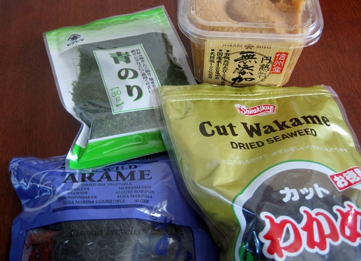

It appears some trace radiation from the Japan nuclear accident has arrived here in Seattle. From the Washington State Department of Health:

> A Department of Health air monitor in Seattle has detected trace levels of radiation in connection with Japans nuclear emergency. The minuscule amounts of radioactive iodine are millions of times lower than levels that would be a health concern.

Am I worried? No. I had planned for this to happen. Although trace radiation may not be a concern, I am taking steps to protect myself from **cumulative amounts of radiation**. Last week I did some research about nutritional strategies to implement that were radiation protective. **The three foods that look to be the most protective are sea veggies (aka seaweed), bone broths and miso soup.**

For the past week I've made stews and soups using [homemade beef broths](/2011/04/homemade-beef-broth/). I add a pinch of seaweed into the mix for additional nutrients. You want to cook the seaweed. It may lose some vitamins, but it is the minerals you want. Radiation or not this is a highly nutritious meal. Since adding bone broths to my diet, I now recover from weight training workouts much faster.

Different seaweeds provide different benefits, so I go for variety. The seaweed on the right is from China. I accidentally bought it months ago. I try and avoid foods from China due to their high pollution levels, however I learned that seaweed does not grow well in polluted waters and it has its own detoxifying properties. A lot of the seaweed comes from Japan, so it will be interesting to see if the accident impacts its quality. But for now, I'm guessing the stuff on the shelf here in America is dated pre-accident and safe to eat.

I bought my seaweed and miso at a local Asian grocery store. They are most likely to have the widest selection. Although when I went, the shelves were already being emptied. The cashier told me they are selling a lot of seaweed right now. When shopping for Miso soup avoid brands that slip in barley (has gluten), sugar or MSG. Rice is OK. I've been making a bowl of miso soup daily since last Friday. Just like my stews, I throw in a pinch of seaweed.

Note that this post is not medical advice. If you have thyroid issues or other related health concerns, do your own research. For further reading on this topic, check out [Natural Protection From Radiation Exposure](https://www.thehealthyhomeeconomist.com/natural-protection-from-radiation-exposure/) from _The Healthy Home Economist_.

---

## Comments

### Sheila
*March 22 at 2011 at 8:29 PM*

quote: "A lot of the seaweed comes from Japan, so it will be interesting to see if the accident impacts its quality."

This was my first question/concern.

Good idea though, I should give it some thought.  I am on the Pacific Coast as well, and just about 2 to 3 miles from the beach (HB).  I guess this makes eating foods high in antioxidants more important than ever!

---

### Amy
*June 18 at 2014 at 11:56 PM*

So... Still buying Japanese seaweed?

---

### MAS
*June 18 at 2014 at 11:59 PM*

@Amy - I get most of my seaweed from Korea.

---

