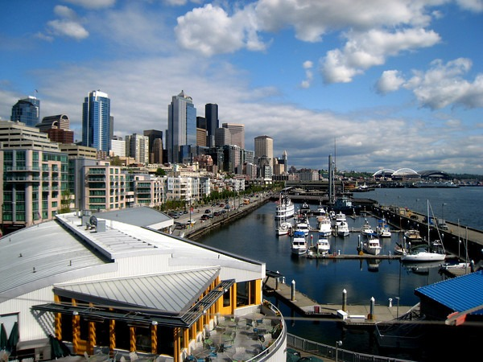

A new season means a new installment for my seasonal approach series to nutrition and fitness. Last year I was inspired to see what would happen if I altered my diet and activity based off the seasons. This is all a grand experiment and not meant to serve as advice. For previous seasons check out these posts:

-   [Fall Strategies For Nutrition and Fitness](/2010/10/fall-strategies-for-nutrition-and-fitness/)
-   [Update on Fall Strategies For Nutrition and Fitness](/2010/12/update-on-fall-strategies-for-nutrition-and-fitness/)
-   [Winter Strategies For Nutrition and Fitness](/2010/12/winter-strategies-for-nutrition-and-fitness/)
-   [Reviewing Winter Strategies For Nutrition and Fitness](/2011/03/reviewing-winter-strategies-nutrition-fitness/)

After a long sleep deprived winter full of holiday parties and sickness, spring is the season that modern man decides it is time to lean out. Not me. I got plenty of sleep and leaned out during the winter. I decided to hibernate like the mammal I am. Note that I live in Seattle and my winter strategy is more extreme than it would be if I still lived in Tampa.

_May 2009 in Seattle_

Other than my [normal diet](/2010/03/what-i-eat-and-what-i-dont-eat-march-2010-edition/), here are my spring strategies:

1.  **Increase Activity** - I'm going to start [urban hiking](/tag/urban/) soon. If I can imagine my caveman ancestor emerging from the cave, I could see him traveling to find new food sources.
2.  **Increase Carbohydrates** - Not a lot, just a little. On days with more activity, I'll be adding more root veggies and potatoes. Ice cream isn't until summer. :)
3.  **More Offal** - Now if I'm emerging from the cave lean, than so are the other animals. This means the most prized cuts of meat will come from their organs. So this means more liver, heart, etc.
4.  **More Seafood** - You can only eat so much offal. ;)
5.  **Reduced Intermittent Fasting** \- I'm developing a new IF strategy that I think overcomes the problems with the other popular protocols out there. Stay tuned on this one.

That is pretty much it. The primary focus this season will be maintaining my current level of leanness while making strength gains and increasing my endurance.

UPDATE MARCH 2011: More spring greens - see 1st comment below.

---

## Comments

### GWhitney
*March 30 at 2011 at 11:03 AM*

And eat lots of Spring greens! This (not surprisingly) is when they are at their most tender and succulent.

---

### MAS
*March 30 at 2011 at 2:42 PM*

@GWhitney - Great idea about the spring greens.  I'm adding that to the post.

---

### Pogonia
*March 31 at 2011 at 7:12 PM*

Just found your blog from a Real Foods link and am subscribing. I love local blogs which include good food. :)  (I am across the water in Bremerton.)

---

