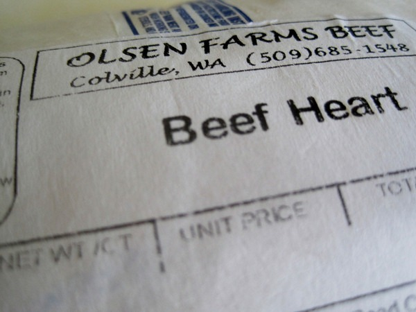

_UPDATE Feb 2013: This recipe has been updated. See [Beef Heart Stew Rebooted (Slow Cooker Recipe)](/2013/02/beef-heart-stew-rebooted-slow-cooker-recipe/)_ I recently bought my first beef heart at the farmers market.   Then I watched the video below, which detailed how to trim the meat.  _[Cleaning a Beef Heart](http://www.youtube.com/watch?v=cfxLptyBQkY) by offalchris_ Once it was cleaned and trimmed, I cut the meat into little dice sized pieces.  Threw it into my Slow Cooker with some beef stock and assorted veggies. Onions, garlic, carrots are some ideas. I added a few Thai peppers, which gave it some serious heat. For Crock Pot dishes, I do the first 30-60 minutes on high and then drop the temperature to low. Five hours later it was done. The taste was nothing like liver or chicken hearts. It just tasted like lean beef. Why would you eat beef heart? Not only is it pretty cheap, but it is a nutrient dense. The article [The "Weird" Types of Meat with the Highest Nutrient Density](http://www.truthaboutabs.com/weird-nutrient-dense-meat.html) by Catherine Ebeling - RN, BSN and Mike Geary, Certified Nutrition Specialist cited these properties on beef heart:

1.  Very high levels of CoQ10, which is excellent for our own heart health. This is another example of "_like cures like_".
2.  Good source of selenium, phosphorous and zinc.
3.  Contains essential amino acids for muscle building.
4.  And the article states beef heart contains "twice as much collagen and elastin than regular meat". This is good for your skin, tendons and cartilage. It fights wrinkles.

If you aren't up for a stew, the article suggests adding beef heart into your ground beef. Are you ready to add beef heart to your diet?

---

## Comments

### Z
*April 9 at 2011 at 7:21 PM*

How much does it cost /lb? What's the average weight of a heart?

---

### MAS
*April 9 at 2011 at 9:08 PM*

@Z - I bought my heart a month ago and forgot what I paid for it.  Since I don't want to quote a bad number, I'll find out on Sunday what the current price is and update this post.

---

### MAS
*April 9 at 2011 at 9:09 PM*

@Z - I'll also weigh it.  I believe it was about 2 pounds.

---

### Aaron
*April 10 at 2011 at 12:13 AM*

When I got my quarter Buffalo last fall I asked the guy for some extra liver.  He threw in 2 livers and a heart for free (said it would likely end up as food for his dogs anyway ... lucky dogs!) 
     What I do with the offal is defrost it enough to cut it up into roughly 3 oz portions, then wrap them in foil and stick em back in the freezer.  Then, every Saturday, I pull one out and toss it in the refer to thaw.  And on Sunday I cut it up and cook it with some of the ground Buffalo, a couple of eggs and some veggies.  
     Liver of course tastes like liver.  But, as you mention, I was surprised at how much the heart tasted like regular meat ... very good
stuff!
     Just two days ago I polished off the last of the quarter Buffalo.  Turned out to be a 6 month supply (for just me).  The absolute best part about it was not having to shop for meat all winter.

---

### thomas
*April 10 at 2011 at 4:24 AM*

As long as we're talking expenses, how much do you think you spend per month on all this paleo and exotic meats diet?  I usually just buy whatever beef cuts are on sale for that week's meals.  Do you have a large freezer?  Just curious how you store so much meat. 

I pictured you going hunting with only a mail-order survivalist knife (the kind with the compass and fishing line in the handle).   Oh, well.

---

### Z
*April 10 at 2011 at 4:21 PM*

Aaron, where did you get the quarted buffalo from? How much freezer space did you need to store it?

---

### Aaron
*April 10 at 2011 at 11:48 PM*

I purchased my Buffalo from High Wire Ranch in Hotchkiss - on the Western slope of Colorado (highwireranch.com)  They come to our Farmers Market on Sat. in the summer so it was easy for me to order/pick up.  They do also ship their meat though. 

     I live in an apartment an just used the freezer/fridge here.  It's one of those where the left side is the freezer and the right side the fridge.  Almost 5 ft. tall inside with the freezer side about 10" wide - but it does have 6 door 'cubies' in addition to the 4 shelves and bottom tray. 

     Anyway, it easily fit 75 lb of Buffalo.  I wouldn't say there was a lot of room left over, but hey, it's not like I'm trying to stuff a bunch of Hungry Man's in there too!

---

### MAS
*April 11 at 2011 at 12:54 AM*

@Z - $4 a pound from OLSEN, which is a regular at the Ballard Farmers market.  Considering the high nutrient content, that is a sweet bargain.  They also sell liver for $4 a pound.

---

### MAS
*April 11 at 2011 at 12:58 AM*

@thomas - I have never calculated my monthly meat expenses.  I have a normal sized freezer.  I tend to load up when I see a good deal.  When Thundering Hooves was winding down, I bought a ton of stuff for 50% off.  

I am very interested in finance and nutrition.  At some point I will start posting about nutrient economics.  Maybe later this year.  When I hear people say that the poor can't afford to eat healthy, I am a contrarian.  The most nutrient dense foods are not that expensive.

---

### Sheila
*April 11 at 2011 at 10:09 PM*

Yes, some of the most nutrient dense foods are not that expensive.  I am always amazed at how one of my favorite foods, (chicken liver) is outrageously cheap.

I would have to seriously get past an aversion to the fact that the meat is "heart", if I were to try it.  But why not?  I eat liver, and even used to eat sea urchin at sushi bars.

No rush on that, though!

---

### thomas
*April 12 at 2011 at 8:13 PM*

I have read books on nutrition (one recommended here) but cannot seem to cut my food costs.  Paleo-heavy has left me wallet-light.  Even broccoli, coconut milk, etc. seem to be expensive and susceptible to variable expenses on the supplier-end.  

I am interested in how to pare down my menu, while keeping the food steady in supply, cost, and nutrients.  Can you do a post on the nutrient-rich cheaper foods you allude to?

---

### MAS
*April 12 at 2011 at 9:18 PM*

@thomas - I have found eating PALEO to be cheaper than conventional food.  

Beef liver is $4 a pound and has by magnitudes greater nutrition than muscle meat.  A can of coconut milk yields 900 calories of highly nutritious MCT fats for less than $2 a can.  

I'll probably do a series of posts in the future, but for now look into fattier cuts of meat (fat is our friend), organ meats and eggs.

---

### Matthew
*April 12 at 2011 at 11:30 PM*

I eat 5000 calories a day and its not too bad.  I'm running out of Thundering Hooves meat-- I've tried out Eel River, but its much more expensive to get it all the way from California.

---

### Matthew
*April 12 at 2011 at 11:33 PM*

Eel River is sold out on offal... we need to stop advertising the benefit of cheap grassfed meat.  It's going to become paradise lost if everyone starts eating liver.

---

### MAS
*April 12 at 2011 at 11:39 PM*

@Matthew - Never a problem finding organ meat at the Ballard Farmers Market.

---

### Z
*April 13 at 2011 at 4:28 AM*

Michael and Aaron, thanks for the info.

Thomas, as far as veggies go, cauliflowers, carrots, red cabbage and green cabbage are cheaper compared to other stuff. Cauliflowers and carrots are really good roasted, cabbage is great raw.

Can't remember for sure, but coconut cream might be cheaper by the weight than coconut milk.

Not sure if you're around Seattle, but if you are, Uwajimaya can be good to find organ meat ($1.60/lb pork liver, ~$3.5/lb beef tongue) and Trader Joe's frozen meat and fruit section has good deals too.

---

### Kyleekins
*July 12 at 2011 at 7:13 PM*

it is 2.67 at my local Swansons right now. I want to make stew and it seems to me (through doing research) as long as you have broth and veggies you are set to go.. essentially i am going to be creative :D thank you for the post

---

### em
*August 16 at 2011 at 12:50 AM*

Is the tongue an organ?  

Anyone know where to get smoked tongue?  Anyone have any opinions on the nutritional value/dangers of smoked tongue?

---

### MAS
*August 16 at 2011 at 1:22 AM*

@em ghee - Good question. It appears the <a href="https://answers.yahoo.com/question/index?qid=[phone removed]0222AAqlG6I" rel="nofollow">tongue is an organ</a>. You can often find tongue at the larger Farmers Markets. I have not made tongue and do not know of the value vs dangers.

---

### Doug
*September 26 at 2011 at 6:16 PM*

I buy beef heart at my local supermarket, Rosauers's, for $2/pound.  The best source I know of for buffalo is Wild Idea Buffalo, in South Dakota.  Check out their website at:

---

### Doug
*September 26 at 2011 at 6:18 PM*

Sorry!  It's  www.wildideabuffalo.com

---

### Malarie
*October 6 at 2011 at 11:08 PM*

Hey Michael,

Greetings from Bellingham! I plan to make this, but just bought a goat and will try it with goat heart instead. 

Since people are talking about pricing, I just wanted to share that I bought a goat from Misty Meadows Farm (Everson, Wa) for $2/lb hanging weight. There were five other people buying goats/sheep at the same time. None of them wanted the organs, so I was able to get them all for FREE. Because so many people are scared of organs, there are ways to find them for cheap. Find a butcher in your local area, and ask them if you could have the organs. They usually just toss them.

 Also, Misty Meadows does only pastured-raised animals, no grains, so this was good, healthy meat. I don't recommend buying liver from factory farmed animals b/c the liver is the filter. I don't know if it matters with the heart.

---

### MAS
*October 6 at 2011 at 11:38 PM*

@Malarie - I'm making liver right now. When it comes to organ meat, I only buy the 100% pastured stuff. It is still dirt cheap.

---

### njbruce
*October 12 at 2011 at 11:23 PM*

Don't know if there is national supermarket distribution but a company called Rhumba specializes in organ meats. The beef heart recently has been $1.99 lb. The meats come cryovac packed so they do last longer in the refrigerator.

---

### Shawna
*March 9 at 2012 at 6:46 PM*

I buy beef heart for stews all the time.  I usually pay between $1.50-$3.00 for a heart and they are usually enough to make a really big stew that has a lot of meat in it.  My son absolutely loves it and, if you cook it slow, it's nice and tender.  Plus, it's not only healthy, but adds a great flavour in stew.  Good stuff!

---

