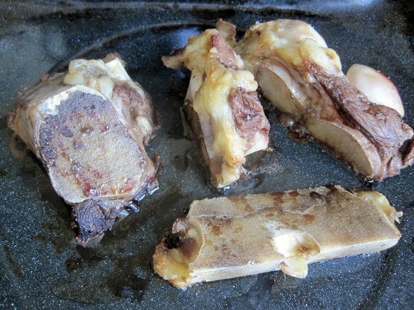
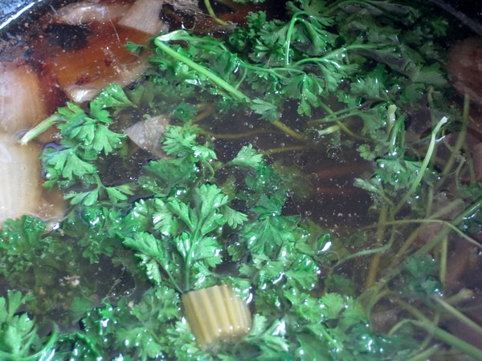

_Update: This is technically a beef stock, as it uses roasted bones._

I've recently discovered a magical elixir. It helps me recovery from workouts faster, protects me from [incoming radiation](/2011/03/nutrition-radiation/), keeps my skin looking great and it tastes awesome. The magical potion is a homemade beef broth. It takes 24-72 hours to make, but is worth the effort. I use the recipe found in the book Nourishing Traditions by Sally Fallon.

Put knuckle bone into stock pot. Add 1/2 cup of vinegar. Cover with water.

Roast Beef Soup Bones for 30-45 minutes at 350 degrees.

Cut up a few onions, carrots and celery sticks. Add them and the roasted meat to the stock pot.

Cover with water. Turn on the heat. Bring it to a boil and then lower the heat until you achieve the slowest simmer possible. Cover the stock pot.

Periodically you want to skim off the large bubbles with a spoon. These are impurities. I do this maybe 5 times in the first few hours and then leave it alone.

Let it sit on the stove with a very low simmer for 24-72 hours. The simmer should be slow enough that you can easily count the bubbles as they rise to the surface. With 10 minutes remaining, add a handful of parsley.

Turn off the heat and let it cool. Using tongs, pull out the large chunks of meat and bones. Throw that away. Then using a strainer, filter out everything else. Pour the broth into jars. Unless you plan on using the broth in the next day, put the jars into the freezer.

There you have it. I do this about once a month. I then add some broth to whatever stew or soup I am making.

---

## Comments

### TigerAl
*April 21 at 2011 at 7:30 PM*

Add a clove or two of garlic, some peppercorns and a halved tomato to the onions and the broth will be extra tasty :)

---

### MAS
*April 21 at 2011 at 9:23 PM*

@TigerAl - Good ideas.  Do you use whole peppercorns or do you crush them first?

---

### TigerAl
*April 21 at 2011 at 11:00 PM*

Whole so that you can strain them out along with the bones.  My mother made this type of broth with chicken, beef or lamb/goat bones.  It makes for a really nice meal-size soup as well, if you add rice or pasta and a few veggies.

---

### MAS
*April 21 at 2011 at 11:08 PM*

@TigerAl - That makes sense.  Thanks!

---

### Nick
*April 26 at 2011 at 5:04 PM*

So you toss all of the veggies too?  Seems like they'd be tasty after all that.

---

### MAS
*April 26 at 2011 at 5:27 PM*

@Nick - The 24 hour simmer has the effect of extracting all the flavor out of the meat and veggies.  It all ends up in the broth.

---

### chuck
*September 26 at 2011 at 11:41 PM*

i just made my second batch of this.  it is so easy, just takes time.  i used a bunch of sad kale and carrots from my garden.  i am always amazed at how much it cooks down.  does yours cook down by about 2/3rds?  i keep the simmer as low as possible.

---

### MAS
*September 27 at 2011 at 1:50 AM*

@Chuck - Mine hardly cooks down. My simmer is super low. Like a single bubble surfacing every 2-3 seconds.

---

### chuck
*September 27 at 2011 at 2:02 AM*

OK, I suspect I have it a tad too hot.  Mine bubbles much more.  I bet mine is super concentrated and strong compared to most.  I do have to water it down when using in some recipes.

---

### chuck
*October 19 at 2011 at 4:14 PM*

have you ever made pho?  i made some this past weekend.  it was DAMN good and quality beef broth is the main ingredient.  relatively easy and i cannot wait to do it again.

---

### MAS
*October 19 at 2011 at 7:59 PM*

@chuck - No I haven't. What cut of beef did you use?

---

### chuck
*October 19 at 2011 at 8:08 PM*

@mas

I had a round steak I used but anything would work.  Followed recipe and simmered the steak in the broth for an hour.  Way over done.  Next time, I will grill the steak separate.  Man was it good, just like the pho restaurants.

---

### Lillian
*November 3 at 2011 at 6:58 PM*

I've been on a broth-making kick lately and was wondering - what do you do with the layer of fat on the top? Most recipe books and sites say to discard it. What do you think?

---

### MAS
*November 3 at 2011 at 8:17 PM*

@Lillian - I eat it. If the animal was healthy, then its fat should be as well. If it were chicken stock, I'd discard it.

---

### Lynn
*October 15 at 2013 at 2:04 PM*

I made my bone broth with soup bones &amp; oxtails. VERY low simmer for @ 20 hours. Result: dark, rich broth but NO gelatin at all. What did I do wrong? 
I live in Newport Beach, Ca. &amp; nowhere here can I find knuckle bones. Would Blue valley Meats ship these? Help!

---

### MAS
*October 15 at 2013 at 3:01 PM*

@Lynn - I don't know why your broth came up short. 

I go to the Asian markets for different bones. The bones will be conventional and not pastured, but  since you'll skim off any fat, it likely isn't much of a concern. I have a stock going now from bones I got at the Korean grocery store. Amazing quality.

---

### Nick
*January 15 at 2015 at 1:19 AM*

How many cups of broth do you generally get out of this?  Do you target a specific amount of water, or just fill whatever pot your using?

Thanks

---

### MAS
*January 15 at 2015 at 1:22 AM*

@Nick - Now I use a pressure cooker. I add about 3-4 pounds of bones. Bring the liquid level up to the line of my 8 quart model. 

https://criticalmas.org/2014/09/pressure-cooker-game-changer/

So no strict measurements. I fill about 3-4 quart jars.

---

