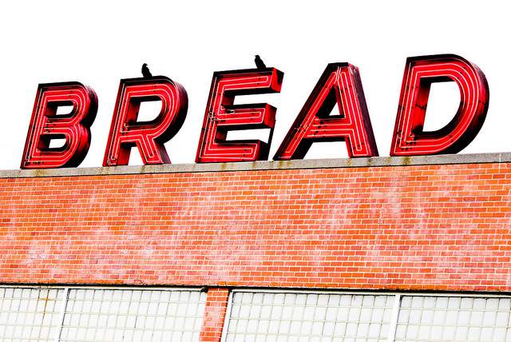

In previous posts, I have celebrated how lean you will get once you [eliminate bread](/2010/08/life-without-gluten/) from your diet. In the post [Be Your Own Dermatologist](/2011/04/be-your-own-dermatologist/), I even covered how removing grains could clear up skin inflammation. Today I realized that I never shared the downside to life without bread. It's not all rainbows and unicorns. There is a price to pay.  _Photo by [Thomas Hawk](https://flic.kr/p/bnXMqi)_ When I removed bread, pasta, baked goods and noodles from my diet, my waist got small and my pants started to fall down. I tightened my belt until there were no more notches. I went out and bought a new belt, jeans and shorts. I had hundreds of dollars worth of jeans that no longer fit me. I donated them to the _GeekBeast_. Now after another year of being bread free, I have discovered that the jeans I bought in 2009-2010 are now too loose. Looks like I'll be returning to the mall soon to buy still smaller jeans. So let this be a lesson. When you stop buying bread, put that money aside. You'll need it later when you are forced to buy a smaller wardrobe.

---

## Comments

### Nick
*April 13 at 2011 at 12:24 AM*

LOL  Nice.

---

### Matthew
*April 13 at 2011 at 12:52 AM*

Now, I have something else to aim for :)

---

### Marty
*April 13 at 2011 at 2:48 AM*

So true! 

I'm having a hard time finding clothes in my closet and have set up my sewing machine to take some in.

'Love it!

---

### chuck
*April 13 at 2011 at 4:33 AM*

people hate when i say this.  i have been avoiding wheat for the last 4 plus years.  i am now at the point where i have to eat like crazy to keep weight on.  i believe your body repairs itself and the metabolism can get back up to teenage like even for someone in their late 30s.  my neighbor is wheat free for about 6 months and has been getting his pants altered  because he lost weight that 15 miles per week of running couldn't take off.

i eat a lot of fat, some protein, and have been upping my carbs in the form of yams, fruits, and occasional white rice.

---

### MAS
*April 13 at 2011 at 5:10 AM*

@Chuck - I have noticed that the longer I go without bread, the more my metabolism has ramped.  I too have started adding yams on the days I lift weights.

---

### Elizabeth
*April 13 at 2011 at 12:38 PM*

Great post!  However...if you were a smart cookie like I was, and packed away all of your 'skinny clothes' for a brighter day, you don't have to go buy all new ones.  By the way, I am NOT much of a fashion slave so if it worked five years ago...it'll work today.  In fact, just yesterday, I found four boxes filled with clothes that now fit...but the laundry and ironing is a killer!

---

### MAS
*April 13 at 2011 at 3:18 PM*

@Elizabeth - That would have taken some serious planning, as the last time my waist was this small I was a freshman in high school.  :)

---

### Jenn
*April 13 at 2011 at 5:11 PM*

I'm inspired!  I have mostly cut alcohol from my diet (which is hard to do as a grad student but I'm not gonna beat myself up for a glass of wine every now and again). My skin is totally clearing up (and I may have dropped a couple lbs)  but bread, oh how I love my bread!  I am tapering off, however...   or is cold turkey the way to go??  Dinner with no bread is no problem--  some chicken/meat/fish and salad or some cooked veggies (easy and yummy).  Breakfast is most difficult. What do you eat for breakfast?

---

### MAS
*April 13 at 2011 at 5:17 PM*

@Jenn - Congrats!  Cold turkey or cut back?  My answer is whatever works.  I'm going to post more on that later.  

Breakfast to me is the easiest.  Half the days, I fast straight through to lunch.  When we sleep we move from burning carbs to burning fat.  Bypassing breakfast extends this period. 

I am a big fan of eggs and kimchi for breakfast.  I also usually have a meatloaf tray going at all times.  This morning I'll be eating the last of my beef heart stew leftovers.

---

### Melissa
*April 13 at 2011 at 6:47 PM*

Thrift stores are your friend!  I rarely buy anything new!  If you can stand pawing through the racks, you can't beat the bargains you might find!

---

### thomas
*April 14 at 2011 at 2:42 AM*

Following a mostly grain-free and sugar-free diet, an unwanted side-effect is weight loss that has occurred in my face.  I look more tired and less fit, even though the opposite is true.  

How to get back that healthy face look without going back to carbs (although I have used this as an excuse to eat pizza)?

---

### MAS
*April 14 at 2011 at 4:54 PM*

@thomas - it happened to me as well.    Your body is still healing from the inflammation.  Just keep eating the healthy fats - such a coconut oil - and your face will be fine.  It could also be lack of sun.  My skin always looks more tired in the spring after being trapped in my cave all winter.  Nothing a little tan can't fix.

---

### thomas
*April 14 at 2011 at 9:22 PM*

Thanks.  Its good to know I wasn't experiencing this.  Will focus on the good fats.

---

### Jim
*April 18 at 2011 at 8:46 PM*

@MAS - Well you have inspired me ...I decided to go low-carb and bread/noodle free for a month to see how much weight I drop.  I had meat, cheese and fruit for lunch ...probably start having salads or meat/veggies again for dinner.  

I did have one question though ...I lift weights at the gym 3 times a week and usually eat a protein bar on the way assuming the 32g of protein and vitamins will help add muscle.  There are 26g of carbs in the bar though (incl. 4g of sugar).  Is this a no-no?  If so, is there a good alternative?

---

### MAS
*April 18 at 2011 at 8:59 PM*

@Jim - Congrats on trying the bread free challenge.  Since your cutting the carbs, don't be afraid to increase the fat.  That is the biggest mistake I see with people going low-carb.  

Protein bars are unnecessary, but probably not harmful.  I prefer yogurt or cottage cheese.  I've always found whole foods to be more beneficial than supplements.  Also, since you are trying to loss some fat, don't be afraid to lift in a fasted state.  That protein bar will spike your insulin, which will shut down hormone sensitive lipase - which is a powerful method for fat loss when lifting heavy weights.

---

### Jim
*April 18 at 2011 at 9:28 PM*

@MAS - Awesome feedback ...thanks!  I will let you know how much I lost in 30 days.

One part I wasn't sure about ...I couldn't quite figure out if spiking insulin was good for fat loss while lifting or bad for it.  It seemed bad, but just verifying.

Also, I always read that milk products only have some amino acids necessary for muscle growth, but say combined with peanuts you get all of them.  Is this a big deal?  It's another reason I eat protein bars (since they contain all amino acids), but don't know how much is science and how much is marketing hype.

---

### MAS
*April 18 at 2011 at 9:49 PM*

@Jim - I know you already have years of weight lifting experience and you have a goal to focus on fat loss, so the advice I would give you would be different than an 18 year old heading into the free weight room for the first time.  IOW, your potential for fat loss is far greater than muscle gains.  Therefore, you should focus your efforts there.  In the event, you lose any muscle, you can always gain it back easily (muscle memory).

Insulin spikes can case fat gain.  They can also help with building muscle, but since your focus is fat loss, I'd restrict any carb spiking meal to only your post-workout meals.  Earn your carbs in the gym.  

I've never heard that about peanuts.  It doesn't make sense. The body is pretty smart about nutrient utilization.

---

### Jim
*April 18 at 2011 at 11:56 PM*

Hmmm ...you are right.  Yogurt and cheese are complete protein sources:  https://en.wikipedia.org/wiki/Complete_protein

Don't know where I read that about milk products ...must have been years ago ...and apparently wrong!          :)

And finally, good advice on the fat versus muscle ...I have been working out for probably 6 months and have increased muscle mass (i.e. I can see it and can lift more), but have not lost any weight at all yet.  

This will be interesting...

---

### VanetiaCapeTown
*March 22 at 2012 at 8:00 PM*

Wow...Well done..Thats  a great problem to have..Needng to get new pants all the time..My weekness is bread! Wow..Love toast,fresh bread...Pasta,rice,cakes...Carbs and lots of em.So you are a great sauce of insparation to me..Today is day1 gettng my waist down from a 20 to 15 to 10 to 8my goal...! Letstgo... !

---

### MAS
*March 22 at 2012 at 8:25 PM*

@VanetiaCapeTown - I wish the best of luck. When I cut out bread I also cut out other starchy carbs. These days I eat sweet potatoes and yams with no weight gain, so you might experiment with them as you are weaning yourself off of bread.

---

### Pahcrazy
*March 24 at 2012 at 2:47 AM*

Ok I gave up bread, pasta, anything containing flour, etc about 5 weeks ago. I average about 25 g of carbs a day and I've only lost 9 lbs. 9 is good, I'm on my way but from all I've read here and books etc the weight should be melting away. Even Atkins says up to 15 lbs in 2 weeks. So what am I doing wrong. 3 meals a day, low carb, low cal but I get enough protein so what's the problem. Any suggestions.

---

### MAS
*March 24 at 2012 at 2:56 AM*

@Pahcrazy - When I gave up bread, I lost inches more than pounds. 

You may need to increase your calories. The body has an efficient way of lowering metabolism if you go too low for too long in calories.

I personally like doing cyclical low carb. Most days I am lower carbs and slightly lower calories. Then on the days I exercise (about every 3-5 days), I increase the calories and carbs. This has prevented my metabolism from slowing. Good luck!

---

### Dez
*January 30 at 2013 at 5:43 PM*

Hi,
I started off at 198lbs and I am now 172lbs. I still have 30 more to go. But I have my abs but I still have side handles. ;o/ I've been working forever to get them down, they have gotten smaller but still are very noticeable. I asked my instructor she said those are 80% diet and 20% exercise. So I figured why not go w/o bread, which is in my daily meals majority of the time.
My husband and I, starting this upcoming Sunday no bread for thirty days. I have questions though. Is it just breads or breads and other starchy food like pasta, rice etc?

---

### MAS
*January 30 at 2013 at 6:40 PM*

@Dez - I would eliminate all grains, which includes pasta. White rice might be OK. It was for me.

---

### AJ
*February 6 at 2013 at 4:21 PM*

I've been reading all of the posts here and have some questions.  First let me say after 20 years with IBS and recent increased stomach issues I read all of the dangers to people with too much sugar and yeast in their diet, especially if there is an imbalance in the GI tract, that is my reasoning behind going low carb.  I went GF first and now I'm sans all bread, pasta, rice, and grains.
  Unlike most people here I run, not going for muscle mass and I don't really lift.  My muscle workouts generally include exercises which focus on improving my running with some back and arms for the PT test I have to do a few times a year.  I'm training for my first half and    I've always been told carbs is the name of the game but in recent years I just can't eat pasta it hurts me more than it helps me.  What are some good run carb options that are low enough to sustain loss in inches but high enough to help with distance increase.  I can eat protein but it has to be clean protein, no red meat and no cheese.  I have so many dietary restrictions it gets hard to find good sources of a lot of key vitamins.
  I'm currently going back to basics with lots of veggies (less fruit b'c of sugar) and white meats.  No acidic foods with my acid issues either.  How can I boost my diet for marathon success, I need more energy than just fruits and veggies can give.  This is especially true with the winter running I'm doing. Thanks!

---

### MAS
*February 6 at 2013 at 4:26 PM*

@AJ - Although I no longer run, my favorite carbs are white rice and sweet potatoes.

---

### betty
*June 6 at 2014 at 7:58 PM*

I know if I stop eating bread and any grains I would loose hard making that first step

---

