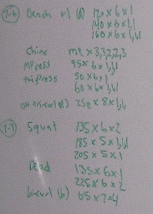

In the post [High Intensity Training My 6 Month Update](/2011/05/high-intensity-training-my-6-month-update/), I confessed that I no longer collect data from my workouts.

> I violated a core HIT rule. I didn't record any workout. ...My training philosophy is the [Minimal Effort Approach](/2010/03/the-minimal-effort-approach/). As long as I feel I'm moving in the right direction, I wont try and complicate things.

Back when I had a home gym I did go through a long period where I recorded my workouts. I did find it useful to see the numbers prior to initiating an exercise. Instead of using a pad and pencil, I had a huge whiteboard with markers in my gym.  _My most successful workout journal to date was a huge whiteboard in my old home gym._  _Two workouts from July 2004._ Once I sold my home, I stopped recording my workouts. For a few years, I struggled to find a balance between making gains in the gym and avoiding injury. The numbers became less and less meaningful. Instead of looking at my numbers to determine what to lift, I really listened to my body. If I felt great, I'd dial up the weight. If I didn't, I'd lower it. Success went from lifting an ever-increasing weight to leaving the gym without hurting myself. I had been thinking about starting a workout journal again when Roger from HIT Charting Journals saw my 6-month update post and offered to send me one of his workout journals. I just got it in the mail and it is pretty nice. I'm going through the pages and thinking about how I can get back in the habit of recording my lifts. I'll probably start slow and record dates and exercises first. Then if I can keep that up, I'll begin entering weights and then finally times.  We will see if I can start up my old habit of recording workouts. It has been \*gasp\* 5 years since I stopped keeping track.

---

## Comments

### thomas
*May 24 at 2011 at 1:22 AM*

Hey Mike, 

I did the HIT the past week and now I have gained 5lbs and am bloated.   I have been on a steady diet of nothing as well.  Some meats, coffee, eggs, etc.  What gives?  Have you experienced similar consequences? 

thanks

---

### MAS
*May 24 at 2011 at 1:34 AM*

@thomas - I can't tell you.  I'm in the diet is everything camp, so I don't think the HIT workout was the cause.  I also use the tape measure over the scale.  It tells me more.

---

### thomas
*May 25 at 2011 at 7:09 PM*

thanks.  I think I will do a mix of HIT and light running to keep the weight down.  

Although, today I was eavesdropping on two guys next to me in the gym and one said to the other "You have to do 21 sets to get full-activation of the muscle", (I thought he meant overall - like an hour workout) however the other guy replied "You mean per muscle? and the guy said "yes, per muscle so you need to do 21 sets of chest exercises." why 21 and not 22? oh well, kids today.

---

### thomas
*June 2 at 2011 at 6:37 PM*

Have you gotten bigger with HIT?  I mean increases in muscular growth and definition with decreases in overall bodyfat.

---

### MAS
*June 2 at 2011 at 6:51 PM*

@Thomas - Although I believe my arms and legs have more strength and definition, my updated diet is still leaning me out.  So my weight is not up, but my strength is.  Summer begins later this month.  I'll start increasing my calories and carbs more then.  

To me the best thing about HIT is I don't get those aches and pains that I always got when I pushed myself too hard with volume training.  Now I can go "all out" without fear.

---

