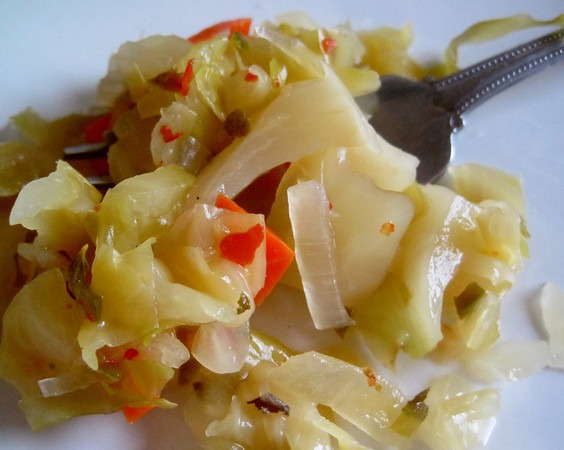

I just sampled my best fermentation to date. It took 3.5 weeks, but it was worth it. Inspired by [Firefly Kitchens](http://www.fireflykitchens.com/), I decided to make my own _Cortido Sauerkraut_. This is Latin American style sauerkraut. It has some heat, but not as much as [kimchi](/2011/03/kimchi-101/). The Mexican Oregano really brings out the flavor. If you have the patience, I highly recommend making this amazing sauerkraut.  _Cortido (also spelled Curtido) Sauerkraut_

### Ingredients

1.  1.5 pounds green cabbage (sliced into thin ribbons)
2.  1 jalapeno (cut into tiny pieces)
3.  6 oz onions (small pieces)
4.  1.5 teaspoons of Mexican Oregano (and no more!)
5.  1 teaspoon of red pepper flakes
6.  1-1.5 tablespoons of sea salt (I use Redmond, but Celtic works too)
7.  1 carrot (cut into very small pieces)

If you are sensitive to heat, reduce the red pepper and jalapeno portions.

### Preparing the Fermentation

1.  Slice the cabbage into thin ribbons and place in a bowl.
2.  Add sea salt and rub it into the cabbage.
3.  Let it sit for an hour. The cabbage will release water.
4.  Slice up the carrot, jalapeno, and onion into little pieces.
5.  Add veggies and the red pepper flakes to the mix.
6.  Now add in the Mexican Oregano.
7.  Stir and then pack into jars.
8.  Use the water released by the cabbage to top off the jars.

### The Fermentation

When packing into the jar, make sure the veggies are below the liquid line. In order for the fermentation to work, all the veggies must be underwater. If you need more water, make a brine with a teaspoon of sea salt in a cup of water and top off. The Fermentation will take 2.5 to 4 weeks, depending a lot on ambient temperature and personal preference. A warmer environment will result in a faster ferment. During the fermentation, you will check to make sure the veggies are below the liquid line. You can use a weight or do what I do and just push the veggies down. During the first week, I will push the veggies down twice a day. Then once every 2 or 3 days. You will see bubbles rise to the surface. This is the fermentation at work. If you use glass jars, cover them with a towel or upside-down paper bag or [box](/2011/10/my-fermentation-station/) to block out light. Also, avoid keeping your ferment in a hot kitchen, as they do much better in cooler areas. When the fermentation is over, seal the jars and place them into the refrigerator. Enjoy! UPDATE November 2011: It is OK to increase the red pepper and jalapenos, however, don't increase the oregano portion. Too much oregano will impart a "soapy" and harsh taste.

---

## Comments

### chuck
*June 17 at 2011 at 2:02 PM*

Man...you are like in my head or something.  I was just thinking about making my own sauerkraut this morning.  After several successful kimchi experiments I figured I could do sauerkraut too.  I am doing my 3rd batch of kimchi now but sauerkraut is next.  thx for these how to posts.    

my brother-in-law's family has a cabbage farm and he makes his own sauerkraut which is typically great.  he makes 20-80 pounds at a time in a trash can.  his last batch was too salty to tolerate so i thought i would take things into my own hands.  homemade is so much better b/c it's not pasteurized.

---

### MAS
*June 17 at 2011 at 4:52 PM*

@Chuck - My previous attempt at sauerkraut was way too salty, so when I made this I used a smaller batch.  Since I nailed it, I will double or triple the quantity the next time.  3.5 weeks is a long time to wait.

---

### chuck
*September 1 at 2011 at 8:52 PM*

i never did my sauerkraut.  just kept doing kimchi.  i think i am going to try this.  did you use dried oregano?  i have dried mexican or fresh oregano in my garden.

---

### MAS
*September 1 at 2011 at 9:26 PM*

@Chuck - yes. I use dried Mexican Oregano. I believe it is the key ingredient. The smell is more pizza like than sauerkraut.

---

### chuck
*September 20 at 2011 at 12:04 AM*

ok, i am 2 weeks in on this recipe and only using this post as reference.  how do you know when it is done?  there is no more bubbles when i push down.

---

### MAS
*September 20 at 2011 at 12:14 AM*

@Chuck - I am currently 3.5 weeks into my latest batch. For some reason it is taking longer now. Probably the cooler weather. What I do to measure the sauerkraut is taste a little bit. It shouldn't be too crunchy. If you like the texture, it is done. If not, keep fermenting.

---

### Laura
*October 9 at 2011 at 7:17 PM*

Hi MAS,
I just started making kimchee and can't buy any natural sauerkraut where I am. I'd love to make some but my mother's on chemo and very, very (very) sensitive to smells. I'm assuming it generates a noticeable odor. I know when I lived in a small NYC apartment it was pretty intense. 
Thanks!
L

---

### MAS
*October 9 at 2011 at 7:23 PM*

@Laura D - True. It can sometimes make an odor. I have found that the warmer the environment and the larger the batch size, the more potential odor.

---

### Susannah
*March 1 at 2012 at 8:27 PM*

just to be sure I do this right... so you leave the jar uncovered or just drape a towel over top for two to four weeks?

---

### MAS
*March 1 at 2012 at 8:32 PM*

@Susannah - I cover my ferments with a towel, paper bag or box. Then I just make sure the veggies are below the water line on a near daily basis.

---

### Susannah
*March 2 at 2012 at 1:59 AM*

Thank you so much.  Can't wait to try this.

---

### jim
*September 10 at 2012 at 2:23 PM*

I was wondering if you knew why no one ever makes sauerkraut with red cabbage?  I have read that the red variety has a lot more nutrients, and is actually one of the most healthful vegetables to eat. So I am curious as to whether you have ever tried red cabbage, or if you know why it is never used?

---

### MAS
*September 10 at 2012 at 2:27 PM*

@jim - Firefly makes a Ruby Red Kraut that is quite good.

http://www.fireflykitchens.com/our-products/

Note that even in red SK, more green is used than red. I have attempted this recipe a few times and have been underwhelmed with the taste.

---

### chuck
*March 13 at 2013 at 4:28 PM*

just finished another batch of this last night.  i love this stuff.

---

### Jenny
*August 14 at 2015 at 4:04 AM*

Just to be clear, you dont use a lid while fermenting? You cover the opening of the jar with cloth or paper bag, and no lid? Or do you use a lid and also cover with cloth or paper bag? I've never fermented anything before and want to make sure I fully understand what I'm doing. I am eager to try this. Thank you.

---

### MAS
*August 14 at 2015 at 3:21 PM*

@Jenny - A loose lid is fine. So is cheese cloth. The only thing I don't use is a tight lid. It is all good.

---

### Lynne
*September 29 at 2023 at 8:11 AM*

Is it ok to make saucekraut in a Mason jar &amp; should I leave it open or lock down the lid?

---

### MAS
*September 29 at 2023 at 1:03 PM*

@Lynne - Do not lock down the lid. A loose cover that allows some degassing is ideal.

---

