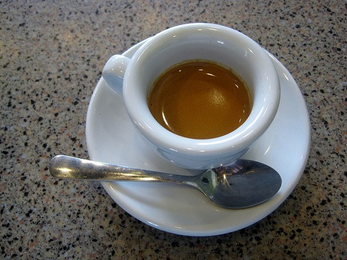

When it comes to coffee, my favorite drink for years has been espresso. No milk, no sugar. To me and others, **espresso represents coffee at its ultimate potential**. When I'm hosting an event for the [Coffee Club of Seattle](https://www.meetup.com/seattle-coffee-club/), I will occasionally get a comment that my drink selection was _too small_ and that had I gotten something other than espresso, I'd still be sipping on and enjoying my beverage. I correct my critics by stating that I am still enjoying the beverage, as the _memory persists_. My love for espresso has helped me really appreciate High Intensity Training. **Less can be absolutely be more.** Going to the gym every 5th day and engaging in an all-out brutally tough, albeit safe workout, is now yielding me greater results than I was getting with High Volume training. When my daily coffee drink switched from [french press](https://ineedcoffee.com/press-pot-tutorial/) to [espresso](https://ineedcoffee.com/espresso-as-a-lottery-ticket/), my caffeine intake dropped and my appreciation for the beverage increased. I began sleeping better, even though my flavor stimulus was greater.  In the book [The New High Intensity Training](/2011/05/the-new-high-intensity-training/), author Ellington Darden states that HIT training has lost popularity in the past 25 years. I believe it. As far as I can see, I am the only person at my [Glitter Gym](https://criticalmas.org/best-of/tales-from-the-glitter-gym/) doing HIT. In fact, I can't recall a single person doing HIT at any of my previous gyms. That isn't concerning to me, since I look for results and am uninterested in what is popular at the moment. When I visit coffee shops across Seattle, I also noticed that the espresso is a minority drink. Most patrons want to _stretch out the experience_ by adding water, milk or some form of frozen sugar sludge. Back at the Glitter Gym, I see patrons _stretching out the experience_ by adding more sets, working out more days and choosing ridiculous exercises that favor injury over muscle growth. They remind me of the guy who repeatedly hits the crosswalk button until the light changes. The biggest criticism I've read about High Intensity Training is that some people will lose motivation if they only go to the gym 1 to 2 times per week for highly brief workouts. I'm only 7 months into my HIT journey, so I am far from an expert, but all I can say is that like espresso, the _memory persists_. **I don't dilute my espresso and I don't dilute my workouts.** The economic forces in fitness are always geared towards more. More sets, more workouts, more gear and more supplements. What I've learned from my study into evolutionary health is that the economic patterns of nature are not geared towards more. **Nature rewards efficiency.** The "_go big or go home_" nonsense is energy foolish and may actually keep you from achieving your fitness goals.

---

## Comments

### GWhitney
*June 7 at 2011 at 8:37 PM*

Good points.

The difference between hitting the traffic light or elevator button over and over again and over training with weights, is that the latter is likely to cause injury while the former is probably just a waste of effort...

---

### Stuart
*June 7 at 2011 at 8:50 PM*

I haven't seen you mention anything about the tabata protocol since Dec 2010. Have you moved away from that? If so, why? If not, what do you think of it?

---

### MAS
*June 7 at 2011 at 9:02 PM*

@Stuart - I am of a fan of the Tabata protocol for other people.  I think it is far superior to cardio.  I could do it and I may start at some point, but I am careful not to take a kitchen sink approach to fitness.  Since HIT is still very new to me, I don't want to introduce Tabata into my workout routine at this point.  Right now I am just doing HIT every 5th day with some urban hiking.

---

### Karl
*June 8 at 2011 at 5:53 AM*

I think you're right on here. I find the intermittent HIT workouts FAR easier to stick with. When I was doing the 4-5x per week 3x10 based workouts if I missed a few weeks I'd feel like I stopped exercising and it would be easy to take a longer break. Now if I travel or whatever I'm actually curious to go back to see if the extra time off helped me get stronger. I can also just do some sprints instead and still feel like I'm still perfectly on track.

I also have to admit that I really enjoy walking in and out of the gym in less time than some people take to get warmed up on the treadmill- call it a smug-powered workout... And like you I'm incredibly pleased with the results.

---

### Ahrand
*June 8 at 2011 at 9:54 AM*

People take the same approach to eating/calories. They are looking for satisfaction and want to stretch it out.

This is where intermittent fasting (restrict feeding time/frequency) and not adding too much flavors (salt, sauces(oils), sugar) comes in. 

Enjoy the pure (raw where possible) food as it come out of the ground/from the animal infrequent and randomly.

In other words, apply your "nature rewards efficiency" philosophy towards training, food, sex, work, studying, ... life .

---

### MAS
*June 8 at 2011 at 4:45 PM*

Karl and Ahrand - Excellent comments.  I fully agree.  High Intensity Training is more resilient with busy schedules and its applications extend beyond the gym.

---

### Drew
*June 10 at 2011 at 5:24 PM*

Brilliant analogy!

Like the enjoyment of a good cup of espresso, the effectiveness of a workout is directly proportional to the quality, rather than quantity of work performed.

---

