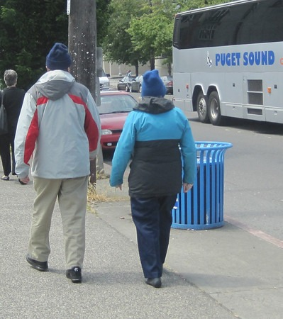

Today was another wonderful day in Seattle. I took some photos as I urban hiked from Upper Queen Anne to Downtown.  _Upper Queen Anne looking west to Magnolia_  _Sculpture Park. Looks a lot different when the sun isn't out._  _Train tracks going underneath Sculpture Park_  _Seattle Waterfront_  _Behind Pike Place Market_ I think summer is finally here, although this couple might disagree. It was 70 degrees and sunny and they walked through Queen Anne wearing winter coats and wool caps. There were others too. [You know how I feel about that.](/2011/06/you-broke-your-own-metabolism/)  _Uggh!_

---

## Comments

### chuck
*June 13 at 2011 at 2:11 PM*

it got down to 60 yesterday in my area.  You would have thought it was in the 40s the way people were acting.  People are getting soft I tell you.  They will complain unless the temperature is between 74 and 80.  Oherwise, it's too hot or cold.  Get over your air conditioned self and enjoy the outside.

---

### MAS
*June 13 at 2011 at 2:25 PM*

@Chuck - I really think people today are aging in fast forward.  It used to just be the elderly that got chilly when the temperature dropped a few degrees.  Now it is the majority.  

When a real biological stress does come to them, they will have wished they toughened themselves up.

---

### Marian
*June 13 at 2011 at 2:45 PM*

OK, I'm just going to put this out there, because I am sure this is not what these people have in mind.

The idea is to expose yourself to temperature extremes.  It rarely gets very hot in this area.  Wouldn't you want to take advantage of a warm-ish day in Seattle, pile some more layers on and take a visit to the tropics?

I get your point about cold exposure and brown fat.  But if the idea really is to toughen up, shouldn't you go to the other extreme, too?  If living in California got you accustomed to warm then living in Seattle will surely get you accustomed to cold-to-coolish.

---

### MAS
*June 13 at 2011 at 2:49 PM*

@Marian - Sure, your logic makes sense.  If I were to ever return to Florida, I'd try to reduce constant exposure to A/C.  

I don't think it takes as much effort to adapt to hot weather.  When I spent a month in SE Asia in late 2009, I got used to the brutal heat in hours, not the months it took to cold weather adapt.

---

### chuck
*June 13 at 2011 at 2:51 PM*

Makes me wonder if those bundled up folks also have an irrational fear of sun exposure?

---

### MAS
*June 13 at 2011 at 2:54 PM*

@Chuck - I see a lot of layering, so I'm going that it is a temperature thing.  If it were a single layer long sleeve shirt and they wore a wide brim hat then I'd agree with your hypothesis.

---

