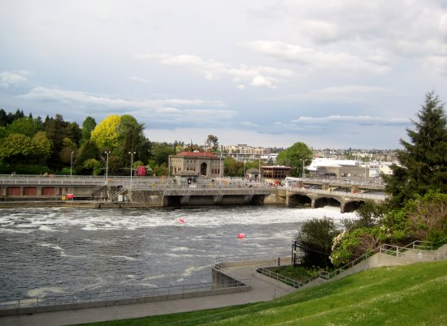

I have about 15 half-written blog posts in the queue right now. I'm not happy with any of them. The sun is rising at 5:10 AM in Seattle and not setting until after 9 PM. I have blackout drapes, but the light is still sneaking into my room and waking me up. During the winter I was able to get extra sleep, now I'm missing some sleep.

My plan was to cut my coffee intake come summer, but then Seattle got the Northwest Coffee Festival and Coffee Crawl with multiple events each day. As a coffee fanatic, I have been going to all these events and consuming a high amount of coffee. This isn't helping my sleep either.

So the result is I've been too tired to complete about 15 blog posts. Sunday is the last day of the Coffee Festival. When it is over, I'll start to reduce my coffee intake. The days will begin to shorten on Wednesday. Hopefully, I'll get my blog mojo back then.

_My hood. This photo has nothing to do with this post. I need more sleep._

---

## Comments

### GWhitney
*June 16 at 2011 at 6:46 PM*

When I get woken up by light around 0430-0500 - I put on a night shade mask over my eyes, pop on my iPod earbuds and listen to a fairly boring audio book at very low volume. It's restful enough - I do this for about 90 minutes, drifting in and out of sleep. I also go to sleep around 1030 p.m., so that helps.

---

### MAS
*June 17 at 2011 at 1:47 AM*

@GWhitney - Sometimes I can get back to sleep and sometimes I can't.  Last night, I went to bed at 9:30 PM.  That seemed to work.  I felt like a middle schooler - but I got great sleep!

---

