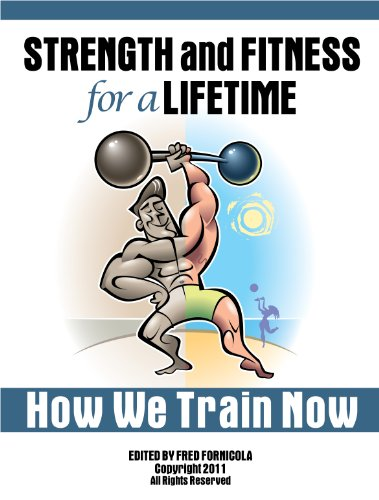

Last week Fred Fornicola from _Premiere Personal Fitness_ sent me a copy of his e-book _Strength and Fitness For a Lifetime - How We Train_ to review. _Strength and Fitness For a Lifetime_ is a collection of older fitness enthusiasts that are still around and still in great shape. Almost all those profiled are over 40, with the majority being in their 50s and 60s. Most guys at the gym make the same mistake when seeking role models. They look at the huge guy in his mid 20s and decide to train like him. Not me. I've always been far more interested in the survivors. I detailed my thoughts on this topic in the post [Rambling Thoughts About Gym Survivorship](/2010/06/rambling-thoughts-about-gym-survivorship/). I wanted to learn what enabled these lifters to survive when so many their age had given up or got sidelined with injuries. I expected that answer to be a common sense scaled back version of training that measured risk versus reward. Although there was some of that, I came away with the opinion that these athletes mostly survived through superior recovery ability.  _Strength and Fitness For a Lifetime: How We Train Now by Fred Fornicola_ Almost all the athletes profiled began training as teenagers, and a few before then. I don't know this to be a fact, but I believe that if you start weight training at a young age, you develop an ability to recover faster and that you retain that ability into your later years. So the fact you are muscular at 55 has more to do with the fact you started lifting at 13 than your 4x a week exercise program. I could be wrong, but you almost never see older guys pushing serious iron that started lifting later in life. My favorite profiles in the book included:

-   **Fred Fornicola** - His approach was the least rigid. He has the mind of a student. Always learning and exploring new fitness protocols. He also had the most solid nutritional advice.
-   **Bill DeSimone** - He takes a smart bio-mechanics approach to lifting and recognizes there is a balance between performance and injury and that avoiding injury is the primary goal.
-   **Dwayne Wimmer** - His training philosophy is [almost identical to mine](/2011/05/high-intensity-training-my-6-month-update/). Perform two brief, highly intense workouts a week and then allow time for recovery.

Some profiles I would have liked to seen in the book would include [John Little](/2011/05/max-contraction-training/) and Dave Durell. They are both over 40 and have a great understanding of recovery, which is a topic critical to the older lifter. Maybe as I get older I'll understand the wisdom from many of these lifters, but my opinion is that most of them over train and their body let them get away with it. The book is a quick read at 96 pages. Fred did a great job with the editing and I also enjoyed reading the introductions.

---

## Comments

### chuck
*June 4 at 2011 at 4:36 PM*

i think a lot of people started weight training for sports performance.  in sports, especially at higher levels, their is a theme of pushing or playing through the pain.  i had a football coach who used to tell us we need to recognize the difference between being hurt and being injured.  this obviously will carry over to the weight room.

when people get to be over 35 or so, that attitude needs to be thrown out the window.  one must become sensitive to what their body is telling them and listen to it.  don't push through the pain or strain because at older ages that is when injuries happen.  stop and move on to another exercise or body part....or just head to the showers.  you will be able to train another day.  unfortunately, it took me a few years past 35 and a few tweeks to figure this out.

---

### MAS
*June 4 at 2011 at 5:31 PM*

@Chuck - Yep.  Or as I like to say - we win by not losing.

---

### Dwayne
*June 4 at 2011 at 5:37 PM*

MAS, Thanks for the mention.  You mentioned Dave Durell in your blog.  He interviewed me for his web site a few months back, if you haven't checked it out yet.  It was a lot of fun, we started talking and before we knew it almost an hour and half went by.  

Thanks again for the mention.

Dwayne Wimmer

---

### MAS
*June 4 at 2011 at 5:45 PM*

@Dwayne - I did listen to that show.  I found Dave Durell's site a few months ago and have been going back and listening to the older podcasts.  He gets a lot of outstanding guests, yourself included.

---

### Dwayne
*June 4 at 2011 at 5:51 PM*

Dave is a Great guy.  He gets Great guests (I was honored to have him contact me) and Dave makes sure the interviews are informative and fun to listen to.  

Thanks for the compliment.

Dwayne

---

### Christine
*June 4 at 2011 at 5:59 PM*

MAS, this is a great article, thanks! 

Chuck, I think you are absolutely right about the notion of most sports performance coaches going for the no-pain/no-gain approach. Had I been exposed to sensible training philosophies earlier on it would have prevented a lot of overuse injuries from college athletics. Sound exercise is meant to improve fitness and health and hinder neither.

---

### Ray
*June 4 at 2011 at 6:34 PM*

I'm not so sure people develop better recovery by beginning training earlier in life rather than actually understanding how to train. Common misconceptions in the fitness industry have people working out 5 days a week not allowing for enough recovery time. People also tend to do forceful movements with jerky starts causing extra strain on muscles and tendons further causing injury. I think the survivours that you talk about are more so the people who understand the science behind the exercises they do. Learning how to keep your workouts safe and intense enough to keep stimulating the muscles later in life is what I believe creates the "survivor." When exercise is performed the right way I have yet to see age really play a factor as in to how intense someone can train safely.

---

### MAS
*June 4 at 2011 at 6:44 PM*

@Ray - What I like about HIT with sufficient rest is that it is much lower risk for injury than high volume training.  Many of the profiles in this book were guys that IMO over-trained.  Too much volume and too much cardio.  

If I worked out like those guys, I'd be sidelined with injuries most of the year.  But for some reason, there are individuals that despite high levels of volume not only don't get injured, but thrive.  Other than genetics and luck, I'm merely speculating that teaching a growing body to adapt to training stress at a younger age may have a protective role.  

I'd love to see a study that interviews hundreds of lifters.  Ask them the age they started lifting and then perform tests to measure their recoverability.

---

### Fred
*June 4 at 2011 at 8:25 PM*

Michael,

Thanks for mentioning the new project.

With regards to overtraining and recovery in general, everyone has to figure out what their goals are and what works for them to obtain those goals - "One mans meat is another mans poison".  Some people have tremendous recovery ability, others not so much.  A lot has to do with additional factors such as nutrition, rest, stress, etc. and I feel that when reviewing these people (anyone, really), one should take and experiment with things, monitor the outcome and keep what works and discard the rest.  I could write volumes on this, but it boils down to remembering that training is an individual journey.

---

### GWhitney
*June 5 at 2011 at 6:11 PM*

I think recovery ability is at least as much about consistent optimal nutrtition as anything else.

---

### Bill
*June 5 at 2011 at 10:38 PM*

Thanks for the good words.

---

### Kev
*June 7 at 2011 at 11:03 AM*

Fred,

What you mentioned resounded with me quite well. As a trainer myself, it is tough to remember that each person is so immensely different, biologically and psychologically. People's natural abilities to recover, train, and inner-most motivation can and usually are exceptionally different. Once that part is learned, realized, and practiced the rest can start to fall into place.

---

### Thor
*June 11 at 2011 at 10:48 AM*

Whilst it is better looking at survivors it still is not a good idea. As you have said very well, maybe they overtrained and their body let them get away with it. Unfortunately the only unbiased way to make such study is to look at say ALL clients of those trainers (especially including those who fell out of the programme for various reasons) and draw conclusions from this.

Looking at the winner in a Russian Roulette tournament does not prove that putting a partially loaded revolver to your temple and push the trigger is a great survival strategy....

---

### MAS
*June 11 at 2011 at 3:17 PM*

@Thor - Great comment.  It really is hard to see what is not there. It is much easier to see the failures in nutrition - as we see what people eat good and bad and their results in body size.  If someone fails a fitness program or the program fails them, they disappear.  

I do still look for that rare breed of male ectomorphs over 35 that have gotten good results gaining muscle without getting injured.  Most of the people in this group have left the weight room.  If they do keep active, you usually find them cycling, running or skiing.

---

### GWhitney
*June 12 at 2011 at 5:11 AM*

Just to keep banging on about my pet obsession - Older ectomorphs thrive on rowing - indoor and outdoor! It's high intensity, low wear and tear...

---

