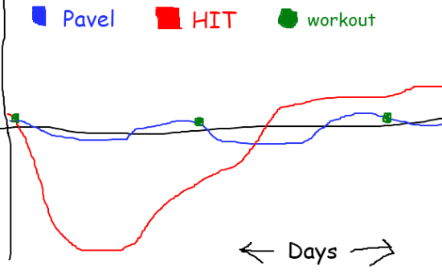

In the post [Training to Failure or Training to Quit](/2011/03/training-failure-training-quit/), I discussed the disagreement about training to failure that exists between my fitness mentors. Pavel and Arthur De Vany believe you shouldn't train to failure, whereas Dr. Doug McGuff and the rest of the High-Intensity Training community believe you should. If you haven't read the initial post, go do so now. I've now had three months to think about a way to reconcile this disagreement.

### Understanding Pavel's Motives

The target audience for Pavel is someone who needs to be at top performance at a moment's notice. He works directly with law enforcement, the military, and in-season athletes. If you are in this group, going to total failure HIT style would clearly impair your performance. Power to the People (PTP) is designed in a way to recruit strength with minimal soreness. I did it for almost 10 years and found it did exactly that. I credit Pavel for rescuing me from the high-rep, multiple set, lower weight nonsense that is peddled by most trainers. All that did was leave me sore with minimal strength gains. However, now that I've had time to think about it, I realize that I was never the target audience for his style of training. I was an office worker that wanted to gain muscle. Although I did gain muscle at first, whenever I tried to ramp us his program using the Russian Bear method, I'd injure myself.  _Power to the People! : Russian Strength Training Secrets for Every American by Pavel Tsatsouline_

### Muscle Failure

It makes sense that Pavel and De Vany would favor lifting plans that avoid going to failure. For Pavel, his clients need to be ready to fight or perform at a high level on a daily basis. De Vany is a student of evolutionary fitness and I can see how the threats of nature would need to be addressed at all times. Going to failure on a regular basis could make you more vulnerable in battles where you did not have time to recover.  _The New Evolution Diet: What Our Paleolithic Ancestors Can Teach Us about Weight Loss, Fitness, and Aging by Arthur De Vany_ The High-Intensity Training crowd is clear about taking the muscles to total failure and then allowing time to recover as the optimal method for building muscle. I've read the science and experienced it first hand. It works. However, if I had to perform at a high level on a daily basis, I wouldn't be doing this method of training. When I return from the gym, I'm toast. The next day I move in slow motion. By day three, I'm still below baseline performance. This is perfectly fine for me, as I push pixels. I would not want to train like this if I were a lifeguard. Since my goal is to gain strength and muscle and couldn't care less about day-to-day high-level performance, HIT works perfectly for me. I also couldn't care less how many pounds I deadlift or bench. More muscle is my mission. Other metrics no longer concern me.

### Neurological Failure

The real issue is determining if repeatedly going to failure sends a negative signal to the neural pathway. De Vany and Pavel believe this to be true. Repeatedly sending failure signals is a concern. Jim's [comment in the previous post](/2011/03/training-failure-training-quit/#comment-8232) got me thinking more about this.

> From my point of view, it just looks too mentally exhausting to be able to continue for a prolonged period of time (e.g., five years). For me, this would outweigh any benefits over other protocols.

Other than to state that many people have trained for years on HIT, I didn't have an answer for this concern. Then I listened to a 2009 interview between Jimmy Moore and Dr. Doug McGuff. Dr. McGuff explains the concept of going above and below the baseline. When we lift weights, our muscles breakdown and we temporarily go below the baseline as our body rebuilds the muscle. After recovery, we are stronger than before and now above baseline. Now it may take four days to get back to baseline. Instead of immediately doing another HIT workout, Dr. McGuff mentioned that he may not train his clients for a full week, so that they spend additional time above baseline. In his [interview on Conditioning Research](http://conditioningresearch.blogspot.jp/2009/03/interview-with-doug-mcguff.html), he said the same thing.

> Keep your training frequency such that you experience more days above baseline than below baseline.

To be _above baseline_ to me is a positive neurological signal of success. I think this would address the _mental exhaustion_ concern Jim had. Pavel's PTP sends the lifter below baseline for shorter, but more frequent periods. HIT combined with McGuff's extended recovery goes deeper below baseline - followed by more days above baseline.  _Body by Science: A Research Based Program to Get the Results You Want in 12 Minutes a Week by Dr. Doug McGuff and John Little_ Confession time. I am heading right back into the gym every 5th day for another HIT workout. I am clearly spending more days below baseline than above baseline. This is intentional. I am weaning myself off the volume I used to do and the novelty of HIT is still exciting to me. Also, I suspect that I'll see many of the gains from switching to this protocol in the first year. At that point, I'll scale back to once a week lifting per Dr. McGuff's advice.  _My highly artistic attempt at explaining PTP vs HIT and baseline._ ;) The above chart shows a week where the Pavel PTP lifter does 3 workouts, never to failure and the HIT lifter does one workout to failure. Both spend time above and below baseline, albeit at different intervals. The Pavel lifter never goes too far below the baseline and is ready for a high level of performance on a daily basis. The HIT lifter, who less concerned with day-to-day performance, goes well below the baseline and then (if they listen to Dr. McGuff) spends a few days above baseline before returning to the gym.

### Who is Right?

I'm here to make the peace between both sides. I think both sides are right and it just depends upon who you are and where you are at in your fitness journey as to which protocol is right for you. Because I just care about gaining muscle and have no need to demonstrate a high level of strength on daily basis, HIT is right for me. If I were in law enforcement, active military, emergency response, or an in-season athlete, I'd favor Pavel's PTP.

---

## Comments

### GWhitney
*June 24 at 2011 at 5:58 PM*

Hi MAS
Thanks for pondering these matters.
I just don't know what to say. I've been weight training off and on for about 25 years. Every protocol seems to work and yet nothing seems to work especially well. The one variable that seems to make the biggest difference is the quality and quantity of my diet. If I eat *a lot* of optimal food, I gain a lot of strength, and a modest amount of size. Something must be working because I can now leg press the maximum amount on the machine at my gym (400 lbs) with *one* leg, 12 reps. I can do that for 2 sets (both legs) and am OK to do it all over again the very next day.

---

### chuck
*June 24 at 2011 at 6:50 PM*

good stuff.  well thought out.  i can say since i optimized my diet, i maintain muscle much easier than when my diet was rich in carbs and low in fat and protein.

---

### GWhitney
*June 25 at 2011 at 9:15 AM*

I’d also like to more closely examine the whole idea of “failure.”

First at a philosophical level: “In the life of the spiritual warrior, there is no failure, only feedback.” – Carlos Castaneda

Now let’s take it a totally practical level, in sports. Imagine you’re doing interval training with 100 meter sprints, separated (for example) with 60 seconds of rest. You’re trying to do six sprints, with each sprint faster than the previous sprint.

Here are your times: 0:16.0, 0:15.0, 0:14.0, 0:13.0, 0:12.0, 0:12.5. The last sprint was 0:00.5 slower the previous sprint. But it was also 0:03.5 faster than the first sprint. Is that training to failure? 

It’s clear that in this session you are not going to go faster than 0:12.0. In my opinion, doing a sixth sprint at 0:12.5 isn’t failure; it’s training toward exhaustion. Not complete exhaustion but you can’t go any faster and it’s clear that performance is diminishing. But by going toward exhaustion, signals are being sent to the central nervous system and muscles that you need to be able to go faster.

The other thing I'd like to point out is that in the ancestral environment running very fast was likely to have been a more frequent requirement than lifting heavy things. 

There's a lot of talk in the paleo community about dragging animal carcasses around. Sure. But that's quite a bit different than the short, intense "ballistic" sort of movements you get in power lifting, Olympic lifiting and Crossfit. In the ancestral environment it was more life "endurance lifting."

---

### MAS
*June 25 at 2011 at 2:28 PM*

@GWhitney - You are making me want to take up sprinting, but then I might have to break a sweat. :) 

RE: CrossFit and ballistic movements, I discovered this yesterday. I hate to be a PubMed warrior, but this study was interesting.  

Check out this 2007 study.
Bruce-LoweFeb2007 (PDF)

“This paper reviews evidence relating to the effectiveness and safety
of explosive exercises, such as Olympic style weight lifting, other
weight training exercises performed at a fast cadence, and plyometric
exercises, that are commonly used in the strength and conditioning
training of athletes. Contrary to popular belief and the practices of
many athletes, the peer- reviewed evidence does not support the view
that such exercises are more effective than traditional, slow and
heavy weight training in enhancing muscle power and athletic
performance. In fact, such exercises do not appear to be any more
effective in this regard than weight training at a relatively slow
cadence, and some evidence suggests they are less so. Also, such
explosive exercises do not transfer well (if at all) to athletic
performance on the sports field, and present a significant injury
risk. Therefore, such exercises should not be recommended in the
strength and conditioning training of athletes, except those who need
to learn the specific skill of lifting heavy weights fast, such as
Olympic lifters and strongmen.”

---

### GWhitney
*June 25 at 2011 at 4:25 PM*

Thanks. Yes - that's my point - stay away from Crossfit and other kinds of ballistic weight training. They are not Paleo. Paleo fitness is hiking, climbing, sprinting and lifting (fairly) heavy things over long distances.

When was the last time you saw anyone carrying two 50lb dumbells across a football field non-stop? But that's Paleo!

And I insist that sprinting is the fundamental evolutionary/survival ability. We must all be the descendants of competent sprinters.

---

### MAS
*June 25 at 2011 at 7:10 PM*

@GWhitney - I am a big fan of the Farmers Walk exercise. I think it is essential for <a href="https://criticalmas.org/2009/10/weight-lifting-wisdom-for-the-tall-lanky-guy/" rel="nofollow">grip strength</a>. 

Soon I'll post on why I haven't started sprinting yet.

---

### Chuck
*June 25 at 2011 at 8:19 PM*

@gw
While hunting this past fall I helped carry 140 pound deer up a steep hill through some rough terrain.  I was able to do this without need for rest.  The 2 guys I was with who are pretty much couch potatoes had to stop every 20 steps or so.  My ground based training over the last several years entailed power cleans, deadlifts, kb swings and cleans, and sandbag work.  Probably not the optimal prep for the deer move but I definitely feel I was better prepared than I would have been doing body building isolation movements.

---

### GWhitney
*June 27 at 2011 at 8:00 AM*

Wow - that's a lot of weight for the farmer's walk! How much stronger do you think you need to get? I'd focus on speed now if I were you ;-)

---

### GWhitney
*June 27 at 2011 at 8:01 AM*

Sorry - One more thought: Usain Bolt. Do we agree that he's an ectomorph, albeit are rather impressive specimen?

---

### MAS
*June 27 at 2011 at 11:32 AM*

@GWhitney - Usain is an ectomorph. He also appears to have minimal distance between his elbow and edge of his contracted bicep, which is rare for ectomorphs. This according to Darden means he has great potential for size and strength.

---

### chuck
*June 27 at 2011 at 11:52 AM*

@gw
Speed has always been my strong point.  I was sprinter growing up and at one point was the fastest on my college football team.  Haven't actually sprinted in a while though.  I should get back on that horse while the weather coopertates.  Btw, i only had 2 legs of the deer.

---

### GWhitney
*June 27 at 2011 at 3:28 PM*

Are you sure about that ;-)

---

### Joel
*December 13 at 2012 at 2:14 AM*

I'm wondering how HIT could be performed for athletes without being sore. Perhaps push for strength and progression in the offseason, then in season workout once a week and lift a few reps short of failure and maintain strength performance throughout the season

---

### MAS
*December 13 at 2012 at 2:15 AM*

@Joel - I'm not a coach, but I think you are right. John Little did a podcast on High Intensity Nation that covers this topic with hockey players.

---

### Lawrence
*January 16 at 2015 at 10:31 PM*

Thank you for writing this article. Today, I listened to Tim Ferriss's interview with Pavel on the Tim Ferriss Show, and Tim asked Pavel for his top tips on hypertrophy and how to build lean mass. Pavel's tips were volume and eating a lot. The latter I agree with but the former flew in the face of HIT and MED (minimal effective dose), the very principles that underpinned Tim's Geek to Freak section in The 4 Hour Body on how to gain lean mass. I was surprised to hear no objection from Tim about Pavel's methods, perhaps he was just being polite, but it left me with some questions.....
I have been practicing Doug McGuff's HIT for almost 2 years and I have got some good results but I am ectomorphic so sometimes I question whether it is the best protocol, because results perhaps aren't as visible as they might be on other trainees. I decided to look into what Pavel had to say about HIT online and his arguments weren't very convincing. He seems to want to fall back on his references to successful athletes who have used the workout protocol he advocates to become successful weight lifters and power lifters. This argument falls down when you consider the selection bias and genetic superiority of these individuals, and also who is to say that they would not have done even better on a HIT protocol. Thank you for sharing your personal view and experience on both protocols, I have found it really useful.

---

