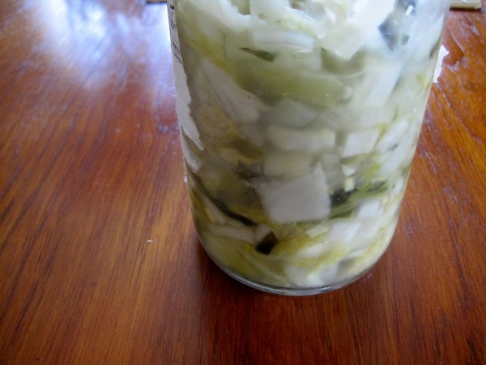

If you find kimchi is too spicy or have a food intolerance to nightshade vegetables, you will want to make your kimchi without red pepper flakes. The first time I made _White Kimchi_, I was unimpressed with the flavor. Kimchi without red pepper flakes can be rather bland. I've learned a few tricks since then. You can learn how to make kimchi from my post [Kimchi 101](/2011/03/kimchi-101/). To make _White Kimchi_, just remove the red pepper flakes. To make the _White Kimchi_ taste better, here are a few ideas.

1.  Add more ginger. This will give it the bite to overcome the blandness.
2.  Add more carrots. This is will give it a little more sweetness.
3.  Add some sugar, sliced apples or sliced pears. Doing this will accelerate the fermentation to about 2-3 days and add a little sweetness.

 _White Kimchi heavy on the ginger and without carrots. Carrots would have made it better._ Note that this recipe will not have the great flavor found in a longer sauerkraut type ferment. One of the things I really like about Napa cabbage kimchi is the short fermentation time. If you find white kimchi too bland and have 4 weeks, then I suggest making sauerkraut. My [Cortido Sauerkraut recipe](/2011/06/cortido-sauerkraut-recipe/) can just as easily be made without jalapenos and red pepper flakes.