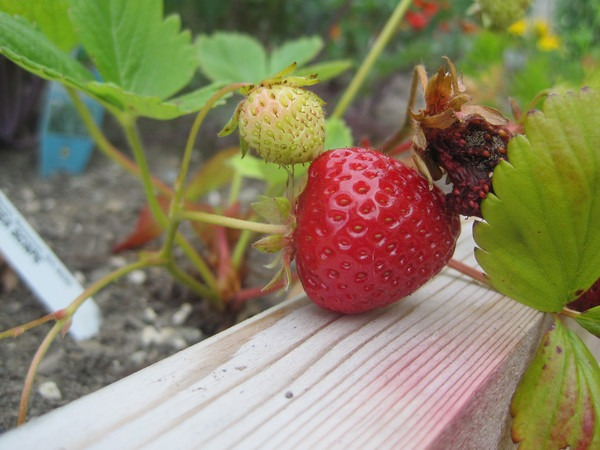

Earlier this year, I was able to get a pea-patch at my apartment complex. It is a 4 foot by 4 foot area. I'm sort of flying blind, but Mother Nature is doing her job. Stuff is growing. I ate some of the Russian Kale today and I survived. :)   

---

## Comments

### GWhitney
*July 2 at 2011 at 5:59 AM*

Congrats. Love the strawberry photo.

Glenn

---

### chuck
*July 2 at 2011 at 4:28 PM*

good for you for doing this despite having little space.  my garden is going nuts.  i have been taking a bunch of matured stuff out and now replanting. fun stuff.

btw, if your space is 4x4 you should look at square foot gardening.  my garden was chaos but it has now brought order to it while maximizing space.

---

### Rachel
*July 2 at 2011 at 6:45 PM*

The kale looks great!  I had kale when I was on the mountain two years ago.  We had so much, I couldn't eat it all.  Then large beetles took it over ):

---

