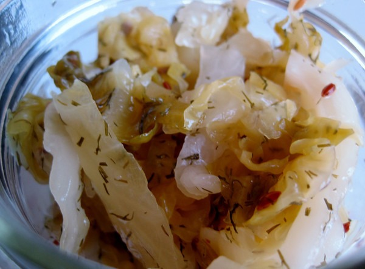
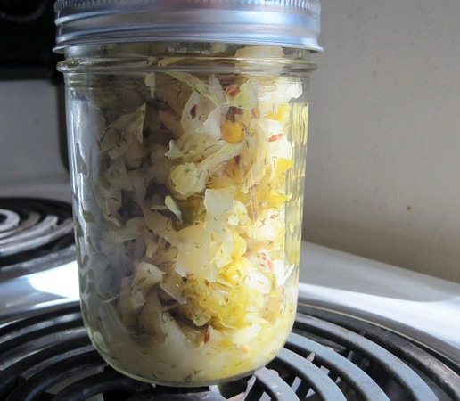

My latest vegetable ferment is a dill and caraway seed sauerkraut. Even though the standard advice is to use fresh dill, I used a spice jar of dill to see what would happen. Dill is known to be anti-microbial. I have discovered that vegetable ferments that use anti-microbial foods such as peppers, garlic and ginger ferment faster. Many sauerkrauts can take weeks to ferment. This one can be ready in 6-7 days. Maybe faster if you like it more crunchy. If you want to get started making sauerkraut and thought of waiting weeks bums you out, then this is the sauerkraut you want to make. **Dill speeds up the ferment.**  _Dill and Caraway Sauerkraut_ Here is how I made it.

### Ingredients

-   1 pound of green cabbage
-   1/2 to 2/3 tablespoon of sea salt (I use Redmond Sea Salt)
-   1/2 tablespoon of caraway seeds
-   1 to 1 1/2 tablespoons of dill

### Directions

1.  Slice the cabbage into thin ribbons.
2.  Place the cabbage into a bowl and rub in the sea salt.
3.  Let the cabbage sit for an hour or two. It will release water.
4.  Add in the spices and stir.
5.  Pack the mix tightly into your jar or jars.
6.  Make sure the veggies are below the water line. If you don't have enough water, mix a teaspoon of sea salt with a 1 cup of water. Stir to create a brine. Pour over veggies until covered.
7.  Start tasting the ferment around day 5 or 6. Because of the dill, this ferment will go faster than traditional sauerkraut. Once the ferment tastes good to you is when it is complete. I've completed this ferment in as fast as 6 days. During the summer, the ferment will go faster.
8.  Once the ferment is complete, seal the jar tight and place in the refrigerator.

### Fermentation Tips

Check on your ferment daily. You will want to push the veggies down below the water line. Another option is to get a weight. The important lesson is knowing the fermentation is anaerobic. The veggies need to be under water for the good bacteria to win the war against the bad bacteria. If you see white foam, take a spoon and scrap it out. You will also want to cover the jar with a towel or an upside down paper bag. This keeps the environment dark, which is a good thing for fermentation. Since it is unlikely that your cabbage will be exactly 1 pound, just multiply out the ingredients to meet your needs.  _Another Successful Sauerkraut!_ UPDATE APRIL 2012: This post was rewritten to reflect the anti-microbial properties of dill. I also shortened the duration of the ferment.

---

## Comments

### Ten
*July 11 at 2013 at 11:27 AM*

Did you use fresh or dried dill?

---

### MAS
*July 11 at 2013 at 1:28 PM*

@Ten - I used dried, but fresh should work as well.

---

