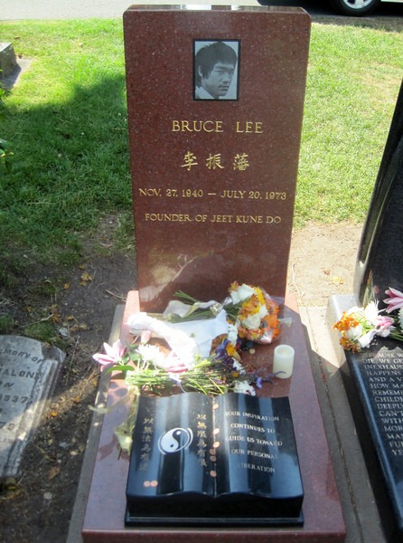

The weather has been so nice in Seattle, that I feel more like exploring than blogging. Today a few members of the [Coffee Club of Seattle](https://www.meetup.com/seattle-coffee-club/) walked over to the Lake View Cemetery and located the grave of [Bruce Lee](https://en.wikipedia.org/wiki/Bruce_Lee).   Bruce Lee's son [Brandon Lee](https://en.wikipedia.org/wiki/Brandon_Lee) is buried next to him.  If you go to [Lake View Cemetery](https://en.wikipedia.org/wiki/Lake_View_Cemetery_%28Seattle%29), the grave is at the high point of the cemetery in the center just off the road.

---

## Comments

### chuck
*July 14 at 2011 at 2:06 AM*

i am still blown away that bruce lee was known to do 50 consecutive one armed chin ups.  that is crazy.

---

