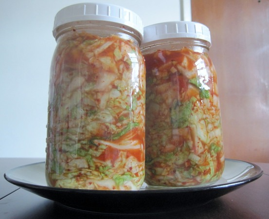

A year ago I shared some photos of food projects I was working on in the post [Nourishing Kitchen](/2010/09/nourishing-kitchen/). Here are some more.

Today I finished a Goat Bone Stock. I did it exactly like I described in my [Homemade Beef Broth](/2011/04/homemade-beef-broth/) post, except I used goat bones. This was the first stock that I took out a full 72 hours. Look at the color.

I'm also about a week into a sauerkraut that uses dill and caraway seeds.

Today I decided to take my kimchi to the next level. Instead of using nappa cabbage and/or bok choy, I used green cabbage like they do at Firefly Kitchens. This means the ferment will take closer to 3 weeks, instead of 6 days.

Also, I cooked up my first beef kidney recently. I prepared it just like I do beef liver. That means garlic, onions and thyme. It tasted OK. I prefer liver.

---

## Comments

### chuck
*July 22 at 2011 at 2:26 PM*

that is a lot of stock after 72 hours.  my first and only batch went over 24 hours and cooked way down.  i didn't end up with nearly as much as you.  it is super flavorful sometimes overpowering recipes that call for beef stock.

---

### MAS
*July 22 at 2011 at 2:34 PM*

@Chuck - One of the cool things about my electric stove is I can dial in the perfect temperature to get the minimal simmer. Although, making a concentrate does have a space saving appeal.

---

