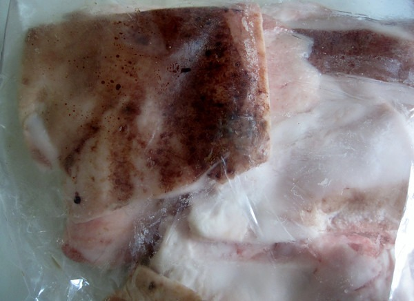
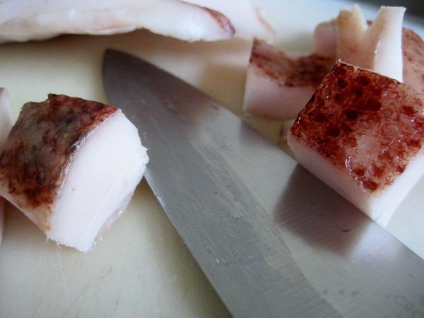
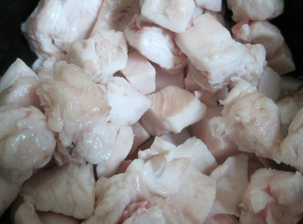
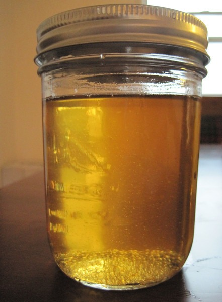

My latest kitchen project was rendering lard using my Crock Pot. Using the slow cooker allowed me to leave the house and even go to sleep while it did its magic. Note that I had hoped to be finished with my lard before bedtime, but miscalculated how long it would take.

### How to Render Lard in a Crock Pot

1.  Source some pork fat at the Farmers Market. Look for leaf lard or back fat.
2.  It will most likely be frozen, so set it out and allow it to partially thaw.
3.  Once it is soft enough to chop, cut it into little cubes.
4.  Toss cubes into Crock Pot and put it onto the Low setting.

As it heats up, the solid fat becomes liquid. Several hours later, the fat will have separated from the hardened stuff.

1.  Remove and throw out the hardened stuff.
2.  Filter the liquid lard through a cheese cloth or coffee filter and into jars.
3.  Place the jars into the refrigerator or freezer.

My one tip would be to start this project in the morning. I foolishly started it in the afternoon and then woke up twice to monitor the progress. My 2 pounds of pork fat took about 12 hours. I may have been able to speed this up by cutting the cubes smaller. Learn your Crock Pot and adjust your start time accordingly.

The 2 pounds of pork fat yielded me almost 2 full pint jars of lard.

_Pork Fat from the Farmers Market_

_Cut pork fat into cubes._

_Pork fat cubes make it into Crock Pot._

_Rendering Lard_

_Finished lard._

_After cooling, the lard will look like this._

You can also use your Crock Pot to [render beef tallow](/2011/02/rendering-beef-tallow-in-a-crock-pot/).

---

## Comments

### Nick
*July 27 at 2011 at 12:23 AM*

Man, just the fat chunks look tasty.  :-)  

Especially pork belly.  I'd just fry that up and eat it.

---

### Geoff
*July 27 at 2011 at 6:42 PM*

My favorite way to do this too.  I have used local fatback to good effect.  I don't necessarily discard the crunchies though.  They were a tasty treat at the end.  I find that I need to render the fat twice to get a full yield though - unless I drain the first rendering after about 12 hours the process really slowed to a virtual halt.  So I render some, drain and filter the fat, clean the crock pot, reload and repeat.  After round 2 I find I have rendered the fat nearly completely.  The smell of the fat rendering is amazingly good too!  I do add a little water to the fat right at the start - I think it helps the fat heat more evenly before it simmers off.

---

### MAS
*July 27 at 2011 at 7:23 PM*

@Geoff - That is a great idea. When my rendered slowed (stopped), I figured my work was done, even though the crispy pieces were larger than when I made tallow. I'm going to do your method next time.

---

### Ben
*July 28 at 2011 at 2:08 PM*

Hi Michael,
I thought no one would ever put an article on this subject. Way to Go! And about time someone did it! Kudos !!! If you need more temps, and or what crock pot setting temps are you can go to crockpotking.com &amp; go to crock pot cooking temperatures page. I always use to rack my brain on this as far as what were the temps, at different settings.
P.S.
I bookmarked your page already. Please keep it coming. Sometimes it's the simply things that knock it out of the ballpark.

---

### MAS
*July 28 at 2011 at 2:20 PM*

@Ben - Great site. Lots of great resources for us Slow Cookers.

---

### PORTOlson
*July 29 at 2011 at 3:38 AM*

Hey MAS, I just found your blog and I'm really impressed; great content.

What do you think about ghee? I'm cooking some up on my stove right now.

---

### MAS
*July 29 at 2011 at 4:11 AM*

@PORTOlson - Thanks for the compliment. I have some ghee I bought. I rarely use it, but I plan to start cooking more Indian food, so perhaps I'll start using it more.  And if that goes well, I'l probably end up making my own. :)

---

### Jill
*February 5 at 2012 at 1:29 PM*

Michael,
Don't throw out the hardened stuff!  Those are cracklings, and they are delicious.  You can add them to biscuits, or throw them on a salad, use them to flavor things or eat them straight.  Just put a little salt on them, allow them to cool and store in the fridge.
And thanks, I've rendered lard before, but I wanted to try the crock pot.
-JC

---

### MAS
*February 5 at 2012 at 5:06 PM*

@Jill C - I used to eat the cracklings. They are tasty, however I'm not sure if they are healthy. There seems to be a debate on the topic. For now, I'm erring on the side of not eating them. Or at least not eating all of them. :)

---

### Bryan
*June 19 at 2012 at 11:09 PM*

I agree that the cracklings (cracklins) are delicious. I'm sure that there are few that will eat them for whatever reason. I'm also sure that to much of a good thing may not be healthy, but that in moderation it probably is ok..  For those that say not good, do you eat (pork) bacon? Craklins are basically the same as the fat on bacon, but might be better for you because it has not been cured. I'm not saying bacon is bad, (I will always eat it) but read the label.

---

### MAS
*June 19 at 2012 at 11:15 PM*

@Bryan - Yeah I am not sure how good or bad the cracklins are. Since one only makes tallow or lard a few times a year, I'm sure it probably isn't a concern. I'm going to snack on them the next time I render.

---

### cindy
*August 7 at 2012 at 5:17 PM*

We grind our fat before rendering it. makes it cook up faster. you city people could have your meat market grind it for you.  we placed the cracklings on cookie sheets and salt and pepper them up, bake in oven(to re-warm them or make 'em crispier)...good snack, but i have seen recipes for 'crackling' soap,cookies and crackers. but they are good on salads. we also squeeze as much lard out of the cheesecloth full of cracklings before we pack the fresh  lard in empty ice cream pails and freeze.
let lard cool to a milky color, but yet pourable, before pouring into icecream pail, if lard is too hot it will melt bucket. common sense to me...but not everyone has it.

---

### Debrajoy
*January 15 at 2013 at 12:08 AM*

Lard mixed with peanut butter, cornmeal and wild birdseed is great winter food for the birds!

---

### Jim
*October 21 at 2013 at 1:44 AM*

The crock pot works great! I was forced to render some lard for friends that where visiting and the crock pot was the hero. We have a very large crock pot and 20 to 30 #s at 1 rendering gets er done. We kill 5 to 10 pigs a year and the lard is one of the prize gifts. Cooking grass fed beef in a frying pan with just a little lard is the new rage around here! thanks for sharing.

---

### T.Weeks
*January 26 at 2022 at 5:08 AM*

There always seems to be a little liquid in the bottom of mine. How do you all separate that out? It's not much (couple tsp), but If I leave it in it seems to spoil the fat faster.

---

### MAS
*January 26 at 2022 at 12:40 PM*

@T.Weeks - It has been a decade since I rendered lard, but I don't recall having that problem. Maybe someone else with more experience will leave a comment?

---

