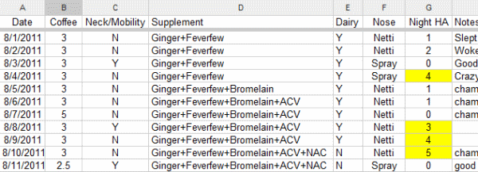

In 2008 I did something that completely changed my outlook on personal health. I embraced the idea that the way to resolve disagreements on what is best for optimal health could be addressed with self-experimentation. In the post [Intermittent Fasting - Fears and Motivation](/2009/04/intermittent-fasting-fears-and-motivations/), I discussed how I was torn between the arguments for and against fasting.

> In the end, I decided that I needed to know if Intermittent Fasting would work for me. Both sides of the IF debate knew more science and nutrition than me. Only my own tests would answer the question. If I lost muscle or strength, I could end the experiment and resume the old way.

In the past 3 years, I've learned much about what fasting levels work best for me. And it was all because I embraced self-experimentation. Self-experimentation is empowering. Instead of surrendering to experts, you take charge, because no health professional will know your body better than you. Now to be clear, I am not referring to emergencies. If I get hit by a bus, I'll go to the Emergency Room, not PubMed.

_A snapshot of data from my most recent self experiment._

During the same time I was having success with [Intermittent Fasting](https://criticalmas.org/best-of/intermittent-fasting/), I did self-experiments with [Cold Weather Training](https://criticalmas.org/best-of/cold-weather-training/) and a low carbohydrate diet. Both were successful. My health was improving and it was a direct result of my self-experiments. Later I would [cure my rosacea](/2011/04/be-your-own-dermatologist/) by eliminating wheat from my diet. Currently, I am tracking variables that may or may not be contributing to my [sinus headaches](/2011/08/hunting-headaches-take-3/).

**Every experiment is a success because even if it doesn't get you the results you expected, you've learned something new about yourself.**

In a speech titled _Self-experimentation: the best science_ at the Ancestral Health Symposium, fellow Paleo blogger [Richard Nikoley](https://freetheanimal.com/) said this about the motivation and philosophy behind self experimenting:

> ...I got to figure this out for myself. And it is a process of learning, trying, experimenting, moving on - without any authorities. There are no authorities, what there is is information.

I agree 100%. Information is too free these days. Taking charge is liberating.

---

## Comments

### chuck
*September 13 at 2011 at 1:45 PM*

You and Seth Roberts are the kings of self experimentation.  At least based on what you guys share on your blogs compared to what others share.  An experiment corrects for variables and you do an amazing job of narrowing down to just one control test item.  It takes discipline to do these kinds of self investigations.  If everything else is not equal, any result would be inconclusive.  You or Seth Roberts should have presented on this subject at AHS.  Richard is a character but I haven't read anything of his that documents rigid controls of his self experiments like you guys do.

---

### MAS
*September 13 at 2011 at 1:53 PM*

@Chuck - Thanks for the kind words. Seth has many more years of experience with self experimentation than me. He did present at AHS.

<a href="https://vimeo.com/28385995" rel="nofollow ugc">"What foods make my brain work best?" by Seth Roberts, PhD</a>

I'm currently working on an article for INeedCoffee about this topic.

---

### chuck
*September 13 at 2011 at 2:03 PM*

I know he did but he didn't post on self experimentation.  Considering he did a different topic, you should have been the guy.

---

### MAS
*September 13 at 2011 at 2:20 PM*

@Chuck - I liked Seth's presentation. Some of it was self experimentation and some included the results of others. He comes up with an interesting theories and figures them out in novel ways. 

I'm just a beginner compared to Seth. I think he has been doing this since the 1990s. 

I'm not sure how rigid my tests are. Currently I'm dairy free and coffee free. 2 major variables at the same time. All because I screwed up on the dairy and had to restart the test. I also started increasing my potassium intake. So instead of doing one variable at a time (to solve headaches), I'm stacking them now to get a result and if that result comes, I'll roll off each variable until the headaches return. That is sort of duct-tape scientific method. :)

---

