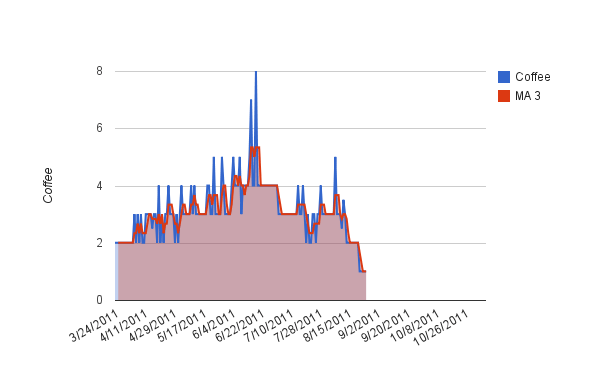

I haven't posted much this week, because I'm feeling really sluggish. I've dropped my daily coffee intake to a single espresso (double ristretto). That might not seem extreme to some, but I live in Seattle and [INeedCoffee](https://ineedcoffee.com)! Today is Day 5 of just 1 espresso. Below is a chart of my coffee intake going back to March 24th. For fun I added a 3 Day Moving Average.  In other news, I messed up on my [30 Day No Dairy Experiment](/2011/08/hunting-headaches-take-3/). I bought some dark chocolate on sale, and I didn't realize until a week later that one of the bars had milk fat. Then Sunday I was out with friends and I ordered a gyro salad without thinking that it had feta cheese on it. So I had to restart the clock on that experiment too. Today is also day 5 with no dairy. No dairy and low caffeine, besides making me sluggish, is giving me sugar cravings. I've made [almond butter cookies](/2022/03/grain-free-and-dairy-free-almond-butter-cookies-recipe/) three times this week.

---

## Comments

### Txomin
*August 27 at 2011 at 2:15 AM*

I commented earlier that coffee was the source of my headaches (and other maladies). I want to point out that, in my case, the problem was the addiction to coffee not the drinking of a given cup of it. I had to eliminate coffee entirely for months before I was home free. You see, once I stopped drinking coffee, I started suffering from additional ill effects due to the withdrawal symptoms. Unlike regular foodstuffs, coffee is a drug and therefore requires a different window of experimentation.

Hope it helps. Best of luck.

---

### MAS
*August 27 at 2011 at 3:31 AM*

@Txomin - If it takes "months" for me, I will have to leave Seattle. There is too much temptation here. I'd be like trying to overcome a slot machine addiction while living in Vegas.

---

### Mike
*August 27 at 2011 at 3:45 AM*

Have you tried a 12 step program?

---

### Mark
*August 27 at 2011 at 12:21 PM*

Michael,

I love your blog.

I have been a long-time caffeine addict, so I know how you feel. To get some ideas on how to improve your energy level, check out the sleep experiment that I did. I was surprised at how much it improved my energy level, my mood, my focus, and the clarity of my thinking:
http://web.archive.org/web/[phone removed]0811/http://www.experimentalliving.com:80/the-sleep-experiment/

I never went below two regular coffees, but that was fine as long as I made the two coffee maximum a "must." This worked great until I aggravated my lower back really badly, which made sleep extremely difficult. Because I was so tired, my will was weak and I went back to my old habits.

I just started up another sleep experiment on Monday, which is extremely similar to the old one with a few minor tweaks. I'm already feeling a lot more energy. I will be doing more blogging on my Experimental Living blog now that my energy is returning. I'm back to doing experiments and self-tracking several variables.

---

### GWhitney
*August 27 at 2011 at 12:28 PM*

I feel your pain... I'm still recommending substituting coffee with 100% cocoa - no sugar, no milk. You still get quite a lot of caffeine from the cocoa but somehow it is of a "mellower" variety.

---

### Geoff
*August 27 at 2011 at 12:53 PM*

Double ristretto is a strong call at the espresso bar!  How does the caffeine content of your "usual" compare to a standard single shot?

---

### Marian
*August 27 at 2011 at 1:49 PM*

Caffeine has a major effect on dopamine levels (so does sugar, hence the cookies).   Have you tried supplements?  Ginseng and L-tyrosine are supposed to help with the withdrawals. I'll second Txomin though.  I gave up caffeine once and it was the longest 6 months of my life!  Relief only came when I fell off the wagon.  Most people think of caffeine withdrawal as headaches and maybe being cranky, but I lost ALL energy and probably 40 points of IQ.  I still think some clever person should market a caffeine patch.

---

### MAS
*August 27 at 2011 at 3:41 PM*

@GWhitney - I got some cocoa. I've been mixing it in the evening with coconut milk. Since I often skip breakfast for fasting reasons, I haven't incorporated it as a morning beverage.

@Geoff - Provided that the shots are pulled short, espresso has less caffeine than brewed coffee. A short espresso is sweet in taste. Longer shots get bitter due to the caffeine making it out of the puck and into the drink. At least that is what I learned from David Schomor's book. Personal experience also confirms this.  

@Marian - I took some L-tyrosine yesterday afternoon. Because I am doing the gradual detox, I don't get headaches, just sluggish. The good news is I detoxed this way last summer and the results were far more lasting than any cold turkey approach. The sweet tooth might be more a result of not being able to eat dairy and dealing with evening hunger. I'm also eating a lot of almond butter. 

@Mark - Thanks. Your blog looks really cool. I am adding it to my reading list. I like your idea of measuring sleep quality. I had been considering adding that to the spreadsheet. Last year, my mood dropped when I combined low caffeine levels with short days. Seattle has some very short winter days. I think this explains one reason why the coffee scene here took off. There is no way I could initiate a caffeine detox during a Seattle winter.

---

### Mark
*August 27 at 2011 at 4:23 PM*

I forgot to mention that I bought a Zeo a few days ago. It's too early to make a judgment on it. It seems pretty cool, but I'm not sure I buy into the sleep score that it comes up with. It seems to be telling me that the quality of my sleep is better than I think that it is. However, it is pretty cool that it tells me the number of times I wake up during the night and the amount of time that I'm awake, in REM sleep, in light sleep, and in deep sleep. I think that this will be helpful for future experimentation.

---

### MAS
*August 27 at 2011 at 4:38 PM*

@Mark - One of my concerns about tracking so much data is that at a certain point the stress of collecting and analyzing that much data could influence the results you are trying to measure. 

I hope you post about the Zeo on your site and what you learned by using it.

---

### Txomin
*August 28 at 2011 at 2:51 AM*

Yep, it took 6 months for me too, Marian. It's tough but it is coffee, not meth. Sure, coffee is a drug but it is very important to keep things in perspective.

Besides, I would like to add that, now that I'm off the 24/7 adrenaline trip, I enjoy my two cups a month far more than any amount of coffee ever before. It cannot be any other way since, ultimately, I was just an addict fighting off the monkey while using self-deceit to justify a clearly abnormal behavior.

Just by reading the post, it is clear that the problem is one of addiction. Is it acceptable to surrender to a situation where feeling normal (energy-wise, etc) is dependent upon the use of a chemical substance?

Stay strong, my friend.

---

### GWhitney
*August 30 at 2011 at 10:34 AM*

Just a speculative thought - mixing the (raw) cocoa powder with any kind of milk might slow down or otherwise blunt the release of caffeine/theobromine.

Can I suggest you try a simple concoction of two cups of water (hot, tepid or cold) with two tablespoons of raw cacao powder? That's probably the best way to replace coffee...

---

### MAS
*August 30 at 2011 at 4:40 PM*

@GWhitney - I'll give that a try later today. Right now I am dealing not with caffeine withdrawal, but a drop in mood. I'll keep riding it out.

---

