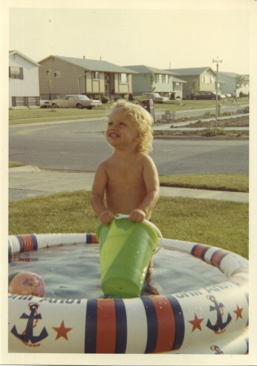

The photo below is me at 18 months. If you look behind my head, you can see a mailbox. A few summers later me and some neighbor kids would put handfuls of gravel into it. I think we did everyday for a week. Then the post office removed the mailbox from our street. I wonder if the adults ever knew the reason why. :)

---

## Comments

### Marian
*August 9 at 2011 at 3:21 PM*

One time I tried to poison my parents by putting shampoo in their Listerine

---

### MAS
*August 9 at 2011 at 3:23 PM*

@Marina - Ha! Not exactly the perfect crime.

---

### Sheila
*August 10 at 2011 at 12:44 AM*

too cute!

---

### GWhitney
*August 12 at 2011 at 1:58 PM*

Not great deadlifting form though... chin should be down ;-)

---

