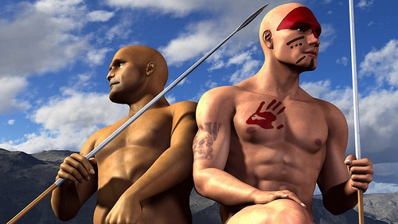

My dietary tweaking over the past three years has led me to _discover_ what many others in the elite fitness community have already discovered. That is the superiority of a cyclical approach to fitness and nutrition. Eating the same number of meals and calories a day in and day out at the same time is too command and control. Nature isn't like that. Paleo man knew all about cyclical nutrition and fitness.

### Paleo Man

Paleo man is hungry and the area he is at has no food. So he travels to a new area. No _Cliff Bar_ or smoothie. He is motivated by hunger and the reality that if he doesn't acquire food, he will die. It is OK that he doesn't have a fanny pack full of snacks. He has something better: body fat. In the absence of glucose, his insulin levels drop and his body becomes efficient at accessing stored fat. To preserve muscle, his growth hormone levels increase.  _Hunters by Brain Wright_ Paleo man comes across an animal and engages in the hunt. He uses high bursts of energy and strength to capture his meal. Note that he didn't jog up to the animal using some nonsensical target heart rate and he didn't stand one-legged on a Bosu Ball during the hunt. Paleo man, like any other mammal keen on survival, starts eating the animal's organ meat first because that is where the most nutrients are. Then he goes for the fatty cuts of meat. Lean meat might be left for the buzzards. Now Paleo Man is full—time to rest and relax. No spin class is needed for him to keep his cardio edge. That is energy foolish and could bring him closer to starvation. It wouldn't be until the late 1960s that men would get duped into believing we need _cardio_ for a healthy heart. And then it would be a few decades more before science would show that [cardiovascular training is a myth](/2011/01/the-myth-of-cardiovascular-training/).

### Modern MAS

Back to the present. A few months ago, I began a TKD (targeted ketogenic diet). On the day before I went to the gym to lift weights, I would engage in [Intermittent Fasting](https://criticalmas.org/best-of/intermittent-fasting/) and low-carb dieting. I put myself into a ketogenic state. The next day, I would enter the gym in a fasted state\* and "engage in battle". Unlike Paleo man, when I demonstrate strength I can control for safety and work specifically with machines based upon human biomechanics. For 10-15 minutes, I do an all-out [High Intensity Training](/2011/02/high-intensity-training-at-ideal-exercise-of-seattle/) workout. One set to failure for about 5-7 exercises. _\* These days I supplement with BCAA._ Then I eat. I eat a lot. Protein, carbs, and fat. I am pulling myself out of ketosis and fueling the anabolic process. Then I rest. I won't return to the gym for another 5-7 days. Sure I will go for walks or 2-3 very short sprints, but anything more would be energy foolish and send the wrong hormonal signals to my body. Doing _cardio_ is ridiculous as it is highly inflammatory, suppresses your immune system, catabolizes muscle, and reduces your insulin sensitivity. Between workouts, I vary my food intake. Some days I eat more and some less. Some days are low carb and some are moderate. I may skip breakfast or not. Like Paleo man, my food intake is not predictable. There is never a point in the week, where I have to eat. My body has become hyper-efficient at regulating my energy levels. No sugar crashes or naps are needed.

### My Results

I started this cyclical approach a few months ago. It is freakishly effective. My metabolism is rocking fast. I exercise far less than I used to and I eat more. By removing the big 4 toxins (sugar, wheat, soy, and vegetable oils) and adjusting my nutrient intake and timing, I am in the best shape of my life. **UPDATE September 2012:** I no longer feel BCAA is needed for fasted training. See [Thinking About Supplements – 2012 Edition](/2012/07/thinking-about-supplements-2012-edition/) for an explanation. **UPDATE December 2012:** I no longer consider sugar to be a big toxin. I've become a big fan of [ice cream](/2012/07/why-ice-cream-is-better-than-protein-powder/).

---

## Comments

### chuck
*August 5 at 2011 at 8:56 PM*

excellent illustration of structuring a life without structure.  often the health conscious types also happen to be the type A's who have to really back off the regimen.

---

### GWhitney
*August 6 at 2011 at 5:49 AM*

"In God we trust... All others must show their data!"

---

### Geoff
*August 6 at 2011 at 10:12 AM*

I like it!  DeVany-esque indeed.  Quick question: does this approach augment your "Seasonal Strategies" approach to diet and fitness or did it supersede it?

---

### MAS
*August 6 at 2011 at 2:30 PM*

@Geoff - I am very much a mentor of De Vany. I think there is a lot of value in the Seasonal Approach as one tries to achieve health. However, it tends to be odd in a modern world with endless supplies of food and lighting. 

Micro-cycles like this may be the answer. Right now my cycle has just 1 "winter" day. If I were overweight, I might adjust it so the cycle had just 1 "summer" day. And then you can adjust the remaining days based upon either the true season, your activity level or modern life obligations.

---

### Geoff
*August 7 at 2011 at 12:35 AM*

@MAS - Thanks much for the response.  I like the idea of varying virtual seasons based on modern environmental condtions...except for the fact that that means I have a long "winter" ahead of me.  Truthfully I'll be following your "Seasonal Strategies" for the next 12 months.  After a year we'll see if this fits with where my life's moved.

DeVany is really inspiring.  Healthy and full of life in his "golden years" he's showing no signs of slowing down.

---

### thomas
*August 8 at 2011 at 3:32 AM*

Have lean is your stomach area? Do you have fat around the side of your waist?  No matter how little or how much I eat/exercise can't seem to lose my gut! I feel like I need to go on "Survivor" just to lose weight.

---

### MAS
*August 8 at 2011 at 3:34 AM*

@Thomas - Have you experimented with Intermittent Fasting?  And are you sugar and grain free?

---

### thomas
*August 8 at 2011 at 4:52 AM*

I don't eat a lot period so no intermittent fasting routine.  Not sugar nor grain free either, mostly I eat pretty healthy but get frustrated about my lack of abs and then eat cake and donuts.  I guess I gotta watch that.  Thanks for the heads up.

---

### GWhitney
*August 8 at 2011 at 7:51 AM*

What I mean is how are you guys tracking progres? How somebody thinks he "looks" and/or "feels" is far too subjective...

Art De Vany has been inspiring but for an economist, he's pretty light on data. 

The other thing to keep in mind if you are following the De Vany-Sisson path is:

1- First be an elite athlete in your 20s
2- Continue to work out intensely in your 30s, including resistance
3- Keep working out intensely in your 40s and eat very cleanly and carefully for at least 10 years
- Then follow their guideliness to a T...

Don't skip Step 1. Oh, it's too late for you for Step 1? (Me too!) Then maybe re-think who you choose to be your N=1 guru... 

Glenn

---

### Txomin
*August 8 at 2011 at 2:03 PM*

@GWhitney

I don't feel right about this but please take a look at my blog. I am in my forties and have never been an athlete of any kind. I am about three months into a paleo diet plus HIT protocol. I have posted some data. The results are real. I will not say that this approach is the only one. I will say, however, that this approach works.

---

### MAS
*August 8 at 2011 at 2:41 PM*

@Txomin - I believe what GWhitney is talking about maximizing success probabilities. Having been an elite athlete in your 20s is a great predictor of future health. That doesn't mean having great health in your 40s isn't possible without that background, it just means you haven't exhibited the survivorship bias that the elite athlete has. My belief is this has to do not as much with raw perseverance, but superior recoverability skills.

---

### GWhitney
*August 8 at 2011 at 3:05 PM*

Yes, that's right MAS. And I also mean that De Vany and Sisson have been able to build and sustain their fitness levels on a very strong base of lots of dense muscle fibers and (probably) fairly high metabolic rates.

---

### Txomin
*August 9 at 2011 at 2:13 AM*

I understand. My apologies.

---

### GWhitney
*August 9 at 2011 at 12:06 PM*

I agree with MAS that superior capacity to recover from intense training is hugely important to attain elite athletic performance. Some athletes in their teens and 20s can recover despite suboptimal diets. IMHO - athletes over the age of about 35 absolutely need an optimal diet (pure paleo, good balance of macro nutrients) to recover from intense training. Plus 7-9 hours of highy quality sleep!

---

### Chris
*August 9 at 2011 at 8:18 PM*

MAS,

I have been really enjoying your blog since I found it back in April, thanks so much for all of the great content &amp; insight

I got the DeVany book a few months ago.  I agree with a lot of what he says and then other things in the book.... I think are way off.

I was a serious athlete from a young age up until university &amp; music school when my career in the music world took things in a different direction.  It was amazing to be able to live my dreams, but the constant travel &amp; copious amounts of work meant no time to train/play.  

Now, at 33, I have spent the last few years committed to making time for training/play again.  Luckily, I have stayed fit &amp; lean.....and have always eaten very well, always focusing on eating a lot of good fats, whole foods, a la Nourishing Traditions, etc. 

In addition to some other sports and yoga, I recently started road biking.  Some of my rides are pretty long distance, but I ride hard and make sure to mix uphill, sprints and leisurely stretches. 

Long winded way of asking...... do you think road biking is more productive or counterproductive for my fitness?

I do it mainly because I love riding and seeing the city + the countryside and I certainly don't do it for a cardio workout....but is it too close to cardio and potentially harmful?

any thoughts?

Chris

---

### MAS
*August 9 at 2011 at 8:32 PM*

@Chris - On Robb Wolf's podcast today Mark Sisson said that even though he competed in over 200 endurance events, he never had "fun" doing it. Mark also talks about the importance of "play". That is where the outcome doesn't influence how we feel about the activity.  It sounds like you are having fun biking, so as long as that is true, I'd keep doing it. 

<a href="https://robbwolf.com/2011/08/09/the-paleo-solution-episode-92/" rel="nofollow">Episode 92 - Robb Wolf</a>

---

### Jeanmarie
*December 20 at 2011 at 3:32 AM*

Looks terrific!

---

### Morgan
*July 17 at 2012 at 7:55 PM*

Great article! I plan to change my sprint intervals routine to mirror the ice cream truck's route through the neighborhood. :) It's a win-win.

---

### MAS
*July 17 at 2012 at 8:12 PM*

@Morgan - HA! I love your comment.

---

### JP
*January 1 at 2013 at 7:33 PM*

Any thoughts on high vs. low GI carbs on the big meal PWO?

---

### MAS
*January 2 at 2013 at 12:57 AM*

@JP - I haven't looked into the high vs low GI carb debate. I tend to crave those that are more on the high side after exercise.

---

### JP
*January 2 at 2013 at 2:27 AM*

Thanks, Michael.  Just started this approach (PWO refeeds) for the last several weeks.  I've been doing the BBS workouts for the last couple of years.  The main carb I crave is rice and I've been using Basmati rice for the refeed.  Basmati is probably the lowest GI white rice.  I plan to give Jasmine, which is the highest GI and GL of the rice varieties, a try next week.

---

