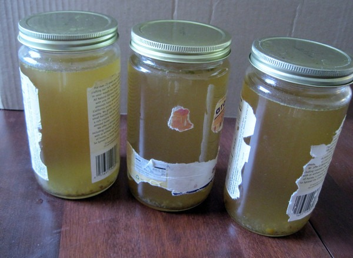

My latest kitchen project came from an idea I read in the comments the [Beef Stock post](http://web.archive.org/web/20150414000007/http://www.cheeseslave.com/beef-stock/) over at brilliantly named blog _CheeseSlave_. I'd had already been making beef stock for a while now, when I read this from commenter _riceinmay_.

> Ouch! My heart hurt when I saw you throw those bones away!!!!! Did you know you can use them more than once? I use mine 3 times. The second and third time its called a remouillage (its french for rewetting). Anyways- the stock isnt as strong- or as gelatinous. Its still flavorful, and a great way to get extra broth and nutrients from that original investment of bones!

Yesterday I completed another batch of [bone stock](/2011/04/homemade-beef-broth/), which I took out 48 hours. After I finished jarring everything, I decided to take the advice of _riceinmay_ and make remouillage. I took mine about 16 hours, although there are recipes online that say you can go a short as 4 hours.

The verdict? As _riceinmay_ stated it was not as gelatinous as the original stock. However, it did have an excellent flavor. I drank a full glass of it this morning for breakfast. No _Jamba Juice_ for me!

_Goat Bone Stock Remouillage_