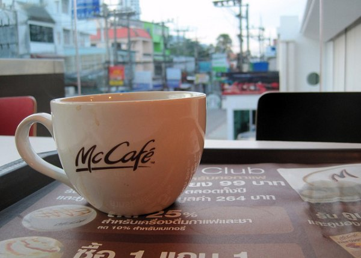
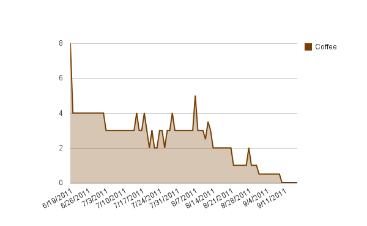

Well, I have done the unthinkable. Today is Day 7 with no coffee. Yes I am drinking decaf and yes I understand that it does have trace amounts of caffeine in it. I'm shocked at the number of people who have brought that to my attention. Cut me a little slack, I may know [something about coffee](https://ineedcoffee.com/by/michael-allen-smith/). I started drinking coffee on a regular basis when I was probably around 19 years old. I pretty much haven't missed a day since then. Even during my [2006 trip to South America](/2006/08/rio-to-buenos-aires-overview/) and my [2009 trip to Southeast Asia](/2010/01/planes-trains-and-elephants-my-2009-asia-trip-overview/), I still managed to find coffee. In 1997, I went 100 hours without any caffeine. It was a miserable experience and in the end served no purpose, as I resumed high coffee intake within a week of that detox.  _My coffee addiction had me [drinking multiple $3 Americanos](https://ineedcoffee.com/sleepy-starbucks-and-caffeinated-sins-in-phuket-thailand/) at McDonald's in Thailand._ I am a strong believer in gradually lowering your coffee levels and establishing what I call a "new normal". So if I drop from 4 espressos a day to 3 espressos a day, I will stay there until everything feels normal. That might take a few days or a few weeks. By normal, I am not talking just about physical symptoms, but psychological ones too. Last summer I got down to a single espresso a day, before depression set in and I resumed a higher level of espresso intake. This year I decided to blast through that plateau. After 9 days of just a single espresso, I reduced my level to 1/2 espresso. I [roast my own coffee](https://ineedcoffee.com/coffee-blending-for-the-home-roaster/) and was able to construct a "half-caf" blend. For another 9 days I did the "half-caf". At each point, I stayed at that level until a "new normal" was established. I have no timelines, so I can take as long as I need.  _Daily coffee intake since June 19, 2011._

### Detox Results?

Besides saving some money, the one effect is that I have been able to nap. No matter how early I wake up or how tired I get, I have always had trouble taking naps. My mind races and I can't fall asleep. Since I've gone from 1/2 espresso to none, I've been able to nap successfully. What about headaches? Too soon to tell, but September has been better than August, which was better than July. I am also doing a 30 Day No Dairy test (I'm on day 26). I've increased my Neti pot usage and recently increased my potassium intake. So I have lots of things going on. I hesitate to get excited, but my sleep has gotten deeper and that is a good thing. Before I get hammered with criticism and feedback on my methodology, my plan was never to do a dairy and caffeine test at the same time. I screwed up twice on the dairy and had to restart the test. Don't worry, I have a plan to figure out the guilty party or parties if and when I solve this riddle. I'm not going to be posting anymore on the headaches until I have more concrete answers. It was a mistake of me to share this health issue publicly. Let's get back to the coffee discussion.

### End Game?

I have no plans on when I am going to end the coffee detox. At this point I can see extending it into October. My adrenals have been pushed by coffee on a daily basis for many years now. Will I go as far as eliminating all caffeine, including tea and chocolate? Probably. I'll keep you posted if I do. When I do return to espresso, I plan to have a more healthy relationship with my favorite beverage. Maybe take a day off every week or a week off every few months. Perhaps interject the randomness that has worked so well for me with [Intermittent Fasting](https://criticalmas.org/best-of/intermittent-fasting/). This is uncharted territory.

---

## Comments

### Txomin
*September 17 at 2011 at 1:43 PM*

Congrats are in order, my friend. I know it is difficult and I know that most people do not understand that. Nonetheless, it is worth the effort.

On the subject of sprinting, I've just read this:

"Is sprint exercise a leptin signaling mimetic"
http://conditioningresearch.blogspot.jp/2011/09/is-sprint-exercise-leptin-signaling.html

---

### Marian
*September 17 at 2011 at 3:57 PM*

Brave, brave man...although I selfishly look forward to you coming back to the "dark side."  Is it possible to roast good decaf beans?  Is the lack of good decaf at cafes just because of lack of demand?

---

### MAS
*September 17 at 2011 at 4:14 PM*

@Marian - Decaf beans break down immediately after roasting. So they have a much shorter shelf life. Depending upon the roast schedule, the beans could be very good or stale. Decaf is never excellent or outstanding. Coava Coffee in PDX has come the closest to decaf perfection. Others are getting better.

---

### GWhitney
*September 18 at 2011 at 6:11 AM*

Forza MAS!

---

### Angelo
*September 18 at 2011 at 9:21 PM*

Do you have any thoughts on Yerba Mate? Did a quick search to see if you'd written about it in the past, but I didn't find anything.  I'm replacing coffee with Yerba Mate for 30 days to see if I notice a difference.

I've often thought rotating through black, green and white teas, coffee, and other traditional beverages like Yerba Mate would be interesting, and quite possibly beneficial.  I would also work in bone broth, kombucha, and beet kvass.

Very curious to see how this progresses for you.  As it stands, I'm skeptical that giving up caffeine will improve quality of life or extend ones life. But definitely open to being wrong.

---

### thomas
*September 19 at 2011 at 12:23 AM*

Oddly enough. I quit drinking coffee last week too.  Had an espresso as my final drink.  Someone told me that my teeth were hideously yellow over the summer and I told myself to quit after labor day.  Coffee stains are apparently very hard to white out and it is not something I would have noticed myself.

---

### MAS
*September 19 at 2011 at 1:37 AM*

@Angelo - I've had Yerba Mate before, but never thought it tasted that good. Kind of a boring beverage to me. I am a big fan of quality tea though. 

I am giving up coffee for now, mostly to see if it helps with my headaches. Also it may fix any adrenal fatigue issues that I may or may not have. It is a topic I know little about. Also there is that cortisol issue. Does removing coffee impact body comp.? All questions I hope to find out. 

@thomas - Reminds me of something I posted on INeedCoffee.  <a href="https://ineedcoffee.com/no-coffee-or-tea-for-at-least-2-weeks/" rel="nofollow">No Coffee or Tea For At Least 2 Weeks</a>.

---

