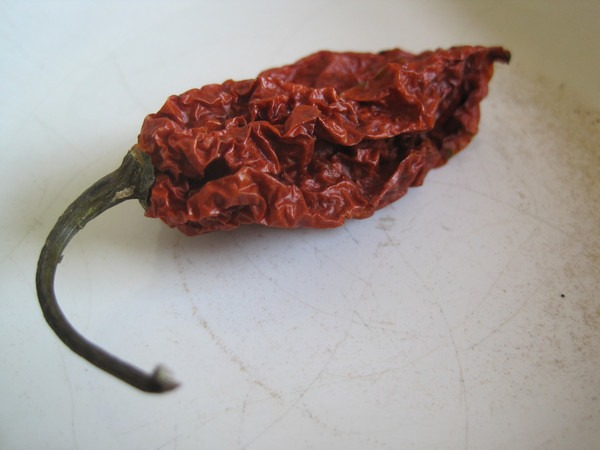

Are you ready for a sauerkraut with some heat? If you fear spicy, you can stop reading now. The Bhut Jolokia chili pepper is also called Ghost Pepper. How hot is it? According to the [Wikipedia](https://en.wikipedia.org/wiki/Bhut_Jolokia_chili_pepper), it is 401.5 times hotter than Tabasco sauce. It is so hot that India announced plans to use this pepper in non-lethal hand grenades to deal with terrorists. In the words of Paris Hilton, "That's hot".

It was pure curiosity that possessed me to try to use it in a fermentation. I'm glad I did, because it turned out great. **It has a strong heat on the front end with a fruity finish.** Although it is hot, the heat doesn't linger like a habanero pepper. It hits, quits and then ends with a sweet finish.

Below is a recipe for this sauerkraut. Pay attention to the safety issues regarding handling hot peppers.

### Ingredients

-   2 pounds of green cabbage
-   1 - 1.5 tablespoons of sea salt (I use Redmond Sea Salt)
-   1 ghost pepper (you can start by using 1/2 pepper or if you really want heat - use 2 peppers)

### Prepare the Cabbage Fermentation

1.  Slice the cabbage into ribbons.
2.  Mix the sea salt into the cabbage.
3.  Rub the sea salt into the cabbage by hand.

### Prepare the Ghost Pepper

Before we start, it is important that you not touch the ghost pepper with your hands. Use plastic gloves. It isn't that the pepper will burn your hands. It is to protect you, should you accidentally rub your eye or mouth after handling the pepper.

1.  The pepper is dried and will need to be reconstituted. Place the pepper in a bowl and pour warm water over it. In the photo above, I am holding the pepper under the water using a spoon.
2.  While wearing your gloves, cut off the stem. Slice open the pepper and remove the seeds.
3.  Dice the pepper into very small pieces.
4.  Put the peppers into the cabbage mix and stir. It is important that you've already rubbed in the sea salt prior to this step. Do not try and rub in the sea salt after adding the ghost pepper pieces.

### Waiting and Jarring

Now we allow time for the cabbage to release its water. This takes about an hour or two. Once this happens, it is time to pack the cabbage mix into jars. Again, because of the ghost pepper you should be wearing gloves. Pack the jars tight. You want all the veggies below the liquid line. If you don't have enough liquid to keep the veggies under water, make a brine. Mix 1 teaspoon sea salt with water, stir and slowly pour over the veggies until the cabbage is submerged.

### Fermentation

This fermentation took about 3 weeks during the summer. It most likely will take an additional week or two during the winter. During the ferment, either use a weight to keep the veggies submerged or do like I do. Every day, I remove the loosely fitted lid on the jar and push down on the veggies. Bubbles will rise, mostly in the first week. This is a good thing, as it means the ferment is working.

To judge when the ferment is done, just taste it. It shouldn't be too crunchy. Once it gets as soft as you like it, then seal up the jar and place into the refrigerator to end the fermentation.

_This is 2 days into my latest batch of Ghost Pepper Sauerkraut._

Hope you enjoy the ghost pepper sauerkraut as much as I did.

---

## Comments

### chuck
*September 6 at 2011 at 2:23 PM*

i remember hearing of an indian woman who has the world record for eating 51 of those peppers in 2 minutes.  i can't imagine her visits to the bathroom after that feat were too pleasant.

http://www.telegraph.co.uk/news/worldnews/asia/india/5139845/Woman-rubs-chilli-pepper-seeds-in-her-eyes-after-setting-new-world-record.html

---

### MAS
*September 6 at 2011 at 2:26 PM*

@Chuck - Wow. I don't think I could be in a relationship with her.

---

