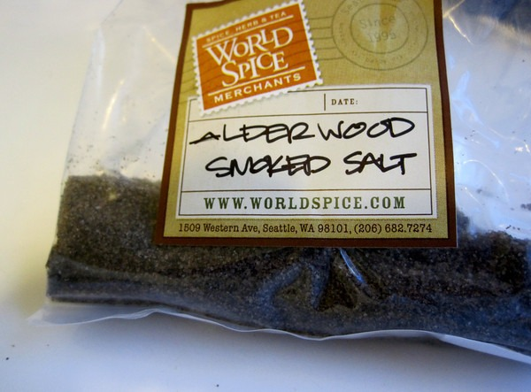
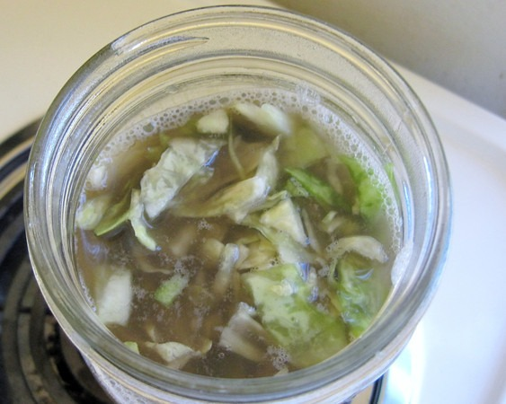

They all can't be winners. After successfully reverse engineering Firefly's [Cortido Sauerkraut](/2011/06/cortido-sauerkraut-recipe/) on the first try and my amazing [Ghost Pepper Sauerkraut](/2011/09/ghost-pepper-sauerkraut/) invention, I was on a fermentation hot streak. Even my [Dill Sauerkraut](/2011/07/dill-and-caraway-sauerkraut/) was pretty good and my green cabbage kimchi also was amazing. But I did have one dud.

This summer I bought some Alderwood Smoked sea salt. My goal was to make a sauerkraut with a nice smokey flavor. On my first attempt, the conclusion was it needed more smokiness. So for the second batch, instead of using a 50% Redmond and 50% Alderwood sea salt mix, I used 100% smoked alderwood. The result was underwhelming. It had the smokiness, but it didn't taste that good. Not bad. Bland.

_Even the darkness from the salt made the sauerkraut visually unappealing._

If you used a search engine to seek out a recipe for smoked sauerkraut and you found this page, my advice is don't waste 1-2 months of your life attempting this ferment. There are much [better fermentation ideas](/tag/fermentation/) you can do.

---

## Comments

### Sheila
*October 12 at 2011 at 4:58 PM*

You really got me on a sauerkraut kick!  I was already interested in fermented foods via kombucha.  I bought some raw organic sauerkraut at my health food store, it was so good.  Although it smelled kind of bad, it tasted good.  I like how low calorie it is and the fact that you still can go into ketosis.  The label said zero sugars!

---

### MAS
*October 12 at 2011 at 5:01 PM*

@Sheila - Combine that with the fact I almost never get sick anymore and those times I do get sick, the duration and intensity is far less. Fermented veggies are amazing.

---

