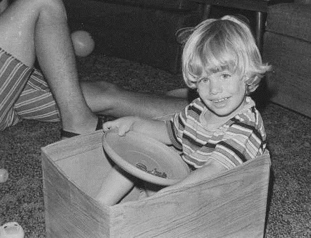

I'm long overdue when it comes to setting new health goals. My [last list](/2011/10/reviewing-my-2009-health-goals/) was made 2.5 years ago. Before I list my new goals, let me share my current health state. I am lean, my skin is clear and I have healthy digestion. For my age and somatype, my strength is good and so is my mobility. Other than my sinus headaches, I do not have any pressing health problems.

### #1 Solve My Headaches

I've posted a few times on how I often get sinus headaches late at night that wake me up. I've done many tests so far to track down the cause, but have not been successful so far. You can read my posts and the comments on _Hunting Headaches_ ([1](/2011/07/hunting-headaches/),[2](/2011/07/hunting-headaches-take-2/),[3](/2011/08/hunting-headaches-take-3/)) and [Trying Acupuncture](/2011/10/trying-acupuncture/) for a background on what I've tried so far. I have more tests planned and _may_ have found a [correlation with headache intensity](/2011/10/slicing-the-coffee-data/) and the timing of my last espresso of the day.

### #2 Stress Reduction

I've always had trouble understanding stress. When asked if I am stressed, I'm never sure what the answer is. _Stress compared to what and to whom?_ How I deal with stress may be different than others and vary on a continual basis. I don't know how to quantify stress to determine if it is or isn't a problem. Thinking about quantifying and dealing with stress has always been in itself stressful. Two things recently have made me think that starting a stress reduction program may be beneficial to me. First is the idea that it may be connected to my headaches. The second came from super trainer [Keith Norris](http://ancestralmomentum.com/) when he appeared on the Latest in Paleo podcast. My question for Keith was about being able to predict the ability of a particular body to recover from an intense workout. I was wondering about sex, age, training age, and somatype, but Keith provided an angle I hadn't considered, which is stress. Stress could be the limiting factor in how well a body recovers from exercise. Since that show, I have been thinking about this idea. The two periods where my fitness level tanked were during the dot-com days after moving to the Washington DC area and when I was trying to sell my house in San Diego. Both were highly stressful situations and I lost strength both times. Interesting.

### #3 Dialing in Optimal Coffee Level

Although I did [learn some things during my coffee detox](/2011/09/what-i-learned-during-my-coffee-detox/), there is a lot more I need to figure out. Am I consuming too much? Do I have some form of adrenal fatigue? Is the caffeine addiction covering up a possible nutrient deficiency? How does coffee affect the depth and quality of my sleep? To what level is coffee increasing my stress levels (cortisol)? I have a lot of questions that I need to answer.

### #4 More Varied Movement

The more I restrict my movement, the worse I feel. Since I live in the modern world and push pixels all day, I need to figure out a way to incorporate more varied movements in my life. I don't have a sport or kids to play with, so this will be a challenge to make part of a daily habit.  _Back when my movement was more varied._

### #5 Improve Posture and Alignment

Because I sit at a desk a lot, my shoulders and neck will sometimes get rounded forward. The more I sit at the desk, the more pronounced the effect. Years ago I used Egoscue exercises to help. Conditioning Research often posts links to videos that tackle specific posture and alignment issues. I haven't been very disciplined about doing posture exercises over the years. I think I need to discover a _High-Intensity_ approach. Find a few core exercises that yield maximum benefit in the shortest time. If I need to spend 20-40 minutes several times a week, I'll likely fail.

### #6 Improve Memory

I am concerned about the effect of always being connected to the Internet is having on our brains. Nicholas Carr wrote a book on these concerns. From my review post of [The Shallows: What the Internet Is Doing To Our Brains](/2010/08/the-shallows-what-the-internet-is-doing-to-our-brains/):

> As great of a tool that the internet is for researching and learning, it comes with a cost. We all have working memories used to do reasoning and comprehension. Another way to view working memory is as a short term storage. When we surf the internet, our working memories are being full engaged. Being filled and emptied of information. Without time for reflection, what we learn doesn't make it into long term memory.

Some internet cheerleaders believe that outsourcing memory functions to _The Cloud_ will eventually be seen as an extension of what it means to be human. Since memory and creativity are linked, I suspect Carr is more right than his critics. To answer this question for me, I will engage in memory improvement activities and decide if it improves my thinking enough to justify the time commitment.

### #7 Tabata / HIIT / Sprinting

I tried sprinting a few times a couple of months ago, but I jumped in too fast and ended up limping home. I'll need to baby-step this one. I'll probably start with a single Tabata every week. For me, it is not about figuring out how much I can do, but how little I can do. Maximum benefit in the least amount of time. The economics of nature rewards efficiency.

### #8 Build Muscle / Strength

Last year was the first year in a long time where I gained muscle. I credit _High-Intensity Training_ and will absolutely continue using this protocol. It is effective and efficient, and I was never sidelined with an injury, which is something I could never say about traditional weightlifting. Stay the course.

### Connected?

I suspect that these goals are at least partially connected. The more varied movement could lead to better posture. Lower stress could increase muscle and improve memory. And the reverse is probably true as well. For me, this list of health goals will be extremely challenging. I've only had success with #8 and partial success with #5.

---

## Comments

### Jason
*October 30 at 2011 at 7:39 PM*

"Find a few core exercises that yield maximum benefit in the shortest time."  I recommend that you check out "3 Minutes to a Pain-Free Life" by J. Weisberg.  His everyday routine takes only 3 minutes.  As a long time Egoscue therapy user I find Weisberg's program to be very complimentary and becomes my default program during the maintenance phase.  I usually only get a new Egoscue menu if I get a severe injury in jiu-jitsu.

---

### MAS
*October 30 at 2011 at 7:46 PM*

@Jason - Thanks for the tip. I just did a search and discovered it is on the shelf at a library branch 10 minutes away. I'm off!

---

### Stuart
*October 30 at 2011 at 9:23 PM*

Ever consider moving to a standing desk? Many people rave about it.

---

### MAS
*October 30 at 2011 at 10:15 PM*

@Stuart - I thought about it and I even read articles that compared sitting to smoking, but something about it never seemed right from a productivty standpoint. 

Then I read this article which articulates that standing for hours instead of sitting may not be the best strategy either. Both have a lack of movement, which is the problem. 

<a href="https://www.bettermovement.org/blog/2011/is-a-standing-desk-a-good-idea" rel="nofollow">Is a Standing Desk A Good Idea?</a>

---

### J.
*October 30 at 2011 at 11:57 PM*

Hi Michael, Have you seen Art Devany's book and his weight lifting routine?---very similar. This is something I did for several months this year until an injury---time to get back in the saddle.

---

### thomas
*October 31 at 2011 at 1:22 AM*

Forget about sitting or standing while at your desk, the alternative is already being installed in offices across US/Europe.  The optimal way to alleviate the stressors of being sedentary and potentially ward-off future injuries is lap pool desktops.  I have heard that they sometimes distract your colleague in the cubicle next to you.  But fortunately, the water-jets can be turned down during that unexpected conference call.

---

### chuck
*October 31 at 2011 at 1:23 AM*

i regard to posture.  i read esther gokhale's book.  it seems to me that proper posture is a constant pursuit.  i have a make shift standing desk.  i suspect it is better than sitting although i do sit a lot to type and i do have my head tilted down to read.  it is an improvement but not optimal.

---

### Aaron
*October 31 at 2011 at 3:09 AM*

Many fine goals.  I wish you luck.  Just to put my 2 cents in ... I highly recommend sprinting.  I could do a whole Manifesto on the subject, but I'll just leave it as 'the best bang for your buck' once you figure out how to do it quickly and safely.

---

### MAS
*October 31 at 2011 at 3:27 AM*

@ J Scott - Yes. I was fortunate to get a pre-release copy of <a href="https://criticalmas.org/2010/12/the-new-evolution-diet/" rel="nofollow">The New Evolution Diet</a>. I have the highest respect for De Vany and think his weight training plan is good, but it wasn't ideal for me. De Vany and other mesomorphs can recover and grow from about any type of workout. When I trained like a mesomorph, my body could never fully recover and I frequently got injured. These days I train every 6th day for 15 minutes of brutally hard slow (or static holds) on machines. It works for me. This past year was the best year I had in the gym since 2001-2002. 

De Vany is superman. His ability to recover is greater than us mortals. If you use his plan, take that into account. Err on the side of longer recoveries. Injuries after the age of 35 are to be avoided at all costs.

---

### MAS
*October 31 at 2011 at 3:34 AM*

@Thomas - Sounds like fun. Also sounds expensive.

@Chuck - I read <a href="https://criticalmas.org/2010/11/8-steps-to-a-pain-free-back/" rel="nofollow">8 Steps to a Pain Free back</a> and liked it, but none of the lessons seemed to stick. Instead of monitoring myself throughout the day, I'd like to be natural and then use brief corrective exercises to return to perfect alignment. Maybe that is not possible. I've done lots of reading and tried different protocols and everything has been too time intensive. Myabe that 3 Minute book @Jason recommended will be the one? 

@Aaron - Baby steps. Tabata first then sprints.

---

### Txomin
*October 31 at 2011 at 7:55 AM*

#2. Aim for your average mental state through the day as your benchmark.

#3. Some people like coffee and some don't. Yet it seems few people get that it is possible to drink coffee without being addicted. Odd. For me is two coffees a month. More means trouble. Less means... nothing.

#4. Stand up to think. You are a programmer. You can't be typing all the freaking time. Stand up while the compiler is crunching up the code or during debugging sessions.

#5. Simply fix it when it comes to mind. That's it. If you obsess about good form or ignore poor form, you will live in a rut.

#7. I tried all three. Sprinting works best for me. Now, the first few times I sprinted, I was literally concerned about tripping over my own feet. I am not joking. Nowadays I don't think I look like a fool any more.

#8. You said it. High intensity training. Always set your goal on adding poundage or reps, not necessarily every workout or week, but relentlessly over time.

---

### Geoff
*October 31 at 2011 at 11:11 AM*

re: sprinting - my favorite exercise modality bar none. I do mine up a grassy hill, but if running sprints are an injury risk then perhaps consider stationary bike sprints.  Tabata's original protocol was bike based, and it is virtually impact free.
re: stress - do you have objective data you will track?  The whole concept of stress is slippery for me.  We can probably agree that chronic stress is bad, but what is it?  Is it the sum total of the body's response to our less than optimal life practices?  Does our mental attitude toward things drive the stress response or does our attitude reflect a pre-existing state of bodily stress?  Is there a high intensity approach to stress reduction?  I will be very interested to watch your progress on this goal.

---

### Geoff
*October 31 at 2011 at 11:42 AM*

Got inspired after posting and pulled out one of my Maffetone books (from back in my endurance athlete days).  He never sold me on his training method but his views on stess were informative.  Are you familiar with his work?

---

### hannahmarie
*October 31 at 2011 at 2:46 PM*

I know exactly what you mean about finding it difficult to quantify stress levels!  I read so much about how stressful our modern world is and how I should be going to yoga/sipping tea/taking deep breaths to relieve it.  It's not that I think there is anything wrong with these suggestions, it's just that I never get to a point where I think "Ok, NOW I am stressed enough to work on stress reduction."  Over the past week or so, though, I've noticed myself getting upset over the littlest things.  Maybe it's time to start taking stress reduction more seriously...

---

### gwhitney@ecdinsight.com
*October 31 at 2011 at 6:43 PM*

On stress - Over the past couple of weeks I have started - immediately upon waking - to say *out loud* - "May I be peaceful. May I be happy. May I be filled with loving kindness."

I suppose you coud turn that into a metric and at the end of each day rate how peaceful, happy and filled with loving kindness you have been...

On a less lofty note - I think the best vehicle for full-body, low injury risk sprinting is the Concept2 rowing machine. It's particularly good for ectomorphs..

---

### Amber
*October 31 at 2011 at 6:46 PM*

Have you ever heard of NCR(NeuroCranial Restructuring)? I haven't experienced it yet but I think it's a really interesting concept. The Doctor that developed it practices in Bellevue, WA. It might be worth taking a look at, especially for the headaches and posture/alignment. http://drdeanhowell.com/ncr_faq/
Good luck with your goals, and thank you for your blog! I just started fermenting vegetables, and it's been very helpful.

---

### MAS
*October 31 at 2011 at 8:08 PM*

@Txomin - Wise advice. I could learn a lot from you. Your thoughts on #5 make total sense. Whenever I obsess on posture, I always end up feeling worse. As for sprinting, one of my quads was locking up. I got some advice from @GWhitney to help. Since it has been many years since I ran, I need to take it slowly. 

@Geoff - You ask some great questions regarding stress. I have many of the same ones. I do know that monitoring stress can in itself be stressful. When i started tracking my headaches, I believe the frequency increased. Did it really increase or did it just seem like it increases, due to increased attention? 

I have seen links to Maffetone from Conditioning Research, but have not read his books. 

@hannahmarie - When it comes to stress reduction, I have to take the beginner approach. Things can only get better. I hope.

---

### MAS
*October 31 at 2011 at 8:09 PM*

@Amber - I have not heard of NCR. I'll add it to my list of ideas. Good luck with your veggie ferments.

---

