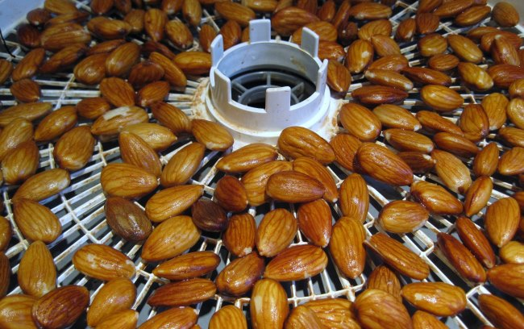

I need some help. Between dinner and sleep, I get hungry. Sometimes very hungry. If I don't eat foods with high satiety then I'll either have trouble falling asleep or I'll wake up hungry. My go-to foods that I use to get to sleep are:

1.  Cheese
2.  Almond butter
3.  Yogurt (Greek works best)
4.  Nuts and seeds

These foods fall into a grey area in Paleo.

### Nuts, Nut Butter and Seeds

Several Paleo sites warn about the high levels of phytic acid in nuts. Robb Wolf often talks about easy it is to overdo the nuts on his podcast. And then there is the issue of [Omega-6s in nuts](http://paleozonenutrition.com/2011/05/10/omega-6-and-3-in-nuts-oils-meat-and-fish-tools-to-get-it-right/).

_Soaking and roasting can break down some of the phytate, but doesn't address the calories or Omega-6s._

### Dairy

Dairy is considered Primal not Paleo. I recently completed a [30 Day test](/2011/09/30-day-no-dairy-test-complete/) to confirm that I don't have any issues with dairy. However, it may not be the best food option to be loading up on before bed. Some people I deeply respect believe dairy should be minimized or eliminated. I recall hearing Paul Chek discuss on a [Wellness Underground](http://undergroundwellness.com/radio/) podcast how with his clients he advises eliminating dairy as the best way to target stubborn body fat. Now I didn't lose any fat during my month away from dairy, but I was also doubling up on almond butter! :)

### An Ideal Food?

An ideal food would be quick to prepare and not too expensive. That rules out bacon. Hard-boiled eggs are OK. Coconut milk and cream are calorie dense, but in my experience do not provide the satiety of dairy. I suppose I could make a tray of meatballs, but I already eat a fair amount of beef and lamb.

Any ideas?

UPDATE: Ideas have been moved to a spreadsheet for testing. **[http://tinyurl.com/paleo-satiety](http://tinyurl.com/paleo-satiety)**

---

## Comments

### Angelo
*October 8 at 2011 at 4:16 AM*

Maybe some starch, like a banana?  Greek yogurt with frozen berries is a personal favorite.

---

### Mike
*October 8 at 2011 at 4:56 AM*

One of my favourite post dinner snacks is banana (heat 1 minute) with butter melted into it. Perhaps more primal than paleo, but do you really think pure paleo is worth sticking to anymore? The fat from the butter will sate you (and butter doesn't have the full evils of dairy such as milk or standard cheese), and the starch in the banana is a good fuel which you must need if you are still truly hungry. It comforts me before sleep and doesn't make me fat.

---

### Franziska
*October 8 at 2011 at 12:02 PM*

Avocados!  I eat guacamole with veggies or even by itself in a little serving cup.

---

### GWhitney
*October 8 at 2011 at 1:48 PM*

Angelo and I agree on most things - getting more Paleo carbs into the diet should help - not just in the evening, but througout the day.

Almost anything orange helps - I call them carotenoid carbs - tubers, squash, carrots, etc.

Chestnuts - whole and pureed. Ideally fresh, but they can be found in jars and in cans (less good).

I tend to have a small snack around 4 p.m. so that my evening meal is quite late - around 8 p.m. and after that I go to bed full. I also wake up non-hungry and can workout very intensely on a (semi) empty stomach.

Unsweetened dried Montmorency cherries are a nice treat and they are apparently a great anti oxidant source.

---

### GWhitney
*October 8 at 2011 at 1:51 PM*

http://www.stoneridgeorchards.com/

---

### Marian
*October 8 at 2011 at 5:34 PM*

If it's really hunger why not try some coconut oil?  You've said you use it in the morning to help extend your fasts.  It sounds more like you've trained yourself to expect a pre-bedtime treat.

BTW, I'm making the chili recipe that was just posted on Mark's Daily Apple.  I'm using the Mexican oregano and chipotle chili powder I bought at World Spice a few weekends ago.  I'll let you know how it turns out :-)

---

### MAS
*October 8 at 2011 at 7:09 PM*

@All - Lots of good ideas here. Thank you!

---

### Sheila
*October 8 at 2011 at 7:31 PM*

salmon

---

### David
*October 8 at 2011 at 10:13 PM*

Really dark (like 90%) chocolate works pretty well for me.

---

### Aaron
*October 8 at 2011 at 10:50 PM*

If I have a sweet potato or yam with my evening meal, I'm satisfied till noon the next day.  If I don't ... then not so much.

---

### Geoff
*October 9 at 2011 at 12:15 PM*

Are you sure you are adequately hydrated?  Sometimes what I perceive has hunger is actually low level thirst.  Perhaps a glass of water or peppermint tea might be just enough to get you over the hump.  A second potential bonus - peppermint tea is a traditional headache remedy.

If you take the water route, then perhaps it could lead to a full-out experiment with The Shangri La diet.  Add some flavorless fat or glucose to the water just before bed.

---

### MAS
*October 9 at 2011 at 3:25 PM*

@Geoff - With increasing beverages, I end up getting up more at night and for me this greatly increases the risk I will not be able to fall back asleep. 

@All - I am going to take the ideas from these comments, test them over the next few weeks and report back.

---

### Ahrand
*October 10 at 2011 at 8:15 AM*

for me green or white tea really helps, try it, it has serious hunger suppressing qualities and little to no caffeine.
If I drink a lot, I need to get up to go to the toilet.
Make sure not to switch on any light and just use one of those baby safety lights (only amber light)  and you'll fall right back to sleep.

Also coconut oil helps and will blast you into ketosis quicker.

---

### Dan
*October 10 at 2011 at 8:25 AM*

A small can of tuna in olive oil + a little salt &amp; pepper and maybe some chilli flakes.

---

### chuck
*October 10 at 2011 at 3:14 PM*

We tend to cook large meals and always have left overs.  Those are my snacks.

---

### Z
*October 10 at 2011 at 9:40 PM*

What about coconut butter?

---

### MAS
*October 10 at 2011 at 9:58 PM*

@Z - Holy cow! I never knew that existed. I'll see if Whole Fools has it. If not,  it appears to be on AMAZON. Thanks.

---

### Marian
*October 10 at 2011 at 10:12 PM*

You can make your own: <em>(video removed)</em>

---

### Matthew
*October 10 at 2011 at 10:47 PM*

1 can of coconut milk + ice cube +  4 scoops of whey protein (unflavored if possible) (+ banana if you find the taste too bland)

I have trouble finishing off the entire thing even after a fasted workout.  It has about a thousand calories and uses about $3 in ingredients.

You can also add some flavor by dropping in peanut butter, dark sipping chocholate, or blueberries.

---

### MAS
*October 10 at 2011 at 11:32 PM*

@Marian - Not sure my hand blender can make it, but I'll give it a try. Thanks!

---

### Txomin
*October 11 at 2011 at 3:15 AM*

For satiety, I always go for butter. Some people eat it raw. I prefer to add it to a cup of broth (instant or homemade). It could possibly work even with warm water.

You are probably aware of this but there is a possibility that the hunger is motivated by very specific nutrient deficiency rather than general lack of nourishment (iow, it could be something as simple as lack of salt).

---

### GWhitney
*October 11 at 2011 at 6:53 AM*

Last night I tried a mug of Yannoh - a chicoree, barley, acorns etc. roasted type of coffee-style beverage with a teaspoon of *butter* mixed in. No caffeine, nicely warming and cosy-making - not too much liquid because it's only a coffee cup amount.

Drank it about 90 minutes before bedtime.

I'll try it with coconut butter this evening. Probably will work just as well.

---

### GWhitney
*October 11 at 2011 at 6:56 AM*

Also - MAS - you didn't know about coconut butter, really? What about the Sally Fallon and Mary Enig book?

In any case, the most cost-effective product is probably coconut cream, which usually comes in bars the shape of soap bars. 

Cool it down in the fridge. Then unwrap the plastic packaging and store is at room temperature in a nice glass container (like butte).

---

### MAS
*October 11 at 2011 at 2:30 PM*

@GWhitney - Actually I don't own a copy of Nourishing Traditions. A few years back I was able to borrow a copy from the library and skim the parts I was most interested in applying at that time. I missed the section on coconut butter. 

Coconut cream did nothing to curb my appetite during my 1 month of no dairy. High calories doesn't always equate to high satiety. 

I had never heard of Yannoh either. 

@All - I am going to try the butter. 

@Txomin - Not sure if I have a nutrient deficiency. I'd like to think I eat better than 99% of the population. But it could happen.

---

### MAS
*October 11 at 2011 at 3:33 PM*

@All - I have built a spreadsheet with all the ideas.

http://tinyurl.com/paleo-satiety

---

### BarbeyGirl
*October 11 at 2011 at 5:07 PM*

Kippers or tuna with some olive/fish oil.

Tea or Natural Calm instead of food.

Or, just eat dinner a bit later.

(I do the latter two.)

---

### Lars
*March 18 at 2012 at 11:03 PM*

Try other tubers, as Turnip...

---

### MAS
*March 19 at 2012 at 12:44 AM*

@Lars - Excellent idea. I need to jump start this experiment again.

---

### Dawn
*February 26 at 2023 at 1:53 AM*

Did you ever break the code on night eating? I also need food before bed and will still sometimes wind up eating cashew butter at 2am. Would really love to stop this.

---

### MAS
*February 26 at 2023 at 10:54 PM*

@Dawn - Great question. I just did a new post on your comment.
https://criticalmas.org/2023/02/night-satiety/

---

