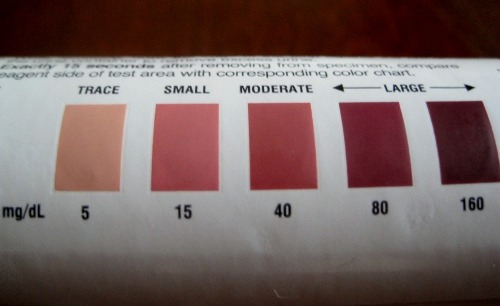

I started doing [Intermittent Fasting](https://criticalmas.org/best-of/intermittent-fasting/) over three years ago. My strategy has always been to just deal with the hunger. If you ignore it, it goes away. When I first began fasting, I'd think about my hunger constantly. These days, it barely grabs my attention. Recently, I was inspired by a post over at the website [Perfect Health Diet](http://perfecthealthdiet.com/) to try an alternate approach to Intermittent Fasting.

The _Perfect Health Diet_ post [Ketogenic Diets, I: Ways to Make a Diet Ketogenic](http://perfecthealthdiet.com/?p=2479) is a detailed explanation of the ketogenic metabolic pathway. The part of the article I found most interesting was how the use of coconut oil, which is loaded with short chain fats, can accelerate the production of ketones.

> This means that if you eat a lot of coconut oil (which is 58% short-chain fats), you deliver a lot of fat to the liver for disposal. The disposal process for fat is conversion to acetyl CoA followed by either burning in the TCA cycle or conversion to ketones.

Since that post was written, I have done many fasts where I consume nothing but 1 to 3 tablespoons of coconut oil. I find it has a slightly sweet taste and it does lower my hunger level. To confirm I was still hitting ketosis, I used Ketostix to measure ketones. After a 16 hour fast with coconut oil, I was measuring Small to Moderate ketones.

_Ketostix_

Well coconut oil by itself may not be enough for the hungry. Have no fear, the Perfect Health Diet book came up with another idea. It said you can consume fermented vegetables on a fast. Wouldn't the carbs from the vegetables interfere with achieving ketosis? Nope. From the book:

> Most vegetable carbohydrates are intercepted by gut bacteria, which digest vegetable fiber into short-chain fatty acids.

If the book is correct, I could eat coconut oil and sauerkraut and still go into ketosis. I decided to test it out.

-   Monday night: My last food intake was at 10 PM.
-   Tuesday 10 AM: 1 tablespoon of coconut oil, 100 grams of [cortido sauerkraut](/2011/06/cortido-sauerkraut-recipe/).
-   Tuesday 1 PM: 1 tablespoon of coconut oil, 100 grams of [ghost pepper sauerkraut](/2011/09/ghost-pepper-sauerkraut/).

The cortido sauerkraut has some carrots, so I was concerned that those carbs might be enough to prevent ketosis. But it didn't. At 2:30 PM, I tested Moderate ketones on the Ketostix. Victory!

_Cortido Sauerkraut - Ketosis never tasted so good!_

So if you've put off [Intermittent Fasting](https://criticalmas.org/best-of/intermittent-fasting/), because you can't deal with the hunger, you now have no excuses. Get yourself some coconut oil and make some [fermented veggies](https://criticalmas.org/best-of/fermentation/).

---

## Comments

### chuck
*October 5 at 2011 at 2:53 PM*

I have done 2 fasts so far.  Only for autophagy purposes.  I haden't eaten anything for about 21 hours in both instances.  I just kept busy and drank a lot of fluids and was fine.  It is probably good to feel hungry every once in a while.  I can tell you, no matter what I eat at night after a fast tastes GREAT and I eat like a ravenous animal.  Haven't lost weight either which is fine by me.

---

### TigerAl
*October 5 at 2011 at 4:26 PM*

Still doing IF once a week, MAS (doing one today as a matter of fact).  I have not had a cold/flu/sinus infection since starting them 2 years ago :)  

I have not tried the coconut oil part but might start that shortly.. take some after the 15 hr fast for women that you recommended or at the 13/14 hr mark?

---

### MAS
*October 5 at 2011 at 4:36 PM*

@TigerAl - I would mix it up. I am a big fan of randomness when it comes to fasting. Everybody is different.

---

### Geoff
*October 5 at 2011 at 11:57 PM*

This post is really interesting.  The idea that coconut oil and femented veg won't disrupt ketosis has given me some great "food for thought."
I recall Mat Lalonde saying that his breakfast was often 1/2 cup of coconut milk, which provided a sense of satiety but, he believed, didn't interfere with autophagy.  Not sure whether the carbs in the coconut milk would be sufficient to disrupt ketosis, but there's only about 6g in a 1/2 cup, so I'd be inclined to doubt it.

With the colder weather coming on I am ramping up my IF again.  For October I'm starting back easily with just two 16-hour fasts a week.  The number of weekly fasts will increase throughout fall, followed by increasing their duration in winter.

---

### MAS
*October 6 at 2011 at 1:04 AM*

@Geoff - That is exactly the same strategy I follow. Less daylight, less carbs, more fasting. 

Coconut Milk has almost no protein, so Mat is probably right in believing it wouldn't interfere with autophagy. It is the amino acids in protein that interrupt autophagy. As for interrupting ketosis, that might vary from person to person as well as the timing of the beverage.

---

### Sheila
*October 6 at 2011 at 5:01 PM*

hi, 

I have been doing my own little version of this, but

with romaine lettuce and olive oil, as a meal for dinner

only.  Just as a light three day thing.

Problem, as I was re-checking my data on romaine lettuce, I was dismayed to find that it has a substantial amount of sugars.  I don't know if this interfered with ketosis as I can not afford keto sticks.

But, I do feel like I am in ketosis.

What do you think of romaine lettuce as part of this "experiment" ?

---

### MAS
*October 6 at 2011 at 5:07 PM*

@Sheila - I don't have an opinion on romaine lettuce. Perfect Health Diet does make a convincing case for using coconut oil over all other fats. 

Ketostix are dirt cheap at Wal-Mart.

---

### GWhitney
*October 8 at 2011 at 1:59 PM*

Cool experiment - thanks MAS.

I gotta admit though that I'm concerned about the possibility of over-consumption of coconut products. I doubt my genetic line (Northern European) feasted on coconuts over the past few millenium - but who the heck knows...

I suppose I could try to replicate the experiment with pork lard and/or duck fat...

---

### MAS
*October 8 at 2011 at 2:23 PM*

@GWhitney - I think butter might work better. It is the short-chain saturated fats that seem to accelerate ketone production. Worthy of test though!

---

### Shannon
*October 22 at 2011 at 1:59 AM*

I have been doing IF with coconut oil a few times a week for the past two weeks.  This week I broke out in a horrible rash.  I have eaten coconut oil for years though by cooking with it but this is the first time I am eating it straight.  Why do you think it is having this effect on me?

---

### MAS
*October 22 at 2011 at 2:02 AM*

@Shannon - That is new to me.

---

### Alex
*October 22 at 2011 at 2:49 PM*

That's a find, Mas. Anyway, I prefer water-only fasts. The simplier - the more chances it works.

- Alex Zinchenko

---

### MAS
*October 22 at 2011 at 3:15 PM*

@Alex - Water fast are great too. One downside to fasting is that feeling of getting cold. By consuming saturated fat, you can stay in ketosis and increase your body temperature.

---

### Becca
*January 20 at 2012 at 6:14 PM*

What types of Intermittent Fasting do you do?  For example is there like one day a week where you don't eat anything (besides the above mentioned coconut oil maybe), or do you not eat from 12am-12pm.

Just curious, thanks!

---

### MAS
*January 20 at 2012 at 6:16 PM*

@Becca - I vary the strategy. However, these days I mostly do 14-16 hours fast with a small amount a fermented veggies and coconut oil. I fast more in the winter months and less in the summer.

---

### MAS
*January 20 at 2012 at 6:17 PM*

@Becca - My eating window is usually 2PM-10PM. The kimchi and coconut oil is consumed around 8AM-10AM.

---

### Becca
*January 20 at 2012 at 6:20 PM*

Very interesting.  I've been trying out a 12pm - 9pm eating window... but find that I often get very hungry around 1am.  Like the hunger will wake me up... think i might try just eating a little coconut oil when this happens.

Thanks!

---

### MAS
*January 20 at 2012 at 6:25 PM*

@Becca - I have the same issue. I must eat right up until the moment I go to sleep or I wake up hungry. Quality sleep is more important than fasting.

---

### Matthew
*January 26 at 2012 at 8:14 AM*

2 Shannon:
That rash was likely a fungal infection from funghi that live on ketones. GOOGLE  site:perfecthealthdiet.com RASH FUNGAL and let us know how you got rid of it

---

### Steve
*February 14 at 2012 at 9:15 PM*

I thought coconut oil was medium chain fatty acids rather than short chain?

---

### MAS
*February 14 at 2012 at 9:25 PM*

@Steve - Good point. PHD has it at 58% short chain. The Wikipedia says it is 66% Medium chain. Something isn't adding up. I'm going to contact PHD.

---

### MAS
*February 14 at 2012 at 9:27 PM*

@Steve - I got the answer. Paul explained it in his comment thread.

"... short chain fats in our lingo encompasses the standard “short-chain” and “medium-chain” — 12 carbons or fewer. Since they’re handled similarly biologically, we thought it made more sense to use a descriptive term instead of technical jargon."

---

### Steve
*February 15 at 2012 at 12:49 PM*

Makes sense. Comparing with long-chain fatty acids found in most saturated fats coconut oil, which also contain saturated fat, has short chain fatty acids in comparison but not as short as some other fatty acids. At least that is how I am making sense of this.

---

### Melinda
*July 9 at 2012 at 11:24 PM*

I didnt see this anywhere, sorry if I missed it, but how long have you fasted before - in one stretch, using the sauerkraut?  I am thinking of doing a mix of this along with the bulletproof rapid fat loss protocol.  https://blog.bulletproof.com/bulletproof-fasting-results/  I IF daily now, anywhere from 16 - 19 hours, will some 24's here and there, using the BP coffee and green teas.

---

### MAS
*July 10 at 2012 at 12:24 AM*

@Melinda - My usual sauerkraut fasts are 14-16 hours, but I've done 22 hours before.

---

### Christopher
*January 31 at 2013 at 6:06 PM*

I've been IFing for around three weeks now. Not everyday, but I have done several 36 hour fast using coconut oil to kill the hunger. My goal is fat loss
and I have lost around 12 pounds. This is a life-style choice I can live with.
I never really liked eating breakfast anyway. On fast days I have coconut oil and coffee in the morning, and my first meal at 2:00PM. My feeding period is 
between 2:00PM and 10:00PM. I normally have one big  meal or two smaller one's. Anyway things seem to be working as planned, eating is not the big deal it used to be.

---

### Mary
*August 6 at 2013 at 3:26 AM*

I am wondering how coconut butter, rather than coconut oil, would work for IF.  Do you have any thoughts?

---

### MAS
*August 6 at 2013 at 4:54 AM*

@Mary - Nope. It has protein. My understanding is it needs to all fat.

---

### Mary
*August 8 at 2013 at 12:51 PM*

Thanks.  I'm going to try coconut butter anyway.  The brand I buy -- Maranatha raw coconut butter -- has 1 gram of protein and 1 gram net carbs per tablespoon.  This morning when I woke up, my ketostix showed a "small" amount of ketones (the pink color, or "small" "15").  I'm going to have 2 TBS after my BP coffee and see what my ketones register on a ketostix in about an hour.  I'll let you know.  Eating coconut butter is way yummier than plain coconut oil.

---

### Mary
*August 9 at 2013 at 2:58 AM*

Okay, so I did check my ketones (same ketostix as you show in your blog) about an hour after I had my BP coffee and coconut butter and my ketones went down to "trace".  I got to work at about 7:40 and didn't eat until 12:30 pm.  However, at noon, I checked my ketones and they were "moderate".  At lunch (spinach salad with salmon, tomatoes, oil/vinegar dressing, + peach, couple squares 88% dark chocolate, and a coconut flour zucchini "muffin" -- gluten/dairy/egg free).  Snack was 1/2 oz almond, more extra dark chocolate, and some sugar snap peas.  At 6 pm my ketone levels were "small".  Then I had dinner.  So I don't think the coconut butter threw off messed up the morning fast much.

---

### MAS
*August 9 at 2013 at 3:00 AM*

@Mary - Good to know! Thanks for sharing.

---

### Jonathan
*August 25 at 2013 at 3:18 AM*

Mary,

I encourage you and all to consider proper food combining.

Check these out, and give it a try and assess how YOUR BODY FEELS; remember, every BODY is different:

1.  http://www.alderbrooke.com/images/food-combining-chart-front.jpg
2. http://www.alderbrooke.com/images/food-combining-chart-back.jpg

Also, remember, we're only human and we all give in to the temptations of our flesh,  some having graver consequences than others; but THANKS and PRAISE be to God because from Him we have a Saviour in Jesus Christ. :)

God bless you all,
Jonathan

---

### Jessie
*September 27 at 2014 at 3:53 AM*

Are probiotic drinks like kombucha, kefir water, coconut water allowed during IF? Thanks!

---

### MAS
*September 27 at 2014 at 3:56 AM*

@Jessie - I don't know for sure, but my guess is no. You can also test yourself with the keto strips to find out.

---

### Carlos
*December 1 at 2014 at 8:53 PM*

It's supposed that you don't have to eat to produce more GH and this is produced when we have high ghrelin levels. So when you eat this veggies you will be suppressing the ghrelin levels and by consequent the GH levels too, so you lost one of the main reasons of intermittent fasting:  boosting your GH

---

### MAS
*December 2 at 2014 at 4:42 PM*

@Carlos - I'm no longer convinced that boosting GH is always beneficial. 
http://180degreehealth.com/low-intensity-exercise-part-iii-lactic-acid-and-growth-hormone/

---

### Rina
*September 29 at 2015 at 8:52 PM*

DUUUUUDE!!! I just so happen to have started my very first batch of homemade sauerkraut!! This is great news!! Woot! Woot!

---

### Johan
*October 14 at 2015 at 4:54 AM*

MAS, do you still recommend this method to be tried out?

---

### MAS
*October 14 at 2015 at 2:38 PM*

@Johan - This method is just a strategy for others to use if they desire to fast but have too much hunger. Not a recommendation. Just a tool. 

https://criticalmas.org/best-of/intermittent-fasting/

---

### Minot
*April 4 at 2023 at 10:16 AM*

If I'm going to fast, I'd like to get the benefits of both autophagy and ketosis so I avoid food during the target window.  However, Dr. Valter Longo does have his Prolon fast which does include vegetable and nut centric meals for four or five days which is his recommended duration based on he and his team's research at USC and in Italy.

---

### Stefano
*July 26 at 2023 at 3:22 AM*

Hey Michael, I was reading this old post and wondered, do you still practice Intermittent Fasting?

---

### MAS
*July 26 at 2023 at 3:00 PM*

@Stefano - Not currently. I'm testing a higher protein diet this year, so I am consuming a protein shake in the morning. I will probably get a DEXA scan at the end of the year to see if adding a morning protein shake had any benefits.

---

### Stephanie
*November 14 at 2023 at 11:32 PM*

I started IF today and was doing it for  5 months or so. I was drinking water and green tea, coconut oil.
I was doing random fasting12-48 hours. I did stop and not abruptly although I  had a lot of hair loss, a lot.  I have researched this and I not found much. Do you know anything about this at all? I really like to fast although reluctant and sticking with 16-22
hours a couple times a week for start up.

---

### MAS
*November 15 at 2023 at 12:36 AM*

@Stephanie - I asked Claude.ai and got this response:

<em>...balanced fasting methods like 16:8 intermittent fasting are less likely to cause hair loss on their own. The impact fasting has on hair depends on the nutrition plan, severity of restriction, and individual response. Those already prone to hair loss may be more susceptible. Moderate, healthy fasting paired with a nutrient-rich diet is less likely to disturb normal hair growth cycles.</em>

Personally, I wouldn't fast if it were causing hair loss.

---

