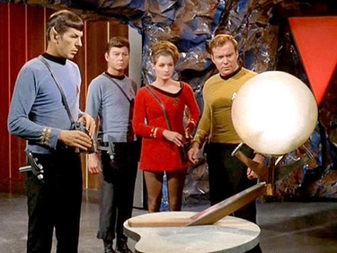

Earlier this week someone asked me if I had seen the humongous cabbage at Central Market. They were being sold as _Kraut Cabbage_ for 25 cents a pound. I had to see just how large they were. At first I didn't spot them, but then out of the corner of my eye I saw what looked to be a display of medicine balls. No way.

Instantly I was reminded of [that episode](https://en.wikipedia.org/wiki/Return_to_Tomorrow) of _Star Trek_ were the crew discovers these huge alien balls. I weighed a mid sized one and it was 18 pounds. The smallest one was 15 pounds. I bought that one. It was sauerkraut time.

_Me and some other customers approach the Kraut Cabbage display at Central Market._

_Kraut Cabbage next to an iPod_

It took almost 2 hours to chop, salt and pack the cabbage into jars. The outside color was less green than green cabbage. The texture seemed about the same. It was basically a green cabbage with a thyroid problem. Once the ferment is over, I will know how the taste varies.

_This time I'm doing a classic sauerkraut recipe that just uses juniper berries._