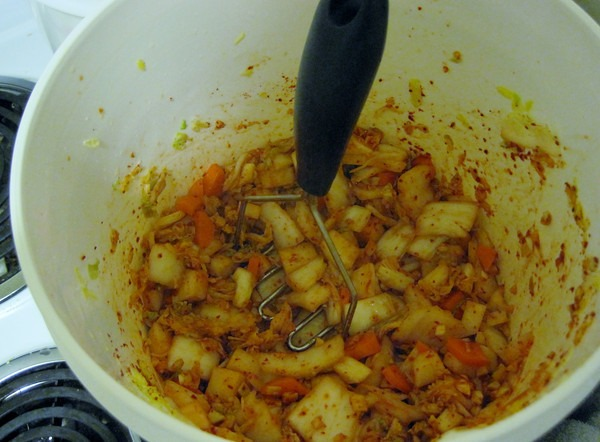
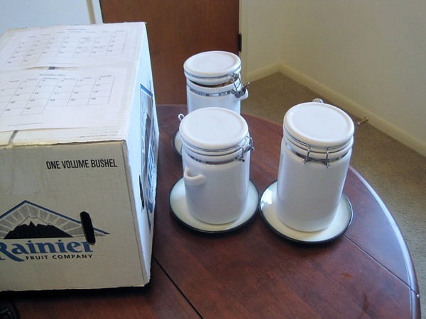

A few weeks ago I came to the obvious conclusion that [making fermented vegetables](https://criticalmas.org/best-of/fermentation/) was a hobby that I was not going to get tired of anytime soon. I also realized that I was eating and gifting these ferments faster than I could make them. I needed to ramp up production.

### Bring On The Buckets!

When I toured [Firefly Kitchens](http://www.fireflykitchens.com/), I learned they used food grade plastic buckets to prepare their ferments. Doing this allows you to make far greater quantities than standard kitchen bowls. So I went to Home Depot and purchased two buckets. You want to use the 2 gallon white buckets that are in the paint section (not the orange Homer buckets). They are made by _Argee Corp_ out of Santee, CA. I contacted the company and confirmed with them that these buckets are food grade quality. Unless you have a problem with flies, you do not need to buy separate lids. These buckets are for preparation and not the ferment itself.  _Ghost Sauerkraut Reboot and Killer Kimchi (yeah, I'm tweaking the recipes again!)_

### Boxes Are Better Than Towels

I started this hobby by covering up jars with kitchen towels. More ferments meant more towels. Pretty soon I was using half my kitchen towels. Then I switched to using paper bags turned upside down. That was better, but I figured out that turning over an empty box worked better. With a single box, I could cover multiple ferments.  _10 pounds of ferments under a single box._

### Scheduling Multiple Ferments

When I was doing a single kimchi ferment, I would just remember the date. Since sauerkrauts take longer, that date could get forgotten. Then I started doing multiple ferments with staggered start dates. At first I used little slips of paper, but they tended to get lost or would fall off the table. What I needed was a single fermentation schedule that wouldn't get blown off the table whenever I opened a window. A quick search online for "printable calendars" got me exactly what I needed. I printed out the current month and the following month. Both calendars were taped to the top of the box. Now at a moments notice I can see when each ferment started and its current age.  _CS=Cortido Sauerkraut, KM=kimchi, GP=Ghost Pepper Sauerkraut, DS=Dill Sauerkraut_

### Potato Masher To the Rescue!

It is common to use wooden blocks to crush vegetables down for easy packing. I looked around my kitchen for something similar. Turns out the potato masher was perfect. I use the masher in the buckets right before I pack the veggies into the jars for fermentation.  _Potato Mashing the Kimchi!_

### Ghetto Crocks

A good fermentation crock can run over $100. I needed something a little more _budget_. Around ten years ago, I acquired a set of ceramic coffee storage canisters. As my coffee consumption dropped, I used fewer and fewer of the containers, until eventually all but one was in storage. A new hobby means a new function for these canisters.  _Each "ghetto crock" can hold over 3 pounds of packed veggies._

### Conclusion

My upgraded fermentation station has really streamlined making [kimchi](/2011/03/kimchi-101/) and [sauerkraut](/2011/09/ghost-pepper-sauerkraut/). Right now I have over 10 pounds of vegetables fermenting.

---

## Comments

### rachel
*October 21 at 2011 at 8:30 PM*

MAS, this post made me smile!

---

### MAS
*October 21 at 2011 at 10:24 PM*

@Rachel - Thanks. I'd love to be able to share some of my ferments with you.

---

### BarbeyGirl
*October 23 at 2011 at 1:45 PM*

You helped get me started on fermentation, and my first kimchi is a smashing success!  

For economical fermentation vessels, I poked around some thrift stores and scored some large, ceramic cookie jars.  They work great.  

Good to know about the buckets, should I ever need to graduate to that...

---

### Enrique
*October 24 at 2011 at 5:12 PM*

MAS, 

I *LOVE* your fermentation posts. I like all of the health related content as well.

I'm holding up my fermentation expermients until I solve some problems I have, which I believe are dysbiosis related and probably (hopefully not) involves infection from a hard to detect protozoa.

It has been suggested (haven't seen any proof though) that using probiotics might promote an existing protozoan infection, because protozoa feed on bacteria and other organisms. That might explain why I feel like crap on certain probiotics, but it might be a reaction like endotoxin release.

I have a question, do you actually wash thoroghly your veggies before fermenting?

Don't you think using a starter would ensure the best possible results?

Thanks!

Keep up the great job!

---

### MAS
*October 24 at 2011 at 5:20 PM*

@Enrique - Regarding your concerns about probiotics and infection, I highly recommend reading the website (and book) Perfect Health Diet. 

I lightly rinse my veggies. If the veggie has a skin like a carrot or potato, I will peel most of it. This may or may not be the best approach. I tend to favor approach between no-sanitation and over-sanitation. 

As for starters, I sometimes will take a tablespoon of the previous ferment and mix it into the new one. This is ideal if you want to accelerate the ferment and the recipe is similar. As we head into winter and my kitchen gets colder, I will do more starters. 

thanks for the nice comments.

---

### Enrique
*October 24 at 2011 at 5:51 PM*

Thanks Michael!

I've been researching for about 10 years on "gut matters", hunting &amp; reading studies and testing things out, really.  I have already the PHD book and follow many other sites.

I have tried fermenting milk with special highly beneficial strains of bacteria like Lactobacillus GG with success. I'm currently treating my issues, so that's my focus now, by following my own program based on experimentation more or less like what you do.

It came to my mind that one can use the strains present in probiotics like Ohhira's, LB17 (strains usually present in traditional fermented foods) and Caldwell's Starter Culture (www.caldwellbiofermentation.com) to complement and ensure things turn out right when fermenting food. A key benefit would also be to introduce highly beneficial strains like the very hardy and studied TH10 strain included in Ohhira's probiotic.

I have some good info and ideas that might complement what you post. I hope to contribute in the near future.

Have a nice day!

---

### Nick
*October 25 at 2011 at 6:20 PM*

Nice!  I really wish that I could get on the fermentation train, but the few times I've tried, what I make it completely inedible.  At least to me.

---

### MAS
*October 25 at 2011 at 6:26 PM*

@Nick - I think you would like a simple carrot, ginger and cabbage ferment. It would be sweet and not spicy. If impatient, you can add some regular sugar to the ferment to speed things up. 

@Enrique - You know a lot more about the probiotic chemistry than me. I look forward to reading your ideas and experiments.

---

### Ed
*October 1 at 2012 at 5:16 PM*

Michael Allen Smith:

I have my two buckets and lids. I could just make a batch in one bucket and cap it.

Won't this work?

---

### MAS
*October 1 at 2012 at 5:18 PM*

@Ed - Yes, as long as the bucket is food grade.

---

### Ed
*October 1 at 2012 at 8:14 PM*

Okay. I bought the same ones you did. Just got the potato masher this morning too.

As a side note, I noticed Costco has organic coconut oil in a fairly large plastic jar for 21.99.
I haven't seen a deal this good yet so I bought two.
Thought I would pass it.

peace buddy peace!!

---

### MAS
*October 1 at 2012 at 8:41 PM*

@Ed - I recently got some Coconut oil from Costco. I too was impressed with the price.

---

### Kat
*October 16 at 2012 at 9:01 AM*

I have a 5 LT Harsch crock that I got years ago, so it didn't cost so much then. I have only made sauerkraut in it &amp; currently have a batch fermenting right now. 

But the thing is that it takes so long for a batch to finish, it would be nice to have other suitable containers so I could have several different veggie ferments going at the same time.

I'm wondering how well the jars with the old style canning lids work? Do they only let the fermentation gasses out and not let air in? Does juice run down the sides while fermenting?

I saw some interesting jars with air lock lids website (scroll down) and am wondering if anyone has tried them: http://www.wisementrading.com/foodpreserving/harsch_crocks.htm

---

### MAS
*October 16 at 2012 at 12:37 PM*

@Kat - Harsh Crocks are great. Wish I had one. 

I use regular canning jars for smaller fermentation projects. I place the jar in a bowl, so when it leaks the water is contained.

---

### Diana
*June 26 at 2015 at 10:48 PM*

Do you rinse your vegetables with tap water or filtered water?  If you've done both, is there a noticeable difference in kimchi results?

---

### MAS
*June 26 at 2015 at 10:50 PM*

@Diana - Just tap water. Never compared.

---

### Diana
*June 26 at 2015 at 10:59 PM*

That's good to know.  I know some people are really careful about using tap water on fermented foods because they don't want the chlorine to kill the bacteria.  I just don't want to go through the trouble of using filtered water.

---

