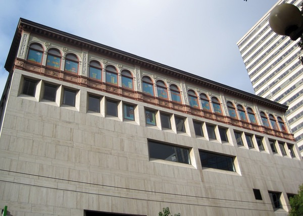
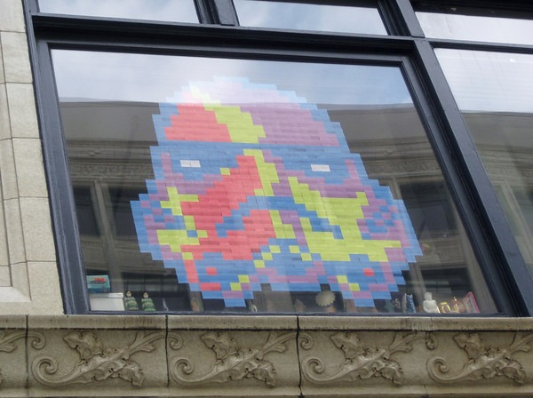

On Pike Street between 4th and 5th Avenue, if you look up to the 6th floor of the Filter building you will see a Super Mario display made entirely of Post-It notes. I heard about this in the news Friday and went down today to see for myself.

Here are some photos I took.

Another building nearby paid tribute to Star Wars with Post-It Notes.

[Full Gallery with Original Photos](https://www.flickr.com/photos/129592470@N02/sets/72157649727517268/) - Feel free to use any picture you like for any reason.

---

## Comments

### Marian
*October 18 at 2011 at 12:56 AM*

http://www.geek.com/articles/apple/apple-store-steve-jobs-mural-uses-4001-post-it-notes-20111017/

---

### MAS
*October 18 at 2011 at 12:58 AM*

@Marian - Nice find!

---

