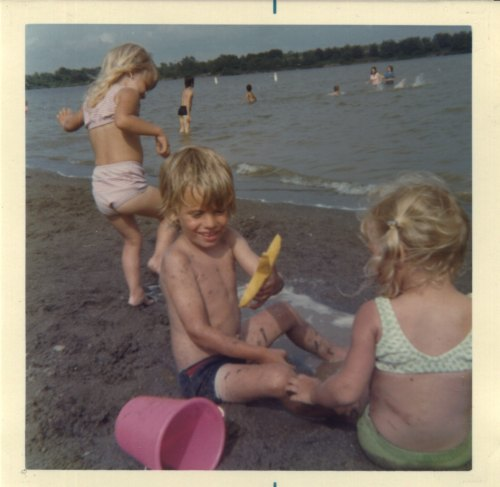

I think I can divide my Paleo journey into 3 stages.

### Stage #1 Personal Development

Weight loss, better skin, more energy, and a stronger immune system mostly arrived in the first two years following a paleo lifestyle. Not only were the gains achieved, but they were also maintained easily. In the late 90s, I got lean doing _The Zone Diet_, but the gains were not sustainable and I ended up quitting the diet and gaining all the weight back. The coolest thing about following the Paleo lifestyle is that I never measure anything or count calories. Now a few years later, I can honestly say that I am in the best shape of my life. 

### Stage #2 Inspire Others

During the journey and afterwards, some friends and blog readers were inspired by my enthusiasm and results. Some lost weight, started cooking or changed their approach to exercise. Since I can only have one journey, hearing positive stories from others kept me interested in learning more about nutrition. 

### Stage #3 Irritate Others

Those friends and readers that could have been inspired have been. Others either aren't interested in making a change now or reject the paleo message for whatever reason. Maybe it seems too hard or too weird. That was why I posted [Ranking My Positive Health Changes](/2011/09/ranking-my-postive-health-changes/). It is a list one can use to slowly move their health in a better direction. A soft sell.  However good my intentions, I think I've begun to irritate others. I have friends that I care about that would benefit from simple health changes that just aren't receptive to the message. And there is nothing I can do about it. My knowledge, experience or enthusiasm isn't going to change that. I'm going to make an effort to scale back my discussion of nutrition outside this blog. Nutrition is my hobby, not my profession. If someone wants to talk about it, I'll be more than happy to share my thoughts. However, unless solicited I'll try and treat nutrition the same as other delicate subjects such as religion and politics.

---

## Comments

### Stuart
*October 13 at 2011 at 4:58 PM*

I think that could be the three stages of anything about which you have found a personal passion. I don't try to change anyone in my life. They are either inspired by my actions or they are not and if I accept that we are both happier.

---

### dhammy
*October 13 at 2011 at 5:12 PM*

Good posting, MAS.  Sadly, I've noticed some of the same things: Most people are not at all interested in hearing about your diet or health changes.  It's hard for me to NOT say things to my overweight, mountain-dew-chugging, prescription-pill-popping co-workers.  But there you go.

---

### chuck
*October 13 at 2011 at 5:35 PM*

i have also gone from very outspoken to just biting my lip.  people know how i feel.  the ones open to change talk to me about it.  being a healthy individual over the long term is gonna speak louder than any words you can say.  

in the end, most people will be unwilling to make the necessary sacrifices.  they would be more willing to pop pills with side effects and live out there life with mediocre to poor health.

---

### Jim
*October 13 at 2011 at 8:24 PM*

Michael,
You've planted the seed, so it will be in the backs of their minds.
Then, in a few years, they will be more receptive when Oprah or Dr. Oz mention it.
Success!

---

### chuck
*October 13 at 2011 at 8:29 PM*

@Jim

Oz has mentioned paleo several times.  He isn't fully advocating it......yet.
http://escapetheherdblog.blogspot.com/2011/02/dr-oz-advocating-paleo.html

---

### MAS
*October 14 at 2011 at 12:07 AM*

I love Chuck's quote. 

"...being a healthy individual over the long term is gonna speak louder than any words you can say."

Art De Vany is living proof that statement is accurate.

---

### marcia
*October 14 at 2011 at 3:57 AM*

Your blog was fundamental in my switch to paleo.  After 6 weeks the results have been amazing (90% improvement in arthritis, better skin, I'm cooking and eating like a queen, losing fat, gaining lean, more rested, HAPPIER).  Body by Science brought me to your site and Critical MAS led me to paleo.  I am so grateful.

---

### Geoff
*October 14 at 2011 at 11:03 AM*

"If someone wants to talk about it, I’ll be more than happy to share my thoughts. However, unless solicited I’ll try and treat nutrition the same as other delicate subjects such as religion and politics."

That's the approach I take and it works well for me.  Rather than try to push a way of living on to others, I let my example pull others to it through their natural curiosity.  Like Jack said - the personal transformation you can achieve eventually speaks for itself and becomes an inspiration to others.

In your description of Stage 2 you wrote that positive feedback from others "kept me interested in learning more about nutrition."  So it seems that that stage was about shoring up the confidence you obtained in Stage 1 and helping others do the same.  That is, it ended up being a stage of mutual reinforcement among the like minded.  Irritation started when you broadened it to include reaching out to people who weren't already like minded.  

So can I respectfully submit that perhaps there are really 4 stages.  Perhaps you might re-label the stages above and add #4 as below:

Stage 1 - Personal Development
Stage 2 - Connect with Others
Stage 3 - Irritate Others
Stage 4 - Inspire Others

---

### chuck
*October 14 at 2011 at 5:14 PM*

Anyone read Robb Wolf today?
http://robbwolf.com/2011/10/14/dont-be-that-guy-or-gal/

Well, I can say there are many more paleos out there today and maybe we are becoming a pain in the ass to people we view as unhealthy.  Word must be getting out that we are an annoying bunch of food snobs.  Oh well, the consensus seems to be that we should just temper our enthusiasm unless engaged about it.  It is harder for me to do that with family whom I really care about but I am holding back anyway.

---

### MAS
*October 14 at 2011 at 5:24 PM*

@Marcia - Thank you for the nice comment. That means a lot. 

@Geoff - Interesting idea that there is a 4th stage out there waiting for me. I 'd like to think you are right. De Vany is an example that you are accurate.

@Chuck - I really wish that site would use a darker font. I don't know why so many Paleo sites have hideous typography. The point of the article is accurate though. I keep going back to De Vany. Calm, cool, never preaching, relaxed and always wiling to help. A class act.

---

### GWhitney
*October 14 at 2011 at 7:35 PM*

I have a friend who ignored my nutrition advice for the past four years. Now is in the hospital recovering from colonic bypass surgery. Because he has few friends and no next of kin nearby, I have to spend an inordinate amount of time visiting him and jollying him along.

It's in my selfish interest to try to help my friends be healthy...

---

### Ed
*October 14 at 2011 at 7:41 PM*

Apart from the paleo diet, do you take any supplements such as collagen tablets? I know your skeptical of vitamins in general. I found a jar in the back of my cupboard and started taking the rest of them. I feel like it's doing something but it's probably in my head.

---

### chuck
*October 14 at 2011 at 8:42 PM*

@GW

We all have those friends and family.  It is so pervasive.  All we can do is just be as supportive as possible without saying I told you so.  Sick people usually have an idea that they didn't treat themselves well thus they end up where they are at.

---

### MAS
*October 15 at 2011 at 3:13 AM*

@ED - I do not take collagen tablets, however if I had already purchased jar, I certainly would. The reason I don't take collagen is because I frequently make large batches of bone stock. I made some this week. If I was unable to make stock, I'd investigate buying some or something similar.

---

### J.
*October 17 at 2011 at 1:57 AM*

@MAS, your blog has been instrumental in keeping me focused on the paleo alternative. Don't worry about the critics and keep the updates coming. My first batch of kimchi was extraordinarily good (following your instructions), and I plan to make a second batch this week. Be well!

---

### Karl
*October 17 at 2011 at 6:11 AM*

I had definitely hit point 3 and it actually hit pretty quickly. I thought I had run out of dietary things to do for myself so I started to get much for interested in having others do the same things. In retrospect I was developing an unhealthy attitude toward food. Food should be a way to increase enjoyment of life in addition to healthy fuel. I was turning it into a drudgery and my admonitions to friends to stop eating bread were bringing them along for the ride. Looking back I think the stress I was cultivating about my eating was starting to undo some of the many positive changes that my diet was bringing me.

Kris Kresser among others really showed me the light with their emphasis on the non-dietary parts of being a healthy person. I've gotten my diet to the A level and I'm not interested in the extra amount of time it would take for an A+. I'm definitely not at an A in stress management or sleep right now, so I'm having far better results focusing there instead of trying to figure out the perfect amount of fruit to eat.

Now that I know more, and by that I mean have developed a healthy respect for all the things I don't know, I'm actually much more persuasive to friends and family. Rather than a rah, rah 'cut out carbs and everything will be great' message that I had fallen into, I have a much more nuanced, reasonable and (I think) correct stance. Whenever anybody asks me what I do I tell them to eat real food, get some extra sleep and start lifting weights. I've found that a simple start like that is enough to either start a conversation with a few questions about what exactly that means or figure out really quickly that there's just no point. I'm happy to talk about the details of those points for hours, but if somebody doesn't ask, I'm much better at just letting it go now. It's a little like dating, show some skin, but play a bit hard to get and you'll win in the end!

---

### paleo
*October 17 at 2011 at 2:23 PM*

I agree.  I started a blog so that I could have an outlet for discussing all the things I find fascinating about nutrition and the Paleo lifestyle.  My IRL friends don't want to hear about it.  Their eyes glaze over.

On my blog, I can pretend that I am conversing with people who are interested in what I am saying...  :D

---

### MAS
*October 17 at 2011 at 3:03 PM*

@J. Scott Shipman - I'm glad to hear your kimchi turned out! 

@Karl - I love your comment! I too am seeing that moving from an A to an A+ can be an unhealthy quest. The next phase most likely will be the inner journey towards calmness. Less research, more calmness. 

@paleo Passage - That is a great name for a website. Excellent choice!

---

### Karl
*October 18 at 2011 at 5:17 AM*

MAS, 

any advice there would be well received. I really like your blog because I feel like you come at these thing from the same perspective that I do (not to mention that you write very good and interesting posts). 

I personally find the calmness aspect really hard to do. My suspicion is that the same thing that had me learning about nutrition and exercise for hours a day (I also follow Dr. McGuff's recommendations), makes it hard to relax which in turn makes it hard to sleep well. I don't have the same level of coffee ingestion as you, but my completely armchair diagnosis without knowing you at all is that you may have a similar set of circumstances, which is also why I pay attention to what you write and what works or doesn't for you.

I've been learning about Zen meditation, but so far I'm only at about 5 minutes a day. I've been enjoying the book Opening the Hand of Thought, which does a really nice job of making meditation seem like a very accessible and ordinary thing worth doing for it's own sake, but also worth doing for a specific goal, even if that's not exactly what they're shooting for. I think it's helpful and puts thoughts into a more productive context, but since I'm so new to it I couldn't say anything more concrete than that. I'm trying it specifically because it's so unnatural to me to do something that encourages not working!

---

### MAS
*October 18 at 2011 at 4:36 PM*

@Karl - I know exactly how you feel. Although I used the word "calmness" in my last comment, I ended up spending close to 3 hours last night researching some angle of nutrition that I hadn't considered before. It was last night that made me realized, I need to go back and review my goals and post new ones. Otherwise, I'll continually go down the rabbit hole of nutrition blogs. 

Thanks for the nice comment.

---

### GWhitney
*October 18 at 2011 at 4:44 PM*

Mindfulness - this is currently rocking (and calming) my world:

http://www.amazon.com/Mindfulness-Eight-Week-Finding-Peace-Frantic/dp/[phone removed]/ref=sr_1_1?ie=UTF8&amp;qid=[phone removed]&amp;sr=8-1

Glenn

---

### MAS
*October 18 at 2011 at 4:47 PM*

@GWhitney - Looks like the Seattle library ordered 8 copies of Mindfulness. I am #1 in line once they arrive! :)

---

### Alex
*October 22 at 2011 at 8:31 AM*

Nice post, Mas. Paleo worked for many people and it's pity that some people will never even try it complaining that it won't work. Same thing with intermittent fasting. I along with lots of others experienced all the positive benefits of IF but some people just refuse to try it because some guy on some forum said that it is crap or something. Anyway thanks for the post.

- Alex Zinchenko

---

