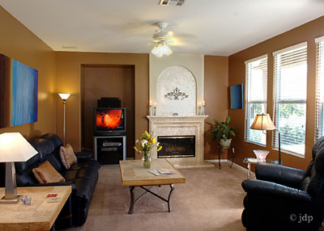

A week ago someone who I really respect convinced me to try acupuncture as a strategy to address [my headaches](/2011/08/hunting-headaches-take-3/). Until that conversation, I didn't have a high opinion of acupuncture. Back in my Florida days, I had an acupuncture student work on me to address back pain. It provided zero relief.

If I was [wrong](/2011/08/half-the-ideas-in-this-blog-are-probably-wrong/) about diet and fitness, then maybe I was wrong about acupuncture. I have been running endless tests and analysis since mid March with no success. I needed a break, so I decided to give acupuncture a fair test. This past week I did my first two visits. I also decided that I would not play Internet researcher trying to learn everything about this form of treatment. Instead, I'm going to accept my ignorance on the topic, trust my caregiver and be a good patient.

_Photo by Gwendel Uguen_

The acupuncture takes place in a very quiet room with four large Lazy Boy recliners. Each chair is covered with a thin comfortable blanket. There is some very mellow almost hypnotic music playing quietly. The room is warmed with space heaters that throw off a calming white noise. The lighting in the room is low and mostly comes from a window.

After discussing my health with the acupuncturist, I had small needles placed in my face, head, feet, hands and forearm. From there I was instructed to relax. The needle pricks were not painful at all. I closed my eyes and time just past. On both visits, I am certain that I fell into a light sleep for about an hour.

Did the acupuncture help my sinus headaches? Not yet. Although I had a great night sleep with no headache after the first session, my headaches come in a wave pattern and statistically I was almost certain to have a great night's sleep with or without treatment. I had 2 more headaches in between visits. And after my second visit, I had a headache.

If I don't see a decrease in headache frequency or intensity by the end of the third week, I will quit going. I will say that I am enjoying the sessions, but mostly because I miss having a large reclining chair where I can lay back and close my eyes.

_My living room in San Diego with the big ole' Lazy Boy recliner._

UPDATE: Acupuncture failed to help my headaches. My acupuncturist encouraged me to seek other health options.

---

## Comments

### MAS
*April 16 at 2014 at 6:53 PM*

Closing comments on this post.
https://criticalmas.org/2014/04/last-post-headaches/

---

