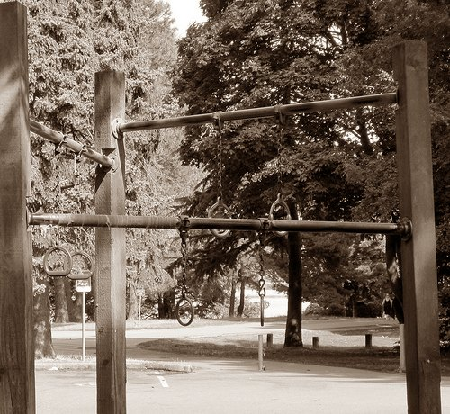

My membership to the Northgate 24-Hour Fitness has ended. During my 2 year relationship with them, they upgraded their facility from a small gym (_Express_) to a monstrosity (_Super Sport_). The fair deal that I once paid would no longer be enough. They need more money to pay for all those treadmills, _Zumba_ classes, and other crap I never use. It was time for me to find a new gym.

My original plan was to play the _gym hop_ game. I would spend a month or two going from gym to gym scoring free trial passes before negotiating a sweet deal somewhere. Then I got another idea that involved taking what I learned about High-Intensity Training and applying it to an outdoor workout.

### Didn't I Try This Once Before?

At the end of the summer of 2009, I tried doing the outdoor workout thing. From the post Freeing Up More Money for Coffee:

> I sort of had a plan on how I was going to do resistance training on the cheap. Seattle's Green Lake Park has two sets of pull-up rings. Add in some push-ups and your cooking. Today I tested out my new gym and it was successful.

Back then my workout was:

> 5 Pull Ups + 10 Push Ups repeated for 7 sets (30-40 seconds between sets)

I now view that workout as focusing too much on volume and too little on intensity. After a few weeks, I felt like I needed to lift something heavy, so I returned to the Glitter Gym. In order to make my return to outdoor training successful, I'd need to figure out a way to increase intensity safely in a body-weight environment.

_My new gym_

### Learning From Art De Vany and John Little

The goal with High Intensity Training is deep muscular recruitment. One set to failure. Then allow time for full recovery. Any additional work is unnecessary and would short-circuit the recovery progress. Doing this with machines at a gym is pretty easy. Drop the pin into the weight stack at the resistance level you want and go. With outdoor HIT, the only weight in the "gym" is what you weigh.

[Art De Vany](/2010/12/the-new-evolution-diet/) is a fan of lifting a lower weight for 15 reps for the first set. He states this pre-exhausts the slow muscle fibers. At that point, he adds weight, reduces the reps, and targets the fast-twitch muscle fibers. But since I'm outside and have no weights, I'm just going to use his idea to get started. Then I'll conclude the exercise using a strategy that I learned from [John Little](/2011/05/max-contraction-training/) to target the fast twitch fibers. Static hold.

John Little developed a protocol called Max Pyramid that involves holding a weight in a maximum _"[moment arm](http://www.youtube.com/watch?v=JipFOs17kg0)"_ to recruit and fatigue all muscle fibers. So instead of moving the weight through a full range of movement, you resist against the weight at the point where the most muscle is engaged. And then you hold it until complete failure is reached. Using the pre-exhaustion technique offered by De Vany, I theorized you could use a far lower weight for the Static Hold. More specifically, your body weight.

### My Outdoor HIT Workout

Yesterday I did my first Outdoor HIT Workout. Here is the plan I designed:

1.  Push-ups at a normal pace until the movement is difficult and begins to lose fluidity. At that point, I lower my body into a static hold where maximum tension is placed upon the chest. Then I hold. At this point, breathing will go from normal to rapid. Once total failure is achieved, I lower my knees and end the exercise.
2.  Chin-ups until the movement gets too difficult or jerky. At that point go to the top and lower into a position where maximum back muscles are engaged. Now I hold until total failure is achieved. Then I lower myself down.
3.  Using a 25# kettlebell, I do as many [goblet squats](/2010/12/the-goblet-squat/) as I can until movement gets choppy, at that point I lower myself into a static hold until failure is achieved. Once failure comes, I'll pull the kettlebell close and then lower it to the ground. Note that you don't need a kettlebell for this exercise. Straight body weight should be fine.

4.  For shoulders, triceps, and biceps I did a few movements just using kettlebell static holds. This is optional.

That is it. My entire workout took about 7 minutes. I reached a deeper level of fatigue than I had in months at the Glitter Gym. The reason is the outdoor temperature was 43 degrees. This allowed me to generate more intensity without having to break a sweat. Long time readers will know that I [haven't broken a sweat](/2011/10/no-longer-a-gym-germaphobe/) exercising in years.

### Workable? Sustainable?

I was skeptical when I drove out to the park for two reasons. First I was concerned that I wouldn't be able to generate enough intensity to create an effective workout. My second concern was the weather. If 61 degrees is the optimal temperature for intensity, 43 might prove too cold, even for someone who practices [Cold Weather Exposure](https://criticalmas.org/best-of/cold-weather-training/).

Did it work? Absolutely. That brief highly intense workout kicked my ass. It was safe and it required no gym membership. A public park with a pull-up bar was all I needed. Since my workout, I've located a much closer park with a jungle gym that I can use to replicate a chin-up bar.

Is it sustainable? I believe so. Unlike the energy foolish, I'm not working out 3-5 times a week for 30-60 minutes. All I need is about 10 minutes maximum once every 5-7 days. As crappy as the weather gets during a Seattle winter, I should easily be able to find a brief pocket of weather similar to my first outdoor HIT workout. Then as we move into warmer weather, I can just move my workout to the early morning hours.

I've escaped the Glitter!

---

## Comments

### Jason
*November 16 at 2011 at 7:57 PM*

"involves holding a weight in maximum “moment arm“ to recruit and fatigue all muscle fibers. So instead of moving the weight through a full range of movement, you resist against the weight at the point where the most muscle is engaged. And then you hold it until complete failure is reached."

Louie Simmons has touched upon this subject as well.  I think he called it functional isometrics.  The only caution he gave was this.  His research indicated that the strength gains generated from this training were greatest 10 degrees in each direction from the joint.  Thus if your elbow was at 90 degree during your hold, then your strength would be greatest between 80 and 100 degrees.  He also talked about rate of force production.  Thus my guess is that he would include low volume plyo's as well.

---

### MAS
*November 17 at 2011 at 12:41 AM*

@Jason - Louie is a smart guy, but I'm just going to go by feel and keep it simple.

---

### Aaron
*November 17 at 2011 at 12:53 AM*

Welcome my friend.  I gave up my gym membership two years ago this month and have never looked back.  In the summer I'm at the playground and in the winter I just workout in the apartment (our winters are a tad harsher than yours up there).  I bought a pull up bar that breaks down and fits under my bed.  And I use some chairs for dips.
I workout similar to your current style but over the past two years have mixed it up a bit.  I sometimes use a backpack with weights on dips, pull ups, and pushups.
I just started my own blog and will soon be writing posts on the specifics of these workouts.  
Sustainable?  Oh yeah.  And so much fun - you will start to look at playgrounds with a new set of eyes, trust me.

---

### MAS
*November 17 at 2011 at 2:58 AM*

@Aaron - Thank you for the encouragement. I'm subscribing to your blog. I got a feeling I'll be getting a few ideas on how to mix up my playground workouts.

---

### Txomin
*November 17 at 2011 at 12:26 PM*

Hmmm... do the squads really work? It is my biggest "but" for out-of-gym experiences.

---

### MAS
*November 17 at 2011 at 3:43 PM*

@Txomin - Believe it or not, they do. I'm actually still a bit sore from my workout 2 days ago. Pre-exhaust, followed by a static hold really works. That was my best leg workout in months.

---

### Txomin
*November 18 at 2011 at 3:26 AM*

Thanks. I'll give it a try. Please post back on your long term experience on this. I'm interested to see how it works out.

---

### Ahrand
*November 18 at 2011 at 8:50 AM*

Halleluja !

This is exactly why I keep read this blog.
Thanks, I will try and put this in practice.

(I hate gyms but love outdoors and a toned body)

---

### Geoff
*November 18 at 2011 at 11:55 AM*

Fresh air, sunshine, free.  What's not to like?  I do my sprinting at a local park and work out with the playground equipment too.  Still, I wonder how you will measure or gauge your progress using this method.  Do you time the static holds?

---

### MAS
*November 18 at 2011 at 4:02 PM*

@Geoff - Good question. I am moving away from metrics. I no longer find them helpful. So I don't time my static holds or count the reps of the pre-exhaustion. I'm going for a level of intensity that I know when I feel it. Although the level of intensity will remain very high, the reps/time needed to get there will vary based off factors that I may or may not be able to control. So I don't bother tracking them. If I injury myself or stop making progress, then I know I've found my upper or lower limit.

---

### Geoff
*November 18 at 2011 at 5:37 PM*

Got it.  Still I wonder whether it might make sense to pay the day rate at a gym once every 8 weeks or so to test yourself against an "objective" measurement like McGuff's "Big 5" or a deadlift challenge just to get a sense of the effect your training has had.  I still find it helpful to test myself every so often to see where I stand.  I'm in a different place and have different goals so I can see why that might not fit with your system.

---

### MAS
*November 18 at 2011 at 6:00 PM*

@Geoff - I like that idea. Especially come January or February. :)

---

### Aaron
*November 18 at 2011 at 10:47 PM*

I agree completely that when exercising this way you toss out the metrics and concentrate on the intensity.  Failure is failure.  I actually think this way may force you to listen to your body a bit more.  
When I vacation to Portland and Florida each year I hit the gym for my workouts.  I'm not trying to hit specific targets to see if I'm improving though.  It's just for fun and to mix it up.  I think that if you pay attention to your body when you workout, you should pretty well know if your strength or body comp. is declining in short order.

---

### Dan
*November 19 at 2011 at 2:27 PM*

Awesome. I've been waiting for this post. I'm not working out right now, but I've been looking for a way to do BBS-type workouts without a Nautilus for some time. Can't wait to bust out my sandbag and training rings this Spring.

---

### gwhitney@ecdinsight.com
*November 20 at 2011 at 10:27 AM*

Sounds great. I think the biggest bonus is the extra unfiltered daylight and the fresh air.

I'm hugely convinced about the benefits of plyometrics, so I'd encourage you to try to clapping pushups - that could be a good benchmark measure. Even more serious would be clapping pullups.

I have a 45lb weight vest that I use for "body weight" exercise. I also sometimes use 5lb wrists and ankle weights sometimes. They cost a bit, but after three years I still find them a good investment.

Lastly - and maybe your'e doing this already - but I would encourage you to do the exercises barefoot whenever possible. Direct contact between the soles of our feet and the pure earth - it's a rare and beautiful experience!

---

### MAS
*November 20 at 2011 at 6:34 PM*

@GWhitney - I used to have a weight vest. When I thought I was going to move from Seattle, I sold it. I wish I still had it. It'd be perfect for the park.

---

### Thor
*November 22 at 2011 at 2:20 PM*

Great one! Re-blogged the exercise description, hope you dont mind

---

### Jared
*November 27 at 2011 at 7:35 PM*

Hi Michael,

How has your training method been going?

---

### MAS
*November 27 at 2011 at 7:39 PM*

@Jared - I have being doing some form of HIT for about a year. Whereas my outdoor method just started about 3 weeks ago. HIT is amazing and I'm finding that I really like training outside. I'll provide another status report in a few months.

---

### Gary
*January 22 at 2012 at 2:45 AM*

If you have a backyard...try putting some weights in an out of the way place there....I have 2 barbells...one for military press and one for bentover rows....just periodically go outside and knock out a set...I am really trying to make my workouts as random as possible to mimic a primal man...sometimes I knockout a set as soon as I get up in the morning...it gives you a nice rush and wakeup...

---

### Jim
*January 25 at 2012 at 2:35 AM*

Mas,

Do you feel that the workout is balanced enough?  I don't see any hamstring work - or do you feel the goblet squat sufficiently works the entire lower body?

---

### MAS
*January 25 at 2012 at 2:38 AM*

@Jim - I don't know. It is possible that I might be developing strength imbalances. I feel that the goblet squat is doing the trick. Maybe by adjusting the stance from week to week, that might be enough.

---

### Alex
*February 10 at 2012 at 6:39 AM*

Hi Mas.I have just found your blog.I think it is very interesting.I haven't read all the articles but I am catching up.I am from Bulgaria and my English is bad.I am an ectomorph and skinny fat.Do you think this kind of training routine is good enough for building muscles?In your articles about ectomorphes you suggest training in 5 reps zone.

---

### MAS
*February 10 at 2012 at 1:34 PM*

@Alex - For me 5 reps and heavy worked much better than the 8-12 reps at a lighter weight. However, in the past year I've changed the way I lift to focus on intensity. Reps and weight are less important. 

I believe HIT will help you build muscle. I do not have enough data to say for sure if the Outdoor HIT protocol in this post will build muscle. I suspect it would. Time will tell.

---

### Alex
*February 10 at 2012 at 2:42 PM*

How should I train with this protocol.Should I use weighted chin-ups and push-ups to work near 5 rep zone?I think this kind of workout with static holds is much similar to gymnasts training.And gymnasts have perfect bodies.

---

### MAS
*February 10 at 2012 at 2:46 PM*

@Alex - I no longer think reps are the important metric. Just do the movements very slow and controlled. Take out the momentum. I would start out not doing weighted.

---

### Alex
*February 13 at 2012 at 11:17 AM*

I have just did my first HIT training.Well I am still feeling the lactic acid and my body is still red.I have thought that I won't get pumped with HIT but i was wrong.I did elevated leg push ups,bodyweight chin-ups and dumbell goblet squat.The part with static hold is really very dificult.I can stand only 10 seconds.But i can't wait till next monday to train again.When should I incorporate some more work targeting stomach fat,for example sprints.If I do them on friday,do you think I will have enough time to recover till monday.Have in mind that we - skinny fats have terrible recovery.

---

### MAS
*February 13 at 2012 at 4:41 PM*

@Alex - Congrats. I don't have a recommendation on when you should start sprinting. Stomach fat should primarily be addressed with diet.

---

### Alex
*February 13 at 2012 at 5:20 PM*

I know stomach fat is best removed with diet,but when I restrict calories I loose muscle,and my metabolism slows down and keep fat.It is better if first I build muscle and then loose the fat.But for skinny fat ectomorph building muscles is almost impossible.What do you think about combininig for example one or two sets of deadlift before the HIT?

---

### MAS
*February 13 at 2012 at 10:19 PM*

@Alex - I don't think adding volume prior to a HIT would increase its value.  

As for the skinny fat thing, check out my post "Moving Up The Leanness Levels" for ideas. 

https://criticalmas.org/2010/12/moving-up-the-leanness-levels/

---

### Alex
*February 14 at 2012 at 6:30 AM*

I am doing these trick allmost 2 years.I don't think low carb,more sleep and IF is enough for skinny fats.These tweaks are working for loosing fat.I can reach 10% bodyfat but my arms looks like my calves.The real problem with belly fat is lack of muscles and high cortisol levels.

P.S. Today I am not fatigued and don't feel my muscles sore from teh yesterday HIT.Maybe it wasn't hard enough training.By the way wich is better for muscle growth, HIT once per week or training every day away from fatigue?

---

### MAS
*February 14 at 2012 at 3:02 PM*

@Alex - Just experiment. Try both ways and continue with the method that works best for you.

---

### Alex
*February 20 at 2012 at 4:54 PM*

MAS,what about doing HIT every other day away from failure.For example push-ups 5x5 with 5 min rest.I am talking about gaining strenght.

---

### MAS
*February 20 at 2012 at 4:59 PM*

@Alex - If you aren't going to failure, then I wouldn't call it HIT. The 5x5 protocol (Pavel) works fine. I did a post on it here:
https://criticalmas.org/2011/06/training-to-failure-or-training-to-quit-part-2/

---

### Alex
*February 20 at 2012 at 5:29 PM*

Intensity is time under tension (load) right?Doing push-ups 6 seconds down and 3-4 up is high intensity isn't it?I think doing squats 5x5 is good for strenght.But 1 set of 20 breathing squats to failure is good for hypertrophy.Isn't the same with HIT?

---

### MAS
*February 20 at 2012 at 5:34 PM*

@Alex - There are many variations of HIT. Don't focus on the weight or reps. The goal is to go to complete failure (safely) and then allow time for recovery.

Hypertrophy can be achieved many ways. HIT is just one of them. 

As long as you are being safe, you'll be fine. Find a plan that works for you. My example is just what I'm experimenting with, which may or may not work best for you. 

Experiment and be safe.

---

### Dale
*February 21 at 2012 at 5:12 PM*

Michael, quick question: as you fail on the goblet squat, how do you 'draw the kettlebell close' when presumably you're already holding the kettlebell to your chest ? 

I myself would like to experiment with goblet squats to failure. But obviously how to unload safely if the crucial aspect.

---

### MAS
*February 21 at 2012 at 5:17 PM*

@Dale - The goblet is probably 18 inches away at the start of the movement. Since this post was written, I have dropped the "draw kettlebell close" step. Now I just drop it.

---

### Dale
*February 21 at 2012 at 5:29 PM*

gotcha, makes perfect sense.

---

### MAS
*February 21 at 2012 at 6:02 PM*

To clarify my "dropping the kettlebell" statement. I'm dropping it on grass and <a href="https://criticalmas.org/2011/12/a-tabata-based-kettlebell-workout/" rel="nofollow">my kettlebell</a> has a vinyl cover. You probably shouldn't drop your KB on a solid surface.

---

### Jeff
*May 28 at 2013 at 4:57 AM*

Do you still do this work out?  Has it built strength?  Has it added muscle mass.
Nothing tastes as good as jacked feels :)

---

### MAS
*May 28 at 2013 at 12:53 PM*

@Jeff , not at this time, although I may return to it soon. I still believe in the workout. Combining HIT with dairy kefir has been the most anabolic combo I've experienced.

---

### Bill
*July 26 at 2013 at 8:58 AM*

Hi Michael, 

   Really enjoyed this post, and have come back to it as a reference numerous times. Both in the spring, summer to get outdoors or even when traveling to have an effective high intensity workout that is brief. Next, like you, was in the winter, and enjoy actually getting outdoors now during this season to get that kick butt workout, especially with the cooler temperature notice intensity has definitely increased....producing great workouts.

   My question is, do you vary the exercises? For example a close grip push-up, or pullups vs. chinups.

Always look forward to checking here on the latest updates you provide.

---

### MAS
*July 26 at 2013 at 1:34 PM*

@Bill - No I don't. I've found that adjusting position makes the movement harder for secondary muscles which takes the intensity off the larger ones. I can do more work safely and go to a higher level of intensity when the most muscles are working together. So a chin-up is preferred over a pull-up. Normal push-up over a close-grip.

---

### Bill
*July 27 at 2013 at 5:46 AM*

@Michael - Thanks for the insightful answer. Will continue to use this wonderful method as you described. Appreciate your sharing these practical ideas as well as related information to help too.

Have a good weekend !

---

### Bill
*August 10 at 2013 at 3:02 AM*

@Michael,

Been really enjoying not having to drive to a gym, wait for machines, and especially like the fresh air during working out.

My question for you is do you ever increase the resistance on the exercises. For example raise your feet to increase resistance doing the pushups?

Enjoy a good summer and reading "Foundation Training is the Real Deal".  This is an area more people should really pay attention to and liked how informative your post was.

Best regards, 

Bill

---

### MAS
*August 10 at 2013 at 3:59 PM*

@Bill - Yes, I have done elevated push-ups. However, I found I can achieve greater resistance by slowing down the repetition and even doing static holds. One thing I like to do is a knock out a few normal paced push-ups and then go very slow and finish by lowering myself to a hold. Taking out the momentum is what I've found to be the best way to add resistance to any exercise.

---

### Bill
*August 11 at 2013 at 10:56 AM*

@Michael - Appreciate your explanation. Can see where slowing down the repetition can really produce better results, especially as you said in removing momentum. 

Will incorporate your ideas into today's workout...know it will be a thoroughly intense one !

---

