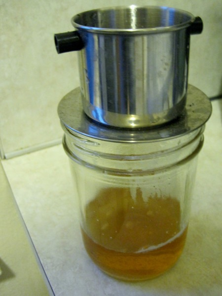
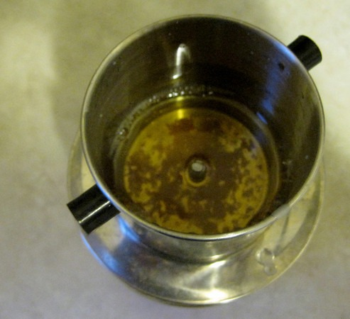

Today when I was finished [rendering tallow](/2011/02/rendering-beef-tallow-in-a-crock-pot/) in my Crock Pot, I attempted to filter it using a coffee filter. In the past, this has worked. But for some odd reason today the tallow did not want to go through the filter. So I quickly came up with an alternate solution that I ended up liking better.

For years I've held onto a [Vietnamese Coffee](https://ineedcoffee.com/brew-vietnamese-coffee/) filter. I think I used it once. When you have a [kick ass espresso machine](https://ineedcoffee.com/rancilio-silvia-espresso-machine-tips/), all other coffee gear gets buried away. Anyway, I used the Vietnamese coffee filter and it worked great. Not 100%, but good enough for me. I guess cheese cloth would be ideal, but when you don't have any and you need to go MacGyver, it works!

---

## Comments

### chuck
*November 22 at 2011 at 1:44 AM*

quick thinking.  how did u clean it?  tallow was like an adhesive wax to me that i had a real hard time cleaning.

---

### MAS
*November 22 at 2011 at 1:52 AM*

@Chuck - Yeah. It took a while. I have some Sals Suds, which does a nice job. As good as I cleaned it, I don't expect to ever use that filter for brewing coffee again. :)

---

### kimelah
*November 22 at 2011 at 12:40 PM*

Ha!  At first glance it looked like a pot atop a metal plate atop a HUGE mason jar.  Then I checked the link for the vietnamese coffee filter.  Ah, understanding.

---

### MAS
*November 22 at 2011 at 12:46 PM*

@kimelah - Good point. Next time I'll put an item next to it, like I did for the huge cabbage photo. 

https://criticalmas.org/2011/10/kraut-cabbage-this-sucker-is-huge/

---

### Txomin
*November 23 at 2011 at 6:38 AM*

Oil filters (for cooking, of course) are cheap and work well.

---

