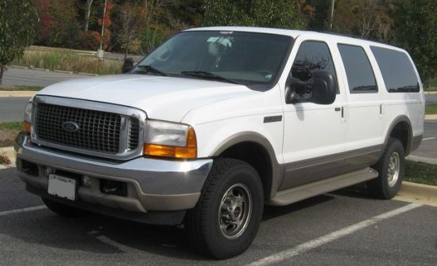

On Saturday evening I was walking across a street in Capitol Hill inside the pedestrian walkway. A large white SUV came up from the side street towards me. It appeared the car was slowing as there was a Stop sign. But it didn't. By the time I realized the car was going to run the Stop sign, I was already in front of it. I straight-armed the car so it wouldn't hit my legs and run me over.

_I was hit by a white SUV. It looked a lot like a Ford Excursion._

At that point the car stopped. I was stunned that I got hit, but I appeared to be OK. For some odd reason I didn't get upset or even say anything to the driver. Maybe I'm getting too forgiving in my old age. So I just continued walking down the sidewalk. The driver didn't check on me and kept going.

About an hour later my arm started to get numb and sore. A friend suggested that I might want to go to the Emergency Room to have it checked out. I thought about spending hours in the ER on a Saturday night, paying for X-Rays and getting a script for painkillers, but decided I wasn't that hurt and my body was fully capable of healing itself.

I went home and applied an ice pack to my arm for 20 minutes. I also knew how helpful the bone broth was towards [healing my back injury](/2011/11/my-miraculous-back-injury-recovery/), so I sipped on a large mug of that magical elixir. Then I slept for 8 hours. When I woke up I was fine, except for a bruise on the base of my hand where I made contact with the SUV.

My friend that suggested the ER to me asked if I would go to the hospital if I were shot. My response to her was: _that would depend on where the bullet hit_. :)

---

## Comments

### Paul
*November 14 at 2011 at 5:30 PM*

First off I'm glad to hear you're ok. I've hadmy own run ins with vehicular injuries in the past month. I'm trying to heal post op doing a but of bone broth, not sure how well it will work with tendons, hey can't hurt right?

I'm actually horrified the driver didn't get out and offer to drive you to the hospital how ridiculous? I'd be careful over the next few days though, some of those injuries take a while to really show up. Get well

---

### dhammy
*November 14 at 2011 at 6:19 PM*

Dang, MAS, stop living in the fast lane...literally!

I would like to see a stick-figure-drawing re-enactment of the event, please.

;)

---

### Kyle
*November 15 at 2011 at 3:53 AM*

Glad it wasn't worse.  I think your quick reaction and strength helped a lot.  Did you look like the Heisman trophy?

---

### MAS
*November 15 at 2011 at 4:17 AM*

Ha! The Heisman pose was exactly what I did. 

Now, can I draw a <a href="https://criticalmas.org/2010/09/the-fall/" rel="nofollow">stick figure re-enactment</a>? :)

---

### MAS
*November 15 at 2011 at 4:21 AM*

@Paul -Wordpress flagged your comment as SPAM. Glad I caught it. Yes, bone broths do wonders for joint injuries. Like cures like.

---

### Winston
*November 15 at 2011 at 5:14 AM*

Glad to hear you weren't crushed.  I presume this is Capital Hill in Seattle?

---

### MAS
*November 15 at 2011 at 5:17 AM*

@Winston - Yes, Capitol Hill is a Seattle neighborhood.

---

### Geoff
*November 15 at 2011 at 11:51 AM*

MAS - Sorry to hear about this.  Glad you appear to be doing well.  I agree with Paul on both points.  A driver not stopping after hitting a pedestrian is morally repugnant and (at least where I live) criminal.  Too bad you didn't get the license number.  Also, be on the look out for delayed after effects, especially if you had any head trauma.  Weren't you going to try and reduce the stress in your life (ha ha).  Hang in there and heal up.  Best wishes for a quick and complete recovery

---

### MAS
*November 15 at 2011 at 3:50 PM*

@Geoff - The car that hit me reminded me of the OJ Simpson car. At the time I really didn't think anything of it. I'm 100% healed now. Even the bruise is gone.

---

### Kumi
*November 15 at 2011 at 7:35 PM*

What an asshole the driver was!!!  I'm very glad to hear that you had only hit your palms and nothing worse happened.  I think you could not say anything because you were shocked what happened, but seriously, you should have taken a photo of the vehicle or the driver at least!  I am upset to hear now...

---

### MAS
*November 15 at 2011 at 9:25 PM*

@Kumi - It all ended well. Had I thought I was injured, I would have confronted the driver. Had the driver fled after being confronted, I would have gotten a license plate. But neither happened and for some reason the incident didn't upset me. 

The next time I get hit by a car, even if I feel OK at the time, I'll take it more seriously.

---

### Sheila
*November 15 at 2011 at 10:24 PM*

OMG!

I am just glad you are ok.

---

### Karl
*November 16 at 2011 at 2:57 AM*

Wow, I'm glad to hear you're ok. It always pays to pay attention!

---

### gwhitney@ecdinsight.com
*November 20 at 2011 at 10:16 AM*

Glad to hear you're OK.

That's exactly why I train for velocity. We need a combination of great strength, but especially explosive speed for these kind of acute dangers. In the ancestral environment it could have been a tree or boulder falling on or near you...

Glenn

---

### MAS
*November 20 at 2011 at 6:37 PM*

@GWhitney - Regarding Explosive training, check out this post and the comment left by Dr. McGuff.

http://conditioningresearch.blogspot.jp/2011/11/explosive-training-doesnt-make-you.html

---

