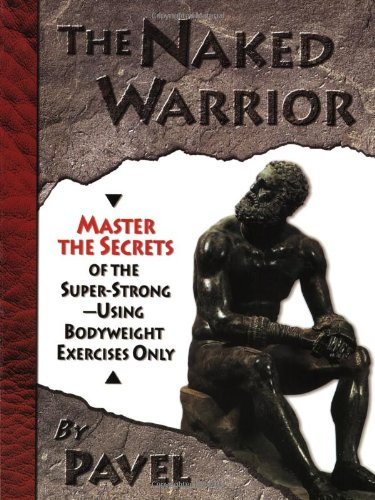

In this post, I will review a book I bought almost 8 years ago. At the time I thought this book was excellent. Not anymore.

The Naked Warrior by Pavel Tsatsouline is a book that focuses on body weight exercises. It promises _secret_ knowledge to help you get _super strong_ without using weights.

When I got the book in January 2004, I was already injured from doing the Russian Bear protocol from Pavel's other book [Power to the People](/2011/03/power-people-10-years/). My wrist could not handle the massive number of sets. Because my wrist hurt all the time, it was impossible to safely work out in my home gym. I had worked up to nearly a 300-pound squat, which I could have continued doing, but racking the plates wasn't letting my wrist recover. I had full confidence that Pavel's _Naked Warrior_ book would teach me how to build leg strength without having to rack weights.

### Enter The Pistol

How does one get super strong legs without squatting? Pavel describes in great detail The Pistol. It is a single-leg squat, where the opposite leg is held in a straight position to the front. The video below shows an athlete doing a Pistol Squat while holding a kettlebell for extra resistance.

_[Pistol Squat w 40 lb. Kettlebell](http://www.youtube.com/watch?v=Iy0J5Z4LWgE) by alkavadlo_

Looks pretty badass, doesn't it? The math of this exercise also makes perfect sense.

If one does a bodyweight squat with both feet on the ground, they can instantly double their resistance by using a single leg. Actually, it is more than double the resistance, because the working leg has to lift the full weight of the other leg off the ground. But it still doesn't work out to a lot of weight for athletes that have years of squat experience. Pavel introduces the Pistol, which places the airborne leg forward, which makes the exercise far more difficult. And as you see in the video above, once that gets too easy, carry some additional weight during the repetition.

### The Problem With the Pistol

Even though I could squat 1.5x my body weight for 5 reps, I was never able to do a single Pistol. I spent months working on the technique. Using chairs for support, I tried vigilantly to master one solid repetition. The most I ever was able to pull off were the occasional jerky sloppy momentum-filled reps. Nothing fluid like in the video above.

My ankle hurt and so did my knee. Instead of making my legs super strong, I wasted months trying to balance a solid repetition without falling over. The Pistol sucks for us tall folk. From the article [Breaking Down the One Legged Squat](http://www.dieselsc.com/breaking-down-the-one-leg-squat/) by Ben Bruno:

> Taller athletes may also find it uncomfortable to do full pistols because their legs are too long and it causes cramping in the hip flexor of the inactive leg. I personally use both methods, but for anyone with knee issues or for taller athletes, I would just stick to a parallel one leg squat to a box.

Is there a safer more effective way to build leg strength without weights that doesn't involve demonstrating a highly technical move that can take months of practice to learn? Absolutely. I'll save that for the end of the article. Now onto push-ups.

### One-Armed Pushups

Push-ups are easy. Push-ups are so easy they bore the average weight lifter. Pavel addresses this in detail in _The Naked Warrior_.

If a standard push-up is too easy then using one arm will make it much tougher. The downside is you've taken an exercise with very little risk of injury and replaced it with a highly technical demonstration of strength that can really put a strain on your shoulder. I could do regular and elevated push-ups with ease but struggled to do a single one-armed push-up.

In the end, I never gained any _super strength_ using the Pistol or the 1-armed push-up, because they were both too technical to perform. At least for my 6 foot 3-inch body.

_I met Pavel in early 2004_

### Bring on the High Reps? Not So Fast!

Not only have I rejected Pavel's _Naked Warrior_ single limb exercises, but I also fully reject the high repetition bodyweight exercises. Doing 50 or 100 or 300 body weight (aka Hindu) squats will certainly make you sore, but I believe the [focus on repetitions](https://web.archive.org/web/20151225094259/http://www.mattfurey.com/hindu_squats.html) as a metric of success is misplaced. My goal is to build muscle by fatiguing my muscle fibers as safely and efficiently as possible and then allowing time for recovery.

Doing ridiculous amounts of reps will make you very good at doing a ridiculous amount of reps, but is the least efficient method for targeting fast twitch muscle fibers. Minimizing momentum and keeping tension on the targeted muscle is far more important than knocking out additional reps. Don't believe me?

Do two push-ups and two bodyweight squats. For the first rep of both exercises do it at a normal 1-second up, 1-second down tempo. For the second rep, slow it down to 3 seconds up and 3 seconds down. Humbled? The weight was identical and yet the 2nd rep was far more difficult. High repetition training may be useful if you are trying to develop a skill, but highly inefficient when it comes to building strength.

### The Intelligent Body Weight Exercise Approach

When I went about designing my current body weight exercise program, I had 3 goals in mind.

1.  **Exercise Selection:** The exercises needed to be non-technical, basic movements that would target the major muscle groups. The exercises would also need to be safe enough to take to full failure. In other words, no 1-legged pistols from an elevated squat box.
2.  **Full Muscle Fiber Activation and Fatigue:** Most bodyweight exercises end when or before positive failure is reached. That isn't enough. I want to use movements that let me safely achieve negative failure as well.
3.  **Minimal Time Commitment:** I strongly believe in the principles of [High Intensity Training](/2011/02/high-intensity-training-at-ideal-exercise-of-seattle/). As the duration of the workout increases, the intensity has to decrease. You may pat yourself on the back for going to the gym 3 times a week for an hour. The fact is you needed to reduce the intensity to make that happen. My goal is to reduce the duration and increase the intensity. I'm down to a single 10-minute workout every 5-7 days. It is brutally intense and it takes me 2-3 days to recover fully. Instead of racing back to my next workout to beat my body up more, I allow sufficient time for recovery.

What is my bodyweight exercise program? I detailed it in the post [Escaping The Glitter: Taking High Intensity Outdoors](/2011/11/escaping-the-glitter-taking-high-intensity-training-outdoors/). The short summary is I do a set of normal reps to pre-exhaust the slow twitch muscle fibers and then perform static holds until total failure is achieved. Then I stop.

### Sorry Pavel

I know Pavel has a cult-like following and I'm certain to receive some negative comments, but I don't think _The Naked Warrior_ is an efficient or safe method for building strength. That doesn't mean it can't be done, but I feel the time one takes to learn those technical exercises could have been better spent.

---

## Comments

### Michelle
*November 27 at 2011 at 4:37 AM*

I appreciate that you can change your mind when necessary

---

### Aaron
*November 27 at 2011 at 4:52 AM*

I happen to be able to do body weight pistols.  You're not missing anything.  I get a much better leg workout by doing exactly what you're saying ... slowing down something like a body weight squat.  As it gets easier, slow it down even more.  A 10 second up, 10 second down rep with constant muscular tension will make it plenty hard.

---

### sandro
*November 28 at 2011 at 5:17 PM*

It happen to me too.I never was able to do pistol squat..too much technical..

Sandro

---

### Falling
*November 29 at 2011 at 1:00 AM*

I spent around a year learning to be able to pistol.  I never could manage rock bottom pistol without a 16kg kb to help pull me forward (I'm 6'1"), plus I hurt my back quite a few times before I got flexible enough to manage.  Eventually I came to the same conclusion that single leg box squats were a better option for my limb length / got a better ROI on my time.  Still, there are some pretty cool neurological tricks in the book.

-ashe

---

### Jesse
*December 11 at 2011 at 4:04 AM*

I bought the book in 2004 as well. I'm a guy of average height (5'10")and was able to pull of the pistol in about 3 weeks. It was a crappy one though and I could only do it on my left leg. As for the OAPU I excelled at those 25 per arm in 2 months using the GTG protocol. I also used GTG for 100 pushups in a set. I think GTG was the best thing to come out of the book. I have recently revisited pistols(bored) and have found different progressions to do them. I have found that doing heavy parallel squats teaches your body the technique to perform a proper pistol. Combined with close stance bw squats. You need to learn to use your hip flexors to pull yourself into the "hole". The csbw squats simulate coming out of the hole. Practice these and pistols to a box or staircase and you'll get there.

---

### MAS
*December 13 at 2011 at 3:20 AM*

@Jesse - Congrats on getting the pistol in 3 weeks. Although I have no plans to revisit this exercise, I'm sure others will benefit from your tips.

---

### Dale
*December 16 at 2011 at 4:20 AM*

Pavel was a mixed-bag for me. The principle of Irradiation proved valuable. On the other hand, all I got with GTG was a nasty case of tendonitis. With the pistol, the turning point for me was two-fold: 

(1) Per Convict Conditioning, treat the pistol not as a skill but as a strength movement. Thus, I performed pistols once a week.  

(2) Your video features Al Kavadlo. I watched his pistol tutorial and stopped worrying about extending my free leg. I stood on various platforms, allowed my free leg to dangle, and simply worked on improving depth, which came rather rapidly. From there I simply decreased the height of the platform over time. This allowed the free leg to extend over time.

---

### MAS
*December 16 at 2011 at 5:42 AM*

@Dale - I came to the same conclusion. The Pistol is a skill. It took me too long to figure out the difference between developing a skill that demonstrates strength and just developing strength.

---

### Dale
*December 16 at 2011 at 5:53 AM*

Hehe, call me a late bloomer. I'm 55. For me it was an admixture of learning that high-frequency simply doesn't work for me and Convict Conditioning sort of 'giving me permission' to treat pistols as a pure strength movement, wherein ample recovery would be necessary. And I even dialed-down the CC prescription for volume. I limited myself to ten focused reps. To start, that looked like 10 X 1. Now I'm working my way to 1 X 10. 

I know that HIT advocates seem to prefer that Time-Under-Tension be amassed in a contiguous set. But my surmise is that it doesn't really matter how you get your 30, 45 or 60 seconds in as long as the intensity is appropriate. 

Enjoy keeping up with your thoughts! And it's that much more enjoyable knowing that we agree on things like volume, intensity, etc.

---

### MAS
*December 16 at 2011 at 5:56 AM*

@Dale - I agree with your HIT conclusion. As long as the end game is fatiguing the fast twitch muscle fibers and then allowing time for full recovery, the path is probably not relevant, provided the movement is safe.

---

### Dale
*December 16 at 2011 at 5:58 AM*

Oh, one other thought. I'm not one of those bodyweight dogmatists who insists that pistol squats, one-armed pushups, etc. are safer than their weighted counterparts. I'd say they are not and should be performed with extreme caution. I do them mostly because because they don't make sense for an old guy. ;)

---

### Gabri
*March 25 at 2012 at 10:16 PM*

Hey guys!

I read TNW, and three weeks later i was doing pistols (i'm also 6 ft 3 " tall). 2 weeks later, and i'm doing weighted pistols now.

Of course it requires not only strenght but also technique, but just as the squat or deadlift, everything needs a good technique, even pull-ups and dips.

With bodyweight exercises, you can train many times a day, as long as you build to that frequency. If you start doing it many times, with a variation that is just too hard for you, you'll eventually finish with tendonitis, al least.

Just be patient and careful.

Good luck everyone

---

### Sifter
*June 7 at 2012 at 3:54 AM*

No offense intended, but I don't really understand the article nor most the comments. If doing the pistol is more skill and technique than strength, then why not just do them off a platform or step with free leg dangling as one poster above suggested? Also, try doing pushups, both hands, off two softballs. you may find that more productive than either regular pushups or Pavel's circus tricks. JMO. Great website, by the way.

---

### MAS
*June 7 at 2012 at 4:14 AM*

@Sifter - Thanks for the comment. I suppose that is a better idea that I wish I had tried back then when my goal was to work up to a pistol. Today I put out a post on how I train my legs these days where the focus is strictly on safe easy-to-learn movements that generate high amounts of intensity.
https://criticalmas.org/2012/06/lower-risk-alternatives-to-the-barbell-back-squat/

The first comment also has an excellent idea for building leg strength safely without relying on developing specific techniques.

---

### Jeroen
*August 8 at 2012 at 5:29 AM*

Hi Michael,

I appreciated your comments on Pavel.
I was able to do 2-3 pistol squats, in sloppy form though, BUT with full range of motion, right after reading 'The naked warrior'
I blame this on my life-long stair walking. (i lived on the fourth floor for all of my 38 year long life with no elevator)
This, for me is the perfect example of GTG :)
Having said this though, after a few months of practicing them, and getting up the point where i can do 10 on each leg, the second set 8 and the third set 6, i must say i am still struggling with the proper form, especially maintaining proper balance throughout the full motion.
It is a highly technical exercise indeed, but very effective &amp; imho very worthy of keeping in your training schedule, whether it'd be CC-style strenght training once a week, or just for practicing the whole body-tension principle.
Anyway, Greeting from Belgium &amp; KEEP WORKING OUT Y'ALL :)

---

### David
*August 15 at 2012 at 2:41 AM*

The example of high reps is of Mat Furey not Pavel. Pavel would never suggest high reps like that . Its no where to be found in his books. His PTP is all low reps. His GTG is all low reps. Only the Kettle bells go to high reps and even thats not 300 reps. You didnt read his stuff.

---

### MAS
*August 15 at 2012 at 2:46 AM*

@David - I never said Pavel was high rep.

"Not only have I rejected Pavel’s Naked Warrior single limb exercises, but I <strong>also</strong> fully reject the high repetition body weight exercises. " 

In this post I give props to Pavel for being low-rep.
https://criticalmas.org/2011/03/power-people-10-years/

---

### Dale
*August 15 at 2012 at 2:55 AM*

You know, it recently occurred to me that there is precious little in Naked Warrior as to intelligent and non-injurious progressions which can be practiced on the way to the pistol. I did profit from principles found in the book such as overall rigidity, etc. But found out, by happenstance, that negatives &gt; static holds &gt; assisted pistols &gt; pistols worked for me. 

I realized from the get-go that I needed to overcome my fear of 'what happens at the bottom', thus careful negatives, initially yielding to the carpet, were the best place for me to start, not that I'd recommend that procedure to everyone. 

Now, to be candid, pistols are still not and may never be a 'go-to' leg exercise for me. I prefer goblets, jump squats and a little sprinting, here and there for hypertrophy.

---

### Neeme
*January 2 at 2013 at 1:40 PM*

Hello! Im 6ft, and my regular squat suck - I cannot do 5x deep squats with 1,5x my bodyweight (that would be approx 212 lbs). Although Im just on 9-10% bodyfat. But when I read the book, I could do clean and controlled pistols with ease. I think it depends from your background. I also changed my running technique 2 years ago, according to "Born To Run" - I run on toes. My achilles is for now so strong I can run easily 15km with additional weight of 23lbs on my shoulders. Also in snow. I admit, when I did pistols, I felt immediately quite strong demand on achilles. So it may well be, that pistols for "regular" gym squatter are indeed too much - knees, joints. But for me - excellent! I can do them several times/day, without any bad side effects. But I think it requires something which also Pavel may have - rock-solid joints and tendons. Grown on running on heavy landscape, in snow and doing all kind of martial arts activities like I do as well.

---

### Dan
*March 6 at 2013 at 7:51 PM*

A lot aof people are misunderstanding Pavels approach to training. The book was written to people who want to be fit, and yet not be exhausted after the training. Basically, you will not grow in size.It is not the primary goal of the program. You want to grow in size - do bodybuilding. To be honest the hindu squats and hindu pushups are for people, that do not have ability to run, its good for overall endurance. Single limb exercises are good, when you don't have ability to train with weights, when you have weigths - train with weights.

---

### Goofy
*May 30 at 2013 at 12:44 PM*

It's guys like you who will never get it.  Sorry man, wouldn't want to be next to you on the battle field. Tension is the make up of strength, the more you can produce the stronger (force production) you become.

---

### Dale
*May 30 at 2013 at 12:46 PM*

^ All the more reason to lift weights in a safe and productive manner.

---

### MAS
*May 30 at 2013 at 12:49 PM*

@Goofy - And standing on 1-leg does that better, how? True tension isn't the demonstration of strength via a specialized skilled movement - unless that particular skill is your sport. Have fun on the battle field with your single limbed bent spine movements.

---

### Dale
*May 30 at 2013 at 12:52 PM*

Agreed, who do want to be next to on the battlefield, the guy who can bang out pistols or the guy who can bang out front squats with 315 ? 

I can do pistols, but they've done little or nothing for my strength.

---

### Sifter
*June 11 at 2013 at 3:13 AM*

"I can do pistols, but they’ve done little or nothing for my strength."

Yeah, but they're marvelous for selling books..  :)

---

### Gary
*August 22 at 2013 at 4:17 PM*

Naked Warrior is great and introduced me to Pistol's. Lots of excuses from people on here who just don't have what's required. The balance, flexibility and joint integrity is just too much for them. Pistols are so much better than regular barbell squats, much more bang for the buck athletically. Then weigh them with a dumbell or kettlebell. No excuses acceptable unless you have something clinically wrong with your body. Unless you have that then the reason you can't do them is you don't want it badly enough.

---

### MAS
*August 22 at 2013 at 4:25 PM*

@Gary - You missed the point.

The Pistol is a SKILL move. How well you do one is a combination of strength and SKILL. Developing the SKILL is actually the limiting factor in building strength. Unless you really have the need or desire to perform a pistol, one should choose exercises with a very low skill component in order to maximize strength gains. 

A goblet squat done slowly or with a static hold is far superior to the pistol for leg strength.

---

### Gary
*August 22 at 2013 at 5:29 PM*

Well i agree there is a skill element in it. You must have known that squatting on one leg rock bottom and then lifting yourself back up was not gonna be a simple affair.  

Many people think this, try the exercise and then realize they don't have anywhere near the hip flexor flexibility or balance to do the exercise. At that point out come the excuses; "i'm too tall" "the exercise doesn't suit my body type"  "i don't  need the skill element involved" On and on the excuses go. 

I'm now 50 and do Pistols every workout, i taught myself to do them from Pavel's book when in my late 40's! If i can do it anyone should be able to do it, provided they have no body abnormalities that precludes it.

Of course if you're saying that the balance and skill take too long to develop and you're not willing to put in that work then yes i can understand that point of view.

For myself i really wanted the exercise and just wouldn't give up until i could do it.  When you persevere then eventually you get there however we now live in an age when concentration and perseverance seem to have gone out the window because everyone wants it now but they're not prepared to put in the work that's required to get there. 

Unfortunately, with the Pistol, it doesn't work that way.

As far as the goblet squat being a better exercise for strength; hmmm no i don't agree with that either. The pistol can be weighted meaning you could use a 50kg kettlebell, if you can find one. How many people could rep out with that?

---

### MAS
*August 22 at 2013 at 6:01 PM*

@Gary - I am all for mobility, balance and flexibility. My concern is when these are done under load with compound movements that require a high learning curve. This is a recipe for injuries. 

My #1 priority is safety. I also believe that strength can be developed without sacrificing safety. 

The Pistol is harder and more difficult than the goblet squat, but that difficulty is not a good thing. To complete an exercise that requires balance under load safely requires doing less that your muscles are capable of performing. Otherwise you risk failing in the middle of the rep, which can result in injury.

The exercises I choose allow me to go to total muscular failure at any point in the repetition without injury. A super slow leg press, wall sit or goblet squat fulfill that requirement. 

Balance and mobility moves are performed separately and not under load. IMO, skill movements are done at higher repetitions which necessitates very low intensity. 

I believe the goblet is superior for muscle inroading, because you are stable throughout the entire repetition, which means you can recruit more muscles. The pistol load (assuming you learned the skill successfully) is limited to the weight handled by the knee, not the stronger quads. 

As for your question, very few people could rep out doing Pistols with a 50kg KB. That isn't a good thing though. It speaks to the difficulty and high failure rate of the movement.

---

### Gary
*August 22 at 2013 at 6:14 PM*

It depends what you want to get out of the Pistol. Most martial artists, wrestlers do them because a lot of times you need that hip flexor strength and drive when you're in a fight and you're pulled onto just one leg. You need the raw strength to be able to get up and out of that position and to continue fighting.

I mean if you talk about leg strength there's very few guys stronger than Steve Cotter in the lower extremities and he's a Pistol champion and devotee of the exercise. Have you ever seen his plyometric Pistol jumps from the deck onto a table? Quite impressive.

I agree with you in a lot of ways; if you're not that bothered about Pistols then it is a lot of hassle to get used to them and to develop the balance, especially for someone your height. I'm only about 5'7 so for me it's easier, i don't have long legs to hold me back!

At the end of the day they're not a necessity unless you really want them. I desperately wanted to master them so kept on doing them. Then again i get obsessive about things and tend to keep on doing things like that until i get them where i want them.

I suppose the bottom line of what i'm saying is you really need to be driven in order to master them otherwise they can become frustrating!

As for the OAPU; i can't do those. I focused on the Pistol, but don't have that upper body strength to do the OAPU's. I do the assisted one's sometimes where you extend one arm out to the side and pushup as normal with the other arm. Those are hard enough for me at the moment.

---

### MAS
*August 22 at 2013 at 6:43 PM*

@Gary - As with any exercise there will be outliers. Some people just thrive on certain movements. I have no doubt Steve Cotter is one of them. The questions that I ask are: 

1- Is Steve amazing because of the Pistol? 
2- Could Steve have gotten to that same performance level using an alternate exercise routine? 

I think it is cool you want to conquer the pistol and did so. My criticism is directed at Pavel's path for "using bodyweight exercises to get super strong".  I prefer the Hillfit program when it comes to body weight exercises. Minimal skill movements that you use to get strong with low time commitment. Then in your free time, train the skill you enjoy. 

https://criticalmas.org/2013/07/hillfit-2-0-a-zero-budget-approach-to-high-intensity-training/

Thanks for your comments.

---

### Gary
*August 22 at 2013 at 8:44 PM*

I suppose if you're happy with what you do that's all that matters.

Have a read of this article and see what you think. This is from Steve Maxwell someone else i've learnt a lot from.

http://www.maxwellsc.com/blog.cfm?blogID=60

---

### Mateusz
*September 3 at 2013 at 9:34 AM*

Hi,

Interesting post. I have been irregularly following Pavel's pistol squat routine with success myself. Based on my own experience, I suppose there may be some other issues affecting your results, other than strength. The hurting ankle sounds familiar :)

Is it possible your problem is ankle joint restriction similar to the one presented here?
http://www.youtube.com/watch?v=_Gwgm3s2EQ0

I observe such restriction in right leg as post-injury result: sprained ankle recovered but without proper ROM exercises as soon as possible.

---

### D
*October 14 at 2013 at 8:17 PM*

"@Gary – I am all for mobility, balance and flexibility. My concern is when these are done under load with compound movements that require a high learning curve. This is a recipe for injuries."

follow the progressions then?

If you can't do one proper pistol, why are you talking about loading?

Would you recommend squatting/deadlifting a heavy load to someone who has never touched a bar? Would you have tried a 300lb squat without even learning the basic technique for holding the bar and squatting? No.
You build up with what they CAN do, don't just go for the end goal.

I'm sorry, but this article reeks of "I tried something I couldn't do in the first few attempts, and didn't have the heart to stick with it.

---

### MAS
*October 14 at 2013 at 11:58 PM*

@D - In this case the "load" is one's bodyweight. Sorry I wasn't more clear.

---

### Adam
*February 8 at 2014 at 10:35 PM*

The reason that pistol squats and 1 arm push-ups were aggravating for you is straight forward.  Your definition of strength is very narrow.  You are concerned with maximum generation of power which is 1 aspect of strength.  That is the purpose of weight lifting with increasingly heavier loads.  If that was your only goal, then body weight exercises won't meet your goals ever.  Skilled application of power to achieve work is also a measure of strength, just a different measure.  The pistol is a highly technical move which requires raw power, flexibility, balance, coordination and stamina to achieve.  This is a broader definition of strength.

As a healthcare provider that works with injuries to muscles and joints I offer this bit of advice.  Hypertrophy without flexibility will cause damage.  Raw power does little practical good if you can't control it.  For instance, you may be able to benchpress 3x your body weight when your back is supported by the bench but unless you've trained flexibility, stability, coordination and stamina then you'll injure your back doing basic push-ups.  There is always a reason for the injuries and it usually breaks down to bad form from poor flexibility.  You cheat the form and you'll break down the cartilage, ligaments, tendons and muscles resulting in permanent damage.  If you can't do body weight exercises without pain then you shouldn't be training with weight.

---

### MAS
*February 8 at 2014 at 11:02 PM*

@Adam - I love body weight exercises. I am big proponent of wall sits and slow push-ups. Both are low skill and do an excellent job of targeting muscles.

I am also in favor of skill movements - just NOT under load. 

A weird thing happened in the 1980s. When strength training got applied to sports, programs were designed to put load under movements that matched the sport, only the skill movements from the sport were never done under load. 

My opinion is to first target the muscles in low skilled movements. And then engage in balance, mobility, flexible, skill movements without load. Best of both worlds and almost no risk of injury. Combining skill + load + volume is a recipe for injury. See CrossFit.

---

### Dale
*February 8 at 2014 at 11:56 PM*

Can't agree with Adam.  I'm much more prone to experience pain from bodyweight exercises than with weights. And I mean relatively heavy weights.

---

### Erik
*February 28 at 2014 at 1:03 AM*

I have done the bear routine in the past and doing it right now. Both with amazing success. Also I built up to a pistol squat by tying a belt to a pole and holding onto it for balance. Can't just start off doing a pistol an one armed pushup and pistol if you can't do one. My opinion. If you kept on doing shaky pistols and wobbling everywhere that is your fault than the programs.

---

### MAS
*February 28 at 2014 at 1:17 AM*

@Erik - Of course it is my problem. I was trying to use highly skilled movements on a 6'3 frame to develop leg strength when all I had to do was a Wall Sit for 90 seconds. I wasted so much time trying to develop a skill when all I wanted was strength.

Congrats on your NW success comrade.

---

### Ken
*March 9 at 2014 at 4:15 AM*

6'2" and can pistol easily
height isnt an issie, it's an excuse
the power of naked warrior is focus on technique not weight
and learning to use the body

just because you cannot work it out doesnt make it worthless
if you look closely these two exercises focus on the four locks, the girdles of the shoulder and hip...it strengthens but more importantly ties them together and helps reduce shoulder, elbow, knee injuries/issues so very powerful simply as prehab/rehab.

I do pistols to fix my knees.  You can when you learn to do them properly,  maybe you should learn it properly before you make a judgment.

---

### Dale
*March 9 at 2014 at 4:24 AM*

Or maybe just not do pistols. Maybe just do a lower-risk, higher-payoff movement.

---

### MAS
*March 9 at 2014 at 6:13 AM*

@Ken - Never said the pistol was the worthless. I said they there were better bodyweight options available for developing leg strength.  

I'm also highly skeptical that the pistol can somehow rehab knees. That is based off my current research which also involved reading Framework For the Knee. https://criticalmas.org/2014/01/returning-glitter/  That protocol suggests that low intensity higher duration cycling is the best exercise for knees. The exact opposite of a pistol.

---

### Eric
*March 18 at 2014 at 5:41 PM*

I think that the one arm push up is underrated if done properly it would be the perfect bodyweight exercice for overall upper body strength development.

---

### Dale
*March 18 at 2014 at 6:21 PM*

I'd put the one arm pushup in the same category as the pistol. I can do both. But neither do much for my strength. In addition to being hell on tendons, there is, in my experience, zero carryover to weighted exercises.

---

### donald
*June 20 at 2014 at 3:34 AM*

I'm 6'3 205, I squat 400 for sets of 5, dead lift 500 for doubles and triples, and when I tried pistols for the first time I found them extremely easy, I was able to rattle off ten without much trouble. I am also a national level athlete, so I am guessing your problem with them has less to do with being tall, and more to do with having poor proprioception and low strength. 
Likewise I found 1 arm pushups to be trivially easy, my height didn't seem to be a hindrance at all, I have a modest to good bench press at ~300lbs. 

I should be clear that I don't use Pavel's system of training, and I don't like high rep strength movements, but I've been exposed to a lot of bodyweight only training movements and have never struggled because of my height. I really don't like reading about how movement X is difficult/impossible if you are over height Y when it's not in reference to an iron cross or a planche.

---

### MAS
*June 20 at 2014 at 4:20 AM*

@Donald - So you developed massive amounts of strength using traditional training methods and then discovered after you were already strong that the pistol and 1-arm pushups were easy? IOW, you excelled at the Naked Warrior by NOT training using the exercises in the Naked Warrior. This makes my point that pistols and 1-arm push-ups are an inefficient method for developing strength, 

The fact you can pistol at 6'3 is more impressive than someone pistoling at 5' 8. Your body is actually moving further and spending a greater amount of time under load while balancing on one foot. That is what I meant by taller athletes being at a disadvantage. Purely a numbers game.

---

### MAS
*June 20 at 2014 at 5:26 PM*

@All - I am closing out the comments on this post. I think everything that can be said has been said. 

To summarize my view:

1- The fact some people can do pistols and 1-arm pushups doesn't negate the fact they are skill moves.
2- There are safer and more effective bodyweight exercises that allow for incremental progressive overload.
3- If you think height doesn't play a role in successfully performing a pistol, I can't help you. 
4- The Goblet squat is superior to the pistol because it is safer, requires less skill, and allows for incremental progressive overload. 
5- I am only "rejecting" the stunt exercises in the book. Everything up to the 1-arm push-up is solid info. And the basic bodyweight squat stuff is good as well.
6- I believe that decreasing the speed of a low skill exercise is a safer and more effective path to strength than choosing more difficult exercises. 
7 - I am not a Pavel hater. Met him in 2004. Nice fellow. I liked most of Power to the People and his stretching and joint mobility books.

---

### vv
*December 18 at 2022 at 4:51 PM*

I have years or weight and body weight training(convict condition and pavel), I disagree with your blog in that pavel specifically says that the program is supposed to be short, efficient, and for strength, not hypertrophy, i do agree that there is a high barrier to entry, pavel compares his teaching to a lake that is "an inch wide, but a mile deep" because his methods require perfection, and attention to detail, i agree with you that all the subtle techniques takes practice, and i would get frustrated too, but naked warrior is only supposed to do one thing: give you an efficient strength program to use anywhere

even though there may not be much carryover to other exercises, the techniques require tension on the entire body, and that is the very thing i think carries over the most: the full body tension, because you really learn your body

now the grease the groove technique definitely worked for me, and carried over to just about every exercise i tried with it, it's just awesome because youre training the nervous system to make the body more efficient

i can do pistols holding a 50lb kettlebell for a few reps, (5'9" 200 lbs), without weight i also hold 3-4 phone books to counter balance, if i want to use no weight or counter balance, i grab my foot and can do the pistol to the floor
anoter tip might be to do pistols off a box, or a few phone books until you get your long legs to go straight out in front of you, i agree holding that other leg out can sometimes cramp the hip flexor

i really apologize you didnt have a good experience with naked warrior, and i hope you may try to revisit in the past, you can email me and we can exchange information, 

for body weight hypertrophy, i really like c-mass by paul wade

---

### MAS
*December 22 at 2022 at 5:48 PM*

@vv - I am sorry WordPress flagged your comment as SPAM. It is published now.

Thank you for the feedback. This post is now 11 years old. In the last year, I discovered an Instagram channel with some very helpful progression videos for pistols. (meghancallaway)  

Pistols are not a priority for me now, but I am more open minded to the possibility than I was when this blog post went up.

---

### MAS
*December 22 at 2022 at 5:52 PM*

@vv - Here is the IG post on Pistol Progression that I was referring to.
[link removed]

---

