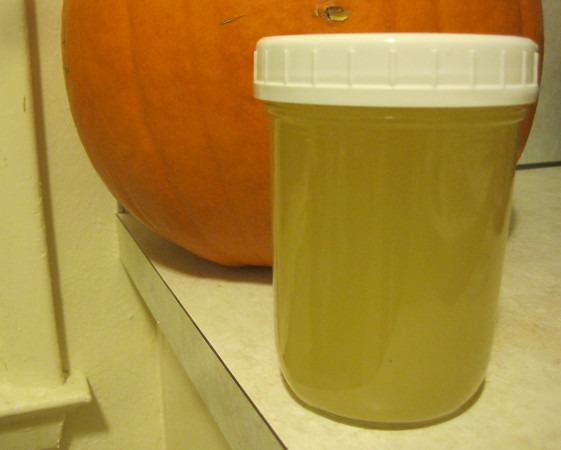

Last night I rendered my first batch of goat fat. I scored a 6 pound bag at the Ballard Farmers Market for $12. I used the same technique for rendering that I use for [lard](/2011/07/rendering-lard-in-a-crock-pot/) and [beef tallow](/2011/02/rendering-beef-tallow-in-a-crock-pot/). The color was a bright yellow. Grass fed animals have yellow fat, whereas the fat from grain fed animals is more white. The flavor was amazing. Like a more buttery version of beef tallow.

_Rendered Goat Fat_

---

## Comments

### thomas
*November 30 at 2011 at 1:44 AM*

What are your cholesterol and triglyceride numbers like?

---

### MAS
*November 30 at 2011 at 1:47 AM*

@Thomas - Perfect last time I checked. Saturated fat does nothing to increase oxidated LDL or triglycerides. If this topic is interesting to you, I highly recommend reading "Good Calories, Bad Calories".

---

### Txomin
*November 30 at 2011 at 8:36 AM*

We are a strange bunch, my friend.

---

### thomas
*December 1 at 2011 at 2:23 AM*

Thanks.  I don't see how consuming all that fat can be healthy but I will read that book.

---

### MAS
*December 1 at 2011 at 2:58 AM*

@Thomas - Also read Perfect Health Diet.

---

### vi
*January 4 at 2012 at 5:57 AM*

I also got a bag of goat fat from the market, to bad it was his last day ever! My dog loves it! I'm looking to get more and bones as well, hope I can find a good farm! Still not sure how to "render" it. Will be experimenting soon!

---

### MAS
*January 4 at 2012 at 6:17 AM*

@vi - You beat me to the goat fat. By the time I got there he was sold out. He hinted to me that he might not stay retired. Maybe the goat guy will be back.

---

