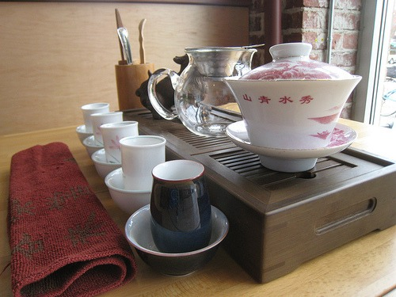

In the past four years, I've probably been to close to 100 tea tasting events. One topic that pops up on a regular basis is the claim that tea will promote fat loss and prevent cancer. I used to eat up this kind of information. Now it all just seems silly when you stand back and look at the situation.  Yesterday afternoon I was at another tea event. During the discussion on how tea helps with fat loss, one lady pulled out a box of cookies and passed them around. Everyone (but me) grabbed one. The diabetic lady ended up eating three. The irony seemed to be lost on everyone. Go into any tea shop and watch the customers. Half are adding sugar to their drinks and most are consuming some form of breaded sugar treat. Instead of seeing sugar and wheat for the toxins they are, they believe that _moderation_ should be observed. After all, tea is so healthy and they drink tea, so they have convinced themselves that they are magically protected from the evils a single cookie, scone or muffin. But they aren't. I love tea and believe it is extremely healthy for you, provided you don't dump sugar into it. I also recognize that tea is no match for a scone or plate of cookies. Tea shop customers don't walk in flabby and leave ripped. I see the same failed logic with coffee shop customers. They trumpet every health story that supports their addiction and then order a toasted bagel or muffin. Around the year 2000, I started drinking tea on a daily basis. I didn't get a single pound leaner until 2008. That was when I started cutting out the wheat. By the end of 2009, I was 99% gluten-free. Now I'm closing in on 2 full years where I've been 100% gluten-free. I dropped 25 pounds of fat. **The tea didn't lean me out. Cutting out the breaded crap they sell at tea shops is what made me lean.** If I stopped drinking tea tomorrow, I'd still be lean. One of the strategies I used to control my hunger back in those days was I'd keep a container of almonds or cashews in my car at all times. No matter where I went I could easily excuse myself to my car for a fistful of sugar-free, gluten-free calories.

---

## Comments

### Ahrand
*November 7 at 2011 at 5:22 PM*

I agree but I also have to acknowledge that green/white tea is a component in hunger control.
With regular green tea drinking there seem to more anti-snacking willpower and better portion control.

---

### MAS
*November 7 at 2011 at 5:31 PM*

@Ahrand - Form my observations, responses seem to vary. Some people get more hungry with the lighter oxidized teas, some with the darker. Back in my heavier days, green tea made me more hungry. 

Also, a lot of the snacking I see in the tea shops isn't rooted in hunger. It could be social or just another way to distract ourselves.

---

### Winston
*November 7 at 2011 at 6:01 PM*

I like the observation that tea can't save you from bad eating habits or a sedentary lifestyle.  And don't expect the antioxidants in tea to prevent cancer, it probably won't.  I drink a lot of coffee, way to much and I add half and half which has a lot of calories.  So, just this morning I decided that it's back to the gym after a long layoff for me.  I typically do the standard weight bearing exercises and running on a treadmill.  And I really need to get back on a healthy diet.   

After years of severe symptoms I ended up diagnosing myself with Celiac Disease.  It often takes on average 10 years to get a diagnosis from the medical professionals for Celiac.  Professor Maalouf at UT Southwestern medical school graciously agreed to run the tests and it was confirmed.  So, I had to cut out all wheat, barley, and rye about seven years ago.  I never knowingly eat anything with those ingrediants.  And while I can't say I particularly like the gluten free (GF) diet, my bone health stabilized and then dramatically improved and I feel significantly better.  Many people have problems with wheat and/or other forms of gluten and find they feel a lot better without it.  I recommend people try it and see.  

On the other hand if you want testing for Celiac you need to stay on a wheat diet until you have the blood tests and upper GI.  There may be newer diagnostic techniques today that don't require the upper GI, I'm not sure.  Gluten intolerance has a wide spectrum from very mild symptoms, to moderate health problems all the way to fullblown Celiac Disease.

---

### MAS
*November 7 at 2011 at 6:07 PM*

@Winston - I like to encourage people that maybe can't afford to run all the blood work, to perform their own 30 Day Elimination test. Go 100% without gluten for 30 days. Then reintroduce it and closely monitor your health for 4 days. It is a free test and anyone can do it. 

I've done it with gluten, fruit, sugar, chocolate, dairy, alcohol and now I'm doing it with nuts. The first step to physique hacking is to learn your own operating system.

---

### Txomin
*November 8 at 2011 at 2:29 AM*

Yep. Tea is a common gateway munch. I've lost track of how many people do just as you say. A cuppa and cake... three times a day.

---

