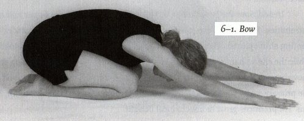
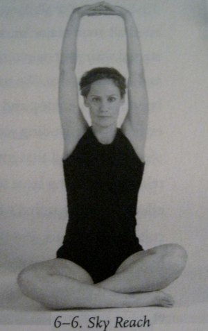

I want to thank Jason for recommending this book in the comments on my [Health Goals Late 2011 Edition](/2011/10/health-goals-late-2011-edition/) post. I listed my #5 goal as _Improve Posture and Alignment_, but I had a concern.

> I haven't been very disciplined about doing posture exercises over the years. I think I need to discover a _High Intensity_ approach. Find a few core exercises that yield maximum benefit in the shortest time. If I need to spend 20-40 minutes several times a week, I'll likely fail.

A 3-minute protocol almost seems too good to be true. Was it?

 _3 Minutes to a Pain-Free Life: The Groundbreaking Program for Total Body Pain Prevention and Rapid Relief by Joseph Weisberg_ takes a unique time-efficient approach to undoing the damage modern life inflicts upon our skeleton. We sit far too much and our movement is not varied. The result is poor posture and pain.

Instead of following a program that takes 30-60 minutes, one that I might do once a week, _3 Minutes_ uses a 6 exercise routine that is to be done daily that takes as the title suggests just 3 minutes. I've had mixed results with stretching and alignment exercises in the past. This book held a clue on why my results were so inconsistent. These stretches should be held from 30-60 seconds. Not less and not more. In the past, I would get impatient the more I did a program and would start to accelerate the routine. That is usually when I stopped seeing benefits and would quit.

A friend of mine told me that the 6 Exercises were very similar to the ones used at the start of her yoga class.

1.  Bow
2.  Arch (called the Cat Pose in yoga)
3.  Lizard (called the Cobra in yoga)
4.  Natural Squat (also known as the Asian Squat)
5.  Split
6.  Sky Reach

### Additional Exercises

Besides the 6 basic required exercises, _3 Minutes_ lists a bunch of other exercises you can pick and choose from to correct specific issues. I added exercises for the neck and my mid-back. Occasionally, I would also do some hip flexor stretching. Even with the additional work, my time commitment never exceeded 6 minutes.

### My 30 Day Results

The book stresses that you must do the exercises in order and do them every day. I complied. It was very easy to take the time to do the routine. Often a song would come on the radio and I'd be finished before the next song started. The greatest benefit I have received from the routine is my shoulder mobility is much greater. I am a big fan of the Sky Reach exercise. The Bow and Natural Squat were also beneficial.

The best exercise is the one in the section on fixing the mid-back rounding. I could see changes in my posture in less than a week. The area that hasn't helped so far has been the neck exercises. My neck is still very stiff. I'm going to keep at the routine, but I may seek out new exercises for the neck if things don't improve by the end of this year.

My only issue with the book is the same issue I have with 99% of all books that prescribe a daily routine. They need to have posters or printable versions of the routine that I can refer to while stretching. Flipping through a book looking for the next exercise is a hassle. At the 2004 Arnold Expo, I had a conversation with Pavel where I suggested he sell poster versions of his _Relax into Stretch_ and _Super Joints_ books. He liked the idea, but it never happened.

I highly recommend the book _3 Minutes to a Pain-Free Life_. It is the only program that I have ever been able to stick to on a daily basis. It has already made a positive impact on my shoulders and mid-back. With time, I hope my neck mobility sees similar progress.

---

## Comments

### Jason
*December 17 at 2011 at 3:55 PM*

Michael,

I am glad to hear that you enjoyed the book.  I certainly enjoy your blog posts and I'm honored that I could contribute something back to you.  Best wishes.

---

### Thor
*December 17 at 2011 at 9:59 PM*

Yep, this routine is pretty much the Sun Salutation of Yoga (http://www.yogasite.com/sunsalute.htm) , except that they added the squat, and they removed the downward dog and some of the transition moves. Now I do like the squat, and I do like the DD, so that's a tie for me. However, the Sun Salutation is time tested, which for me would be the tie-breaker. And you can always squat afterwards...

Be that how it may - doing something like this every morning is certainly a great idea!

As for Pavel's books: look at p47 and p99 of RiS for example - once you know how to do the exercises this is really all you need on a day to day basis...

---

### Txomin
*December 18 at 2011 at 12:10 PM*

There is also "dynamic stretching".

---

### MAS
*December 18 at 2011 at 4:42 PM*

@Thor - I sold back all my Pavel books, except PttP, years ago. Now I see them as complimentary to some of the ideas from the 3 Minutes book. 

@Txomin- I sometimes like to do some dynamic stretching prior to activity. The 3 Minutes routine is best for every day and I wouldn't do it prior to activity.

---

### Chris
*December 18 at 2011 at 9:12 PM*

It is a good book.  Fascinating how we all seem to arrive at the same materials!

---

### casey
*June 29 at 2013 at 11:28 PM*

Exercises appear to be yoga postures, except #5 Split."  Can't imagine what that would be similar to in yoga, except maybe "Warrior"?

---

### MAS
*June 30 at 2013 at 1:00 AM*

@Casey - yes. I was told by my friend who does yoga that the some of the moves are core yoga postures. The book makes that case to hold to positions from 30-60 seconds. Not sure if yoga is that precise.

---

### casey
*June 30 at 2013 at 4:25 AM*

I'm very into yoga, and I appreciate what the author was trying to accomplish with this, but I just don't think this corresponds to my practice....I would really like to know what the "split" is all about?

---

### Amar
*July 31 at 2013 at 5:49 AM*

Hi,

I am not sure if you have heard of Egoscue before?  I am doing their Neck e-cises and it's helping.  I mentioned this because you have mentioned Neck issue in your blog post.  

http://vicariouslyyours.hubpages.com/hub/Neck-Pain-Exercises

https://www.youtube.com/watch?v=Wja73NKheZU

---

### MAS
*July 31 at 2013 at 6:34 PM*

@Amar - Yeah, I've discussed Egoscue on many posts.

https://criticalmas.org/?s=egoscue

Found his protocol only mildly effective for my neck and it required too great of a time commitment. I have been using his shoulder exercises for over 10 years.

---

### tim
*September 17 at 2013 at 8:23 PM*

You should look into <a href="http://gokhalemethod.com" rel="nofollow">Gokhale</a>—brilliant.

---

### Martin
*June 27 at 2015 at 3:51 AM*

Hello Dr. Weisberg,

I am nearly 75 years of age, have been using your "Weisberg way/ 3 Minute Maintenance Method for about 11 months and am having excellent results. May I have your permission to share your information and book with others as long as I give you credit as the source? Thank you for your consideration.

Cheers, Martin Campbell

---

### MAS
*June 27 at 2015 at 4:23 AM*

@Martin Campbell - This is not Dr. Weisberg's site.

---

### Guy
*July 27 at 2015 at 10:39 PM*

Hi
Just read this and started on 6 exercises. Also found a video on YouTube , and have ordered the book. 

Would you recommend any form of warm up or any specific time of day. 
Only ask as used to train quite heavy first thing before work ( which is probably what causes my pain to come and go)
Therefore thinking of doing straight out of bed first thing?

Thanks

---

### MAS
*July 28 at 2015 at 1:18 AM*

@Guy - Personally I would not go straight from bed into these movements. Some walking and light movement first. maybe 15-30 minutes.

---

