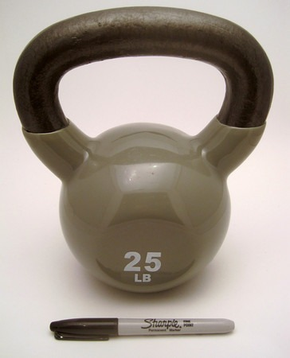

_In the summer of 2010, I received 2 kettlebells from Power Systems in exchange for a review. This article has been moved here for archival purposes._

I've always wanted to train with a kettlebell. The Russian-developed cannonball with handle has gained popularity in the past decade. I see them in videos online, but I don't see them at my gym. One gym manager said they are so popular that some members take them home with them, so they stopped buying them. So I was really pleased recently when Power Systems sent me a 25-pound kettlebell to review.

The first thing I noticed was how little it was. They were able to pack 25 pounds into a small area. Unlike other kettlebells, the Premium Kettlebell from _Power Systems_ has a vinyl casing. Their website states that it is there to help _reduce noise and prevent damage to floors_. Probably a good idea. I still wouldn't drop it.

_25 Pound Premium Kettlebell beside a Sharpie Pen to demonstrate size._

Included with the kettlebell was a flier with six exercise ideas.

1.  Kettlebell Deadlift
2.  Two-Arm Swing
3.  Tactical Lunge
4.  Kettlebell Clean & Press
5.  Push-Up
6.  Low Windmill

As with any new exercise, you should take it slow. Do no more than five reps for each exercise and then put it away for two days. You don't want to get injured. Learn the movements, especially the Kettlebell Clean & Press, as it could strain the wrist. Once you are comfortable with the exercises, you can build a complete workout using the Premium Kettlebell.

For me, the 25-pound weight was ideal to build a Tabata workout. You may need a lighter or heavier weight. A Tabata is a workout style developed by Japanese researchers in 1996. It is a high-intensity interval training protocol that lasts just four minutes long. Twenty seconds of all-out movement, followed by 10 seconds of rest. This is repeated eight times. A Tabata workout will target both aerobic and anaerobic systems. The four-minute time commitment makes it ideal for the busy student, parent, or worker.

The Tabata requires 8 exercises, but you can repeat them. You could split the Clean & Press, Push-Up, and Low Windmill into separate left side and right side exercises. By gripping the 2 vertical handle sides, I was able to add an overhead squat to my Tabata. If you do experiment with new moves, be sure to fall back on the 5-rep test outlined above. Safety first.

If you are looking to build out a home gym, I would seriously consider starting with a Premium Kettlebell. There are many different exercise possibilities and it takes up very little space.

_Sources:_

Premium Kettlebell Product page from Power Systems. Kettlebells range in weight between 5 and 50 pounds.

[Weight Lifting Wisdom For the Tall Lanky Guy](/2009/10/weight-lifting-wisdom-for-the-tall-lanky-guy/) Article I wrote on the importance of grip strength. The audience is for ectomorphs, but I also feel it will help those new to kettlebells.

---

## Comments

### Geoff
*December 27 at 2011 at 2:37 PM*

MAS

Thanks for saving your kettlebell article.  I love my KBs.  From my experience, the best exercises for a Tabata workout using KBs are the swing, the snatch (if your technique is flawless), and the front squat.  If you want to press in your Tabata workout I'd suggest the thruster instead of the clean and press - it's less technically demanding.

What I really love about my KBs though is how much better they are for me in overhead work as compared to DBs or even a barbell.  They make my shoulders feel great!

---

### MAS
*December 27 at 2011 at 4:04 PM*

@Geoff - Thanks for the tips. I found a video on Thrusters. Does this look like good form? I'd probably slow the negative. 

<em>(video removed)</em>

---

### Geoff
*December 27 at 2011 at 6:23 PM*

MAS - That's the exercise, alright.  Overall, her form looked pretty good.  The side view showed some lower back rounding that is probably best avoided.  She wobbles a little bit on some of the reps - I suspect Pavel would say she's "losing tightness".  Still, from my (non RKC certified) eye, she seems to pretty solid.

My favorite way to use thrusters for conditioning is to combine them with hill sprits a la Dan John.  Do 8 quick thrusters, then sprint up a short hill.  Walk down to recover and repeat.

The tricky part for me with Tabata KBs is keeping my form rock solid when I'm gassed near the end.  Let discretion play the better part of valor - use light weights and stop as soon as your form gets shaky.  From that perspective the swing is probably the best choice.  It's a technically simple lift that provides a lot of it's own feedback.  With a lift like the swing you can go heavier too.

---

### MAS
*December 28 at 2011 at 2:39 AM*

@Geoff - Interesting you mention hill sprints. I recently discovered how I feel better after running uphill than on flat ground. Not sure why. Less pounding?

---

