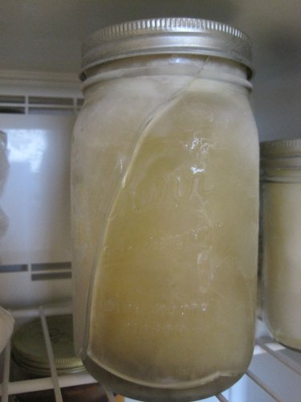

For the past year I've been trying to figure out the mystery on why some of the glass canning jars I put in the freezer shatter and others don't. At first I thought I overfilled the jars with too much stock. So I lowered the liquid line, yet the breaks continued. Then I thought the plastic lid was the problem, so I used the metal ones. Still more breaks. Then I tried pre-cooling in the refrigerator first. That didn't fix the problem. Then I tried different areas of the freezer and even tried it lidless. Again they shattered.

_Another shattered canning jar in my freezer._

At this point, I thought the case of jars I got was defective was so I reached out to Jarden Home Brands, the makers of Kerr jars, to see if they solve this riddle. Their advice was so valuable that I thought I'd share it with anyone that has the same issue that stumbles upon this page. Here is what I learned:

1.  **You should only use straight jars and not those with rounded shoulders.** _"Jars with rounded shoulders inhibit the expansion of the food, allowing the food to take on the shape of the jar in the freezing process. Foods freezing and taking on the shape of the jar places undo stress on the rounded shoulders and can cause breakage."_
2.  Not every canning jar is ready for the freezer. _"Only use Ball Can-or-Freeze regular half-pint and wide-mouth pint jars, Ball and Kerr Quilted Crystal Jelly Jars in 4, 8, and 12 ounce sizes, Kerr regular and wide-mouth half pint, and wide-mouth pint jars._ Why? _"These jars are designed for freezer use since they are wider at the top than at the bottom and have tapered sides. This shape allows food to expand straight upward as it freezes."_

Look at the photo above. The broken jar has rounded shoulders. The little jar to the right doesn't and it didn't break. All my old glass [almond butter jars](/2011/06/someone-has-been-messing-with-my-almond-butter/) have a straight design and as a result, they have never broken in the freezer. My guess is the only way to prevent the rounded shoulder jars from breaking in the freezer would be to fill them to just below the rounded shoulder. I don't plan to test that theory though, as I've lost too many good jars already.

---

## Comments

### Malarie
*December 17 at 2011 at 12:22 AM*

I am so glad you shared about the jars. I too, thought it was due to filling the jars too full, but I will now purchase only the straight jars. Thanks!

---

### Kyle
*December 17 at 2011 at 3:32 PM*

Great information.  My family seems to finish the bone broth within a week, stored in the refrigerator.  Do you know how long bone broth could be stored in the refrigerator?

---

### MAS
*December 17 at 2011 at 3:37 PM*

@Kyle - I do not know how long bone broth keeps in the refrigerator. My guess is a week is still good.

---

### rachel
*December 18 at 2011 at 11:11 PM*

Thanks so much for this info!  I haven't tried making bone broth yet, but when I do I intend to freeze some for later :)

---

### Christopher
*December 31 at 2011 at 8:55 PM*

I've used Ball pint-sized rounded jars without any trouble, I fill them to just below the threaded portion.  But they were specifically labeled for the freezer.  I've never had a jar break from freezing--only from dropping/tipping over after frozen.  But +1 the wide-mouth jars, because you can easily extract the contents while still frozen (just let sit out or run under cold water for a few seconds to loosen).  That makes it easier to start cooking with it.  Also, if you run short on jars, the jar-shaped block of frozen broth can be extracted and stored more safely in plastic bags, freeing up the jars for other uses.

---

### fleur
*April 22 at 2013 at 2:40 AM*

Thanks so much for this, I have been trying everything to prevent breakages and this explains why some jars break while others are fine. I thought I may have to go back to plastic (eek) or stainless steel (expensive) if I couldn't work it out - so thank you!

---

### karla
*August 8 at 2013 at 2:42 PM*

Thanks for the information.  I am trying to get away from plastic. I freeze a lot of fruit and beet juice etc.   thanks again.

---

### Rachel
*September 26 at 2013 at 8:51 PM*

Thanks so much for posting! I made organic chicken soup a few weeks ago &amp; just now discovered that over half the jars are cracked!! It's heartbreaking!!

---

### Cs
*November 30 at 2013 at 6:39 AM*

I have had this problem also.  I thought it had to do with the jars touching .  I need to freeze in the ½ gallon size.  I will test your below shoulder theory.  Thank you

---

### Jean
*January 20 at 2014 at 6:01 PM*

Thanks so much!  I was having this exact problem.  Now I understand what happened.

---

