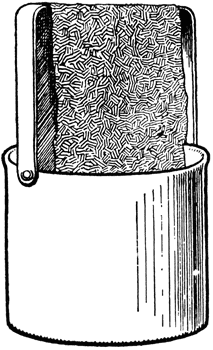
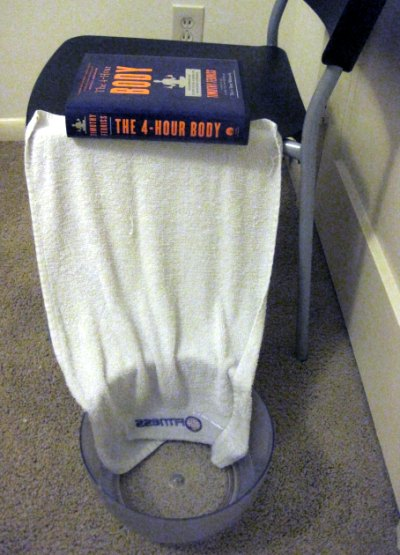

During my trip to Ohio, I noticed an interesting pattern regarding my [nighttime headaches](/2011/10/health-goals-late-2011-edition/). When I stayed with my mom, with the exception of the [gluten poisoning](/2011/12/paleo-in-ohio-adventures-in-inflammation/) night, I didn't get headaches. When I stayed with my sister, I got headaches. My mom runs a humidifier in the house, whereas my sister doesn't. Sounds like I just discovered my next test. Before running out to buy a humidifier, I checked online to see if anyone had built their own. In the description of [this video](http://www.youtube.com/watch?v=HyEmJINcfLA), there is a link to a homemade humidifier from 1918.  _[1918 Homemade Humidifier](http://etc.usf.edu/clipart/19800/19896/homemadehumd_19896.htm)_ The premise is you hang a towel down into water. The water will wick up the towel. Air will pass through the towel and humidify the air. At least that is how I understand the theory. My room is very dry right right now. On Tuesday I had a brutal headache, so I decided to try my hand at this project.  _MacGyver Humidifier_ I was skeptical it would work, but after about an hour I could feel the water making its way several inches up the towel. Pretty cool. I really hesitate to get excited, but I had amazing night of sleep last night. Testing will continue.

---

## Comments

### Jeremy
*December 16 at 2011 at 12:00 AM*

Hopefully this works and gets rid of those devasting headaches good luck with further testing :)

---

### Jim
*December 16 at 2011 at 2:28 AM*

Maybe put a fan behind it?  Also, if it doesn't work, I think that book has a chapter on the 15-minute humidifier.

---

### MAS
*December 16 at 2011 at 5:39 AM*

@Jim - Funny!  :)

---

### Michael
*December 17 at 2011 at 1:26 PM*

I'd do it with a disposable towel, because there'll be a lot of microbial activity on the towel really quickly.

---

### Tim
*December 17 at 2011 at 3:11 PM*

My grandmother had a house with floor grates where the heat just rises from the vents - no fan on the furnace. I remember her setting metal pans on the grates filled with water.  So even with a fan based furnace, you could set bowls of water near your furnace registers and the water vapor would be carried with the warm air.

i have several open top fish tanks, so that helps humidify my home. I do have to refill them more in the winter for sure! This also is great for the aquarium since they receive fresh water more often - kinda like rain ;)

---

### MAS
*December 17 at 2011 at 4:05 PM*

@Michael - Good idea about avoid microbial activity. I will probably just swap in a new towel every 3 nights.

---

