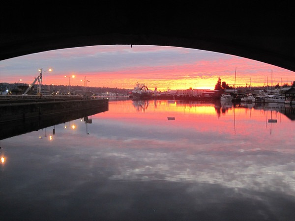

I'm back in Seattle and I've got a list of many things I need to do. However, I ended up going on a 7 mile urban hike when I saw the sky color this morning.  

---

## Comments

### dhammy
*December 13 at 2011 at 7:56 PM*

Excellent photos!

---

### Kumi
*December 13 at 2011 at 9:37 PM*

Welcome back, Michael!  What a beautiful photos!  Will see you at Stomptown coffee tasting on the 18th ;)

---

### Stuart
*December 13 at 2011 at 10:59 PM*

What gear do you take on these hikes? Specifically, the shoes? Anything special?

---

### MAS
*December 14 at 2011 at 12:27 AM*

Thanks all.

@Stuart - I take no more gear than a camera and/or cellphone. I wear flat shoes, currently ONITSUKA TIGER BY ASICS. Today my only intention leaving the house was to get a single photo of the sky. Then I just proceeded to keeping on hiking. So a 10 minute journey turned into 2 hours. All done on zero calories. 

Here is a close approximation of the hike.
http://www.gmap-pedometer.com/?r=5218436

---

