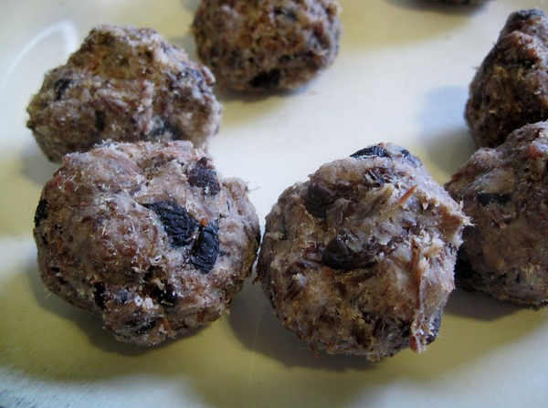

About a month ago I started brainstorming about food. I wanted a food that was loaded with saturated fat, cheap, portable and preferably good tasting. If you are unclear on why someone would seek out saturated fat, I recommend the book The Perfect Health Diet.

What is pemmican? From the [Wikipedia](https://en.wikipedia.org/wiki/Pemmican):

> Pemmican is a concentrated mixture of fat and protein used as a nutritious food. The word comes from the Cree word pimhkn, which itself is derived from the word pim, "fat, grease".\[1\] It was invented by the native peoples of North America.

Pemmican has 3 main components.

1.  Fat
2.  Protein
3.  Berries/Spices

For my first pemmican I used [goat fat](/2011/11/rendered-goat-fat/), lean beef and blueberries. I also added a little salt. I'm not going to provide a complete recipe yet, because I made several mistakes along the way. I'm still learning the food dehydrator and I discovered my food processor is worthless for this task.

How did it taste? Not awful, but not that good either. Once I get a better tool to chop the dehydrated beef and dial in the spices better, I expect this food to be a staple.

---

## Comments

### Kyle
*December 1 at 2011 at 5:53 PM*

Hi MAS,

I tried the pemmican from US Wellness Meats and it was pretty good.  In addition to the prepackaged version they sell it in a tub that you can customize to your liking.  My daughter snacks on pemmican when she needs energy during sporting events.  

Kyle

---

### chuck
*December 1 at 2011 at 6:02 PM*

i had a more disastrous result with a similar experiment.  the lard was difficult to clean after rendering but everything else went smooth.  the end result was not palatable.  very frustrating to say the least.  so many great ingredients came out so bad.  my dog liked it though.  i have decided to just stick with jerky.

---

### MAS
*December 1 at 2011 at 6:16 PM*

@Chuck - I agree. Rendering fat can be very messy. My goat fat project had to be done in 5 batches. Lots of cleanup time. 

@Kyle - I will most likely buy tallow from US Wellness at some point. Very high quality and a great price.

---

### Txomin
*December 2 at 2011 at 7:28 AM*

I've been curious about pemmican for a while. Do keep us posted, please.

---

### leoncaruthers
*December 8 at 2011 at 9:30 PM*

The key to pemmican texture is the cutting you do before you dry the meat.  Try for long, thin straws of meat before it goes in for drying.  Big chunks like you might normally make for jerky will wreck a food processor, or just plain not work (like the big chunks in your pictured balls).

You also want to dry it at a low-ish temperature, maybe even just on a box fan in a furnace filter like Alton Brown does.  You also want it really, really dry.

The final texture should be like a meaty fudge, with very few -- if any -- chunks.

---

### gwhitney@ecdinsight.com
*December 13 at 2011 at 7:31 PM*

I haven't dared to make it yet but I'm tempted. That said, crafty people like you and Mark Sisson have tried and been disappointed. I'm now inclined to reconceptualize the whole thing and instead of berries, using lots of dessicated onion and garlic flakes plus lots of mild dried red peppers. Whadaya think?

---

### MAS
*December 13 at 2011 at 8:57 PM*

@GWhitney - Recently I had pemmican made with chopped nuts and a spice mix (???) that tasted great. So it is possible to have a flavorful pemmican. Maybe your idea would work, but I'm going to stick to dried fruit to add sweetness. My problem was getting the meat portion correct. I'm gearing up this week to solve that problem.

---

### Barb
*January 22 at 2012 at 12:44 PM*

I've read quite a bit of Stefansson (1879-1962) on pemmican, but never made it myself. Very fascinating info mostly available on-line with a bit of searching, from the book Not By Bread Alone. My take-away notes are: cut the meat cross-grain and quite thin so that it breaks apart easier after drying; use a food processor to reduce the dried meat (jerky) into a fluffy mass (Indians used to pound it ala mortar and pestle); use the right proportions of meat to fat, and warm the fat/lard to liquid before mixing with meat; any other ingredients make it less than a true pemmican and mostly occurred when white men tried to imitate Indian pemmican but wanted a better flavor (what a hope). 

Keep in mind that pemmican has two great benefits: safe long-term food storage of up to ten years or more (claimed), and very concentrated food for carrying when travelling (saves both weight and space). Modern man has a lot more alternatives than the trappers and adventurers of the 1800's and early 1900's. Even men who relied completely on pemmican when travelling often had difficulty with palatability so don't expect to LIKE it. One man's full-day ration when working extremely hard (paddling a canoe or portaging day after day) was roughly 1/2 to 3/4 pound. It required no cooking or warming to eat which was also a great benefit. 

Although I have considered pemmican's usefulness the palatability thing hangs me up. You don't mention exactly what your purpose is in making it, but I assume for backpacking. I would suggest making the fluffed jerky and then try a multi-day hike carrying different kinds of fat (lard, goat fat, butter, whatever) and mix it to taste when you are ready for a meal. Keep notes on proportions and how it tastes. Mixing a large amount of pemmican ahead of time may be a waste of meat if you can't force yourself to eat it. At least after a day of hiking you will be hungry enough to eat it if the taste is only a bit marginal.

I assume you already know that the reason for separating fat and meat is so that the fat can be rendered to prevent rancidity. Mixing them back together was to prevent moisture getting into the dried meat, the fat created a water-proof seal around the meat which was then stuffed into bags and stored off the ground for years at a time. All in all, I decided that for myself I would prefer jerky and just supplement it with butter or lard as desired. I'd be interested to hear if you can make a traditional pemmican that you like the taste of and can eat regularly. Good luck!

---

### MAS
*January 22 at 2012 at 3:48 PM*

@Barb - I am very new to pemmican. This week I will make my 3rd batch. Since I've actually had pemmican that tasted good, I at least know it is possible. Thank you very much for your comment.

---

