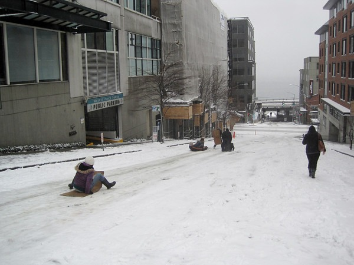

Yesterday I went for a [20 mile urban hike](/2012/01/urban-hike-seattle-snowstorm-2012-edition/) through Seattle. The city was covered with snow and the winds got pretty intense at a few points. But I made it and I still had enough energy to spend an hour cooking my dinner once I got home. How I accomplished this hike with relative ease flies in the face of conventional wisdom in the fitness field. In this post, I'm going to take on 3 different fitness myths.

### Myth #1 - Eat Breakfast Before Engaging in Endurance Events

On the majority of my urban hikes, I consume zero calories before I take my first step. I fast. The body is fully capable of using stored body fat for fuel. Intermittent Fasting will not "eat up" your muscle, nor will eating breakfast jack your metabolism more than the calories consumed. From the post [Intermittent Fasting - Fears and Motivation](/2009/04/intermittent-fasting-fears-and-motivations/):

> When you fast your insulin levels drop big time. Your Growth Hormone (GH) levels increase. Exercise, especially interval and weight training, also elevate GH levels. GH is protein/muscle sparing and GH helps the body mobilize fat for fuel. Not eating for long periods of time (starvation) is catabolic, short periods of fasting aren't.

When I wake up in the morning my body is in a fat-burning mode. Why would I want to interrupt that process with a smoothie or Cliff Bar? I can eat when I get back home. My energy levels are much more constant in a fasted state than when I used to ride the carbohydrate roller coaster. Yesterday, my "breakfast" consisted of a few ounces of [kimchi](https://criticalmas.org/best-of/fermentation/) and one tablespoon of coconut oil. If that seems odd, read the post [Intermittent Fasting - The No Hunger Method](/2011/10/intermittent-fasting-the-no-hunger-method/). It describes a wonderful hack that I tested from The Perfect Health Diet.  _Perfect Health Diet: Regain Health and Lose Weight by Eating the Way You Were Meant to Eat by Paul Jaminet_

### Myth #2 - Endurance Events Require Endurance Training

Back in 2008 and 2009, I used to do a lot of urban hiking throughout the hills of Seattle. However, in the last few years, it has really slowed down. In fact, the last long hike I did prior to yesterday's 20 milers was in June 2010. I consider a long hike to be more than 10 miles and without multi-hour breaks. The only exercise I do these days, other than neighborhood walks, is a [7-10 minute High-Intensity Training workout](/2011/11/escaping-the-glitter-taking-high-intensity-training-outdoors/) that happens just once a week. How is this possible? How did I perform an endurance event, not only without doing any endurance training but without doing any cardio? Most fitness professionals fail to understand exactly what creates endurance. [Greg Anderson](/2011/02/high-intensity-training-at-ideal-exercise-of-seattle/) wrote _Why Not Aerobics?_ ([PDF: Why-NOT-Aerobics](./img/Why-NOT-Aerobics.pdf)) that explains that the three components of endurance are genetics, skill, and muscular strength. The genetics we can't do much about. I could train "the skill" of endurance, which the article says are things like stride length and efficiency. A better plan is to just work on getting a lot stronger and then let those benefits spill over to other activities.

> Muscular strength is the single most trainable factor in endurance performance. It is the muscles that actually perform work. When strength increases, the relative intensity of any given task decreases.

I'm someone who has done it both ways. When I was in college, I ran [two marathons](/2008/03/the-runner-1989-1995/) and didn't work on muscular strength. I focused on the skill components of endurance. These days, I just focus on muscular strength. Let me say that life is much sweeter now. My energy levels are higher, I no longer get aches and pains from overuse injuries and my immune system is much stronger. When I trained as a marathon runner, my "skill" didn't carry over into cycling or other endurance activities. It was localized. Earlier this week I reviewed [HillFit](/2012/01/hillfit-strength-is-not-just-for-hikers/) by Chris Highcock. His message is the same as mine. The most efficient and safest way to get to the top of a mountain or whatever your endurance goal happens to be is to increase your strength.

### Myth #3 - Make Sure You Get the Right Gear For Your Event

Seattle is the home to REI (Recreation Equipment Incorporated). They sell any piece of outdoor fitness equipment you could possibly imagine. Hiking shoes and socks for every season. They offer a jacket or coat for every possible micro-climate condition. Bring your credit card, because this stuff isn't cheap. And in my opinion, it isn't necessary. Most of the customers who go to these sporting gear stores are not climbing K2. They might be doing a 2-hour hike. That shouldn't require hundreds of dollars in gear. Don't fall for the "must get gear" mentality. **The best gear you can bring with you to any event are stronger muscles.** For my 20-mile hike through the snowstorm, I wore a sweatshirt with a rain jacket. I didn't have waterproof pants, gloves, or a hat. Oh well. I didn't run out to REI to save myself from the elements. Yes, I was cold, but my body adapted and I made it home OK.  _The sledder on the left is using a piece of cardboard for a sled. No trip to REI for her!_

### You'll Be Fine

You don't need breakfast, skills, and special gear to take on the world. Focus on getting stronger and you'll be fine.

---

## Comments

### Thor
*January 19 at 2012 at 6:25 PM*

nice post (...and even nicer pictures in the previous one by the way...)

one qn:
"the three components of endurance are genetics, skill and muscular strength" 

where is cardiovascular capacity / VO2max whatever you want to call it there? there are enough examples of lifters who can lift 100's of kilos, but are out of breath after 100 brisk walking, so something does not seem right here

---

### MAS
*January 19 at 2012 at 6:36 PM*

@Thor - That is a good question. I don't know the answer, but I'll try and take a guess. Those lifters are probably more in the heavyweight division, where extra body fat can help with the movement. So they might be overweight. 

Another thought is that those lifters are doing skill training themselves. This gets into the demonstration of strength versus development of strength debate. I give some of my thoughts on this in this post:
https://criticalmas.org/2011/11/my-bench-press-sucks-and-i-dont-care/

Maybe someone else can drop a comment answering your question.

---

### chuck
*January 19 at 2012 at 7:14 PM*

Wait....you aren't sick and exhausted from walking all day in the cold with no food?  Most of America is stunned.

---

### MAS
*January 19 at 2012 at 7:19 PM*

Oh yeah, I forgot to include Myth #4, which is that I didn't take any anti-inflammatory drugs. I consumed a mug a beef bone broth, which is loaded with healing nutrients. This morning I am perfectly fine.

---

### Matthew
*January 19 at 2012 at 7:33 PM*

@Thor

It depends on how you do your strength training as a lifter.  Most powerlifters take long breaks (5 minutes) in between sets and try to lift at 90% of their 1 RM for 3-5 rep sets.  I take 30 seconds breaks, if I'm not super setting and rarely break 30 - 45 minutes in the gym (when I do it's because I'm doing full body variable effort training).

If you lift heavy with less rest and add in occasional mid distance sprints you can maintain endurance without training it.  I currently squat 525 lbs and I can still run a mile in about 6 - 7 minutes, even though most of my running is from my office to the bus stop about a quarter mile away to catch the bus.

I also did the STP bike ride (208 miles) in 12 hours, so I may be a bad example.

Unfortunately, if your goals are to do things other than build muscle safely HIT becomes over kill and makes your system less resistant to shocks. In other words, it never exposes your joints to that kind of stresses you might have seen in the "wild" and thus you end up having to train "skill" separately, which is hard to do while recovering from an HIT workout.

---

### Rhona
*January 19 at 2012 at 8:04 PM*

In answer to Thor's question, the 3 physiological factors that limit/determine endurance are:

1)VO2max
2)Economy (how effective you are at using the oxygen you have extracted from the air - the more economical you are the less oxygen you need to use for any given speed/work rate)
3)Fractional Utilisation - the percentage of your VO2max you can sustain for the duration you are racing over.    Trained athletes can sustain a higher percentage of their VO2max than untrained.

The high intensity training Michael has been doing will have probably been effective at improving at least number 1 above, and possibly number 3.

Really your definition of strength/endurance is what makes the difference here.  Someone who just lifts weights is not going to perform as well in an endurance event such as a marathon or triathlon compared to someone who does no strength work but lots of 'endurance' training......

---

### MAS
*January 19 at 2012 at 8:04 PM*

@Matthew - HIT recoverability is only a problem if you spend too many days "below baseline". This is easily addressable. Dr McGuff covers this in Body By Science. In the modern world, you far more likely to get injured over doing it in the gym than under-doing it by not being prepared for some unimaginable threat.  

My personal story is that I when I straight-armed the car that hit me, I recovered quickly. I never trained for being hit by a car, but my joints were fine.
https://criticalmas.org/2011/11/getting-hit-by-a-car/

---

### MAS
*January 19 at 2012 at 8:05 PM*

@Matthew - Also, there is nothing that says the HIT lifter shouldn't engage in skill training for their chosen sport. They can and should do both.

---

### Pam
*January 19 at 2012 at 8:10 PM*

I love this. I so agree and I love how you tie it back to the research. I am taking off this afternoon for a long urban hike on the east side. You inspired me...

Thanks!

---

### Matthew
*January 19 at 2012 at 10:39 PM*

Rugby is very real threat :-p

I also have a tendency to hit deers on my bicycle and jump off tall objects.  

As I said, most people go to the gym to look good or build strength/muscle for which HIT is probably best. 

I can't get to the gym more than once or twice a week since doing four sets of squats makes it difficulty for me to move for days.

---

### Geoff
*January 19 at 2012 at 11:41 PM*

@MAS 

Good article.  Thanks for posting this.  I've got a couple of thoughts from my endurance running background.  I agree that you don't need a lot of food, training, or gear to do an event like yours.  Still (and I think it's probably implicit in your post), there's a world of difference between a day long urban hike at a relatively low effort level (where you get a lot of energy from fat) and, say, running a marathon at 85% of max heart rate (where glycogen is a signficant energy source).  We need to keep in mind the importance of context. 

When I was aiming for a performance goal in an endurance event I was much better served by eating before the event (I do best with lean protein) and having some carbohydrate during the event if it lasts more than 90 minutes.  That said, it doesn't mean that Clif bars, Gatorade and GU are essential.  I did a 40 mile trail run last year on fruit, potatoes and water and felt just fine.

The same thing could be said for training - to do an event like yours specific training probably isn't needed and can be detrimental to health.  But I agree with your response to @Matthew - If you're targeting a performance goal, some "skill work" is going to be needed.   Basically, to run a long way fast you need to run a long way fast once in a while.  I find physical and mental benefits in competion from doing at least some sport specific training.  As you and McGuff point out, though, the key is spending more days above baseline than below.  The "chronic cardio"/LSD model of training is certainly not ideal for health - it's overkill and unnecessary, but then again, marathoning probably isn't ideal for health.  

I do agree 100% that strength training is very valuable for endurance performance.  My regret is that I didn't do more strength training sooner.  I could have spent the time I spent logging "junk" miles more productively doing strength work.

Gear is generally overrated and overdone for endurance events, in my opinion.  Thanks for calling out the endurance community on that one.  Most people go into marathon runs - and especially ultras - way too "overgeared".  If you're shooting for a performance goal - a good pair of shoes that fit well and work with your gait helps.  My wife reminds me that women would do well to invest in a good jog bra too.

Sorry to dedicate such a long comment to what really amounts to a quibble over details. I think your fundamental point is spot on.  I love the pictures!

---

### MAS
*January 20 at 2012 at 12:22 AM*

@Geoff - Although I've heard of people that have begun training for endurance events with ketogenic diets, it is something I haven't tried. If I ever step out of retirement, I would certainly experiment.

---

### Geoff
*January 20 at 2012 at 12:34 AM*

@MAS for my last standard marathon, I tried "train low/race high".  I did my "skill training" runs every other week after a 24 hour fast.  Except for the post run recovery window I ate a ketogenic diet.  For the few days before the race I ate many more clean paleo carbs.  Race morning I had a little lean ground beef (and coffee - natch) except for a couple of sips of sports drink after 30K I had just water during the run.  It was not my fastest time, but it was my most enjoyable.  I think there is some real merit to "fat adapting" endurance athletes on ketogenic diets.  Still, I think a short, clean carb loading period right before competition helps.

---

### MAS
*January 20 at 2012 at 12:44 AM*

@Geoff - Thanks for doing that experiment, so I don't have to. :)

---

### Becca
*January 20 at 2012 at 6:07 PM*

awesome post.  all of those myths often just end up becoming excuses for people anyways.  "oh i can't go hiking because I don't have shoes."  It's nice to see you debunk 3 myths and eliminate 3 excuses :)

---

### MAS
*January 20 at 2012 at 6:34 PM*

After reviewing my post today, I wanted to clarify something. 

This post is in no way saying that my method is optimal for everyone or every situation. It was about shattering the limiting beliefs we hear from so-called fitness professionals. Humans are resilient. We are capable of more than we give ourselves credit for. And we don't need to spend a bunch of money to make it happen.

---

### Alan
*January 21 at 2012 at 2:52 AM*

MAS,

I was wondering. When you first started doing your urban walks in Seattle,
did you do them in a fasted state? Or did you adapt to it over time?

Since I eat breakfast everyday I don't think I could do an urban walk such as yours in fasted state the first time.  I would have to gradually work up to it. For religious reasons I fast one day a year and I know based on that experience I would not be able to walk eight hours. But I believe I could adapt to it.

---

### MAS
*January 21 at 2012 at 2:55 AM*

@Alan - I started urban hiking first. Fasting came later and yes I worked up to it. However, I found it easier to fast while hiking over sitting around. I used to eat immediately upon waking every day myself. I broke the habit one hour at a time.

---

### Curb
*January 21 at 2012 at 9:02 PM*

Michael, nice job of providing some good information but you make the same logical mistake the people promoting these "myths" make. You make the issue black and white when really there's a whole lot of grey.

Hiking and running a marathon to set a personal best are two very different events. Paraphrasing legendary coach Jack Daniels, competing in and completing a marathon require two very different approaches. 

To run a fast (relative to each individual) long distance race you will need to have topped up on carbohydrates. Plenty of research to back this up. 

Having said that your points about not taking in food before or during a lower intensity endurance event have merit. It's what the marathoners did in the 70s and is becoming more prevalent once again. There's research to back this approach to training the body to adapt to utilizing fat for energy. 

An even better approach that isn't exclusive (no carbs vs. lots of carbs) is what Bob Seehobar calls Metabolic Efficiency and Mike T Nelson calls Metabolic Flexibility. You need to train your body to be able to use either fats or carbs efficiently for fuel. (google the names and terms to get more info.) 

So really it comes down to your goals. For general health/fitness your approach is probably pretty good. But for endurance performance you'll need to also train how to best utilize carbs as well. 

@Thor - re: VO2 max. The last five years or so some good research has shown this isn't really a "hard" physiological limit. Or at least not the way it's currently defined. But for endurance events it all comes down to power-to-weight ratio. Getting stronger but also getting lighter is the way to go. Even if you're lean but big you're going to have to carry all those extra muscles around for distance which will make the heart &amp; lungs work harder. Use training protocols that develop max. strength &amp; power without causing hypertrophy. And of course, you'll still need to do some long duration endurance training not just HIT intervals if you want to long duration events.

---

### thomas
*January 21 at 2012 at 9:29 PM*

Without proper footwear don't your feet get really cold?  I hate the feeling of feet that feel encased in blocks of ice, how did you manage?

---

### MAS
*January 22 at 2012 at 12:14 AM*

@Curb - My post was not about designing training plans for endurance athletes. It was about human resilience and the economics of strength training as a way to gain endurance without engaging in endurance training. 

I'm sorry the comment thread forked into the perception that I was speaking to runners, which is why I added this comment above:

"This post is in no way saying that my method is optimal for everyone or every situation. It was about shattering the limiting beliefs we hear from so-called fitness professionals. Humans are resilient. We are capable of more than we give ourselves credit for. And we don’t need to spend a bunch of money to make it happen."

---

### MAS
*January 22 at 2012 at 12:15 AM*

@Thomas - Although my gloves and hat were not water-proof, my footwear was. For that I am thankful. Wet feet would have sucked.

---

