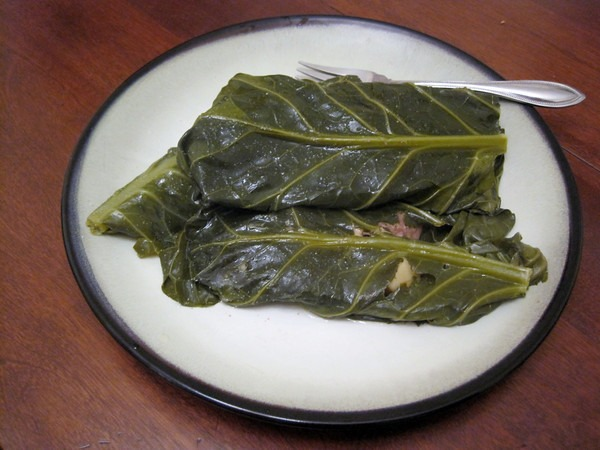

On my recent trip to Los Angeles, I met up with a friend that grew up on Oahu. She taught me about the traditional Hawaiian dish of [Lau Lau](https://en.wikipedia.org/wiki/Laulau). It is very simple to make provided you don't mind waiting 3 hours for it to steam cook. **Summary**: _The traditional Hawaiian dish._ 

#### Ingredients

-   pork butt
-   steak
-   sweet potato
-   fish pieces (cod or salmon)
-   collard greens (or taro leaf)
-   sea salt

#### Instructions

1.  Chop up meat, fish and sweet potatoes into cube sized pieces.
2.  Salt the meat.
3.  Place a collard green leaf on top of a piece of foil large enough to wrap it (think burrito).
4.  Add pieces of pork, beef, fish and sweet potatoes.
5.  Wrap up leaf into foil.
6.  Finish wrapping all leafs.
7.  Place wrapped lau lau into stock pot with steamer.
8.  Steam for 3 hours.
9.  Unwrap and eat!

Preparation time: 30 minute(s) Cooking time: 3 hour(s) Culinary tradition: Hawaiian Note: I have made this dish 3 times now. I prefer to have twice as many pieces of pork butt and sweet potatoes as beef. Personal preference is best.  

---

## Comments

### Shawn
*January 26 at 2012 at 4:15 PM*

MAS,

I really like reading the recipes that you put on the blog as they tend to be extremely healthy - or so I thought. Have you ever seen a documentary called "Forks over Knives"? I have to say that before that doc I used to think that non-fat milk and lean meat was the way to go. After watching that documentary and reading a couple of books I question the sanity of meat more and more.

Have you seen the documentary? It's on Netflix - if you haven't seen it I would really encourage you to check it out. If nothing else maybe it will make great fodder for a post!

Shawn

---

### MAS
*January 26 at 2012 at 4:49 PM*

@Shawn - I haven't seen the movie. All the people that I respect in nutrition call it a vegetarian propaganda film that bases many of their claims off bad science. The best critique I've seen on this film is <a href="https://deniseminger.com/2011/09/22/forks-over-knives-is-the-science-legit-a-review-and-critique/" rel="nofollow">“Forks Over Knives”: Is the Science Legit? (A Review and Critique)</a>. It is very long, so if you are short on time, jump down to the "Get it? Got it? Good!" section for the heart disease correlations. 

For me personally, I've done the low-fat, the vegetarian, the Zone and now the Paleo/Nourishing Traditions. I'm in the best shape of my life now and I've never felt better. Do whatever works best for you and be willing to experiment.

---

### Jenn
*January 26 at 2012 at 5:44 PM*

YUM!  another of my favorites from Hawaii, which should be right up your protein alley:  poke.  I've tried a couple of my own versions, but here in ABQ there's really only one place to get super fresh fish.  

I agree, I love seeing the recipes, and wish lived closer because except for the offal recipes, I'd be inviting myself over for dinner :-)

---

### Shawn
*January 26 at 2012 at 8:25 PM*

MAS,

One of the things I like to do is follow the money. I understand that the meat and dairy industry are pushing like crazy but I don't get the vegatarian "lobby". Who profits? Vegatable makers? Farmers? 

I guess at the end of the day you have to set aside the passion and politics and look at the base of the issue. Honestly I'm not sure who's right but the science looks - compelling. Being in the medical industry I have a personal profit motive of people continuing to eat the crap they do as we make a TON of money with our infusion devices thanks to dummies who continue these unhealthy lifestyles. I think that like most things in life the truth is probably in the middle. 

Either way I would highly encourage you to watch the movie. It lays out the information pretty well. I've Also if I ever get musical ability I'm going to form a band and name it "Vegetarian Propaganda" and our first single will be "Glitter Gyms". 

Shawn

---

### MAS
*January 26 at 2012 at 8:29 PM*

@Jenn - Thanks! You are welcome to swing by for dinner if you ever visit Seattle. I promise not to serve pig uterus. :) I have a vegan recipe going up later this week.

---

### MAS
*January 26 at 2012 at 8:37 PM*

@Shawn - You ask a good question. 

My initial response is their motivation is more about their ethics "meat is murder" than science. So when they found science - even if it is bad - that supports their cause, they trumpet that information. 

There may be financial motivations as well. Grains and legumes are dirt cheap to produce and store, which means the potential for higher profit margins may exist. I'm not too knowledgeable about the economics of food, so this is pure speculation.

---

