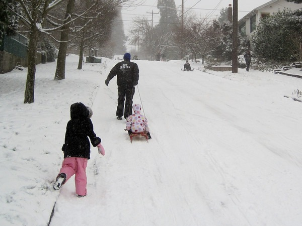
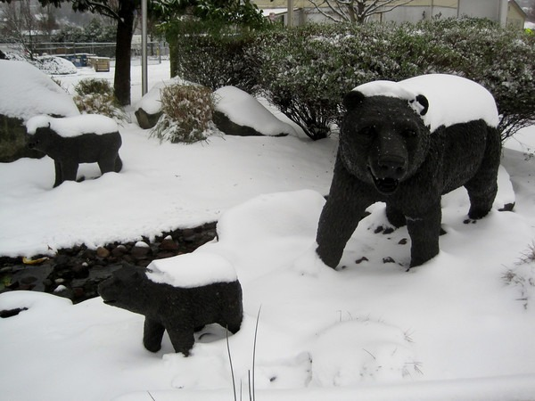

A good snowstorm doesn't happen in Seattle every year, so I took advantage of the day and went for an urban hike. Three years ago, I did a [16 mile hike](/2008/12/urban-hike-seattle-snow-edition/) through the snow. Today I did 20 miles. My hike took me through Ballard, Phinney Ridge, Wallingford, University, Montlake, Madison Valley, Capitol Hill, Downtown, Belltown, Queen Anne and Fremont. I saw lots of kids and many adults having fun in the snow. It was another great day in Seattle.  _Today's urban hike was [19.978 miles](http://www.gmap-pedometer.com?r=5261026)._  _Sledding Family on Phinney Ridge_  _Interlaken Blvd on Capitol Hill_  _Snowmobile in Madison Park_  _Snowboarder coming down the Queen Anne Counterbalance_  _More fun coming down Queen Anne Ave._  _A family of bears spotted in front of the Fremont Brown Bear Car Wash ;)_ Full photo gallery for [Urban Hike - Seattle Snowstorm (JAN 18, 2012)](https://www.flickr.com/photos/129592470@N02/sets/72157649720325169/)

---

## Comments

### Alan
*January 19 at 2012 at 3:04 AM*

MAS,

I live in the NorthEast and I have no snow in front of my house at this time. It looks like you're having all the fun. We've had unusually warm weather. 

We did have a freak snow storm at the end of Oct. 2011 which devastated the state for many days.  A lot of power outages because of the extra weight on tree limbs that still had leaves. I was lucky because I did not lose power. We're expecting an inch or two of snow on Friday.

The truth is I am happy with this lack of snow because it makes getting to work difficult.

---

### Kelly
*January 19 at 2012 at 4:12 AM*

That's my mom on the snowmobile! haha Today was awesome for snowmobiling.

---

### Kelly
*January 19 at 2012 at 4:17 AM*

btw it's Miss Toni on the snowmobile, for any of her students reading this :)

---

### Kumi
*January 19 at 2012 at 8:17 AM*

Wow, you really did it as you said yesterday!!!  
20 miles on the snow roads!  I am sure your shoulder and neck muscles need stretched out :)

---

### chuck
*January 19 at 2012 at 3:06 PM*

very cool and adventurous.  i am curious if you plan something like this out or just bundle up and go where your boots take you.  do you map it?  do you stop for food/drink?  do you bring headphones?  do you visit friends?  20 miles is a long walk.

---

### MAS
*January 19 at 2012 at 4:02 PM*

No headphone, no food. I stopped briefly at 2 coffee shops for an espresso. My path was mostly random. What started out as a moderate hike turned into a monster hike. 

I'm only slightly sore today. Actually I sprained by right ankle Sunday night, but hiked on it anyway. I couldn't pass up this snow opportunity. It might 3 or more years before it comes again.

---

### chuck
*January 19 at 2012 at 4:31 PM*

how long did it take?  without the headphones, betcha soaked in the surroundings and got a lot of thinking done.

---

### MAS
*January 19 at 2012 at 4:37 PM*

@Chuck - I left home at 9:15 AM and got back just before 5 PM. I did get an idea for a blog post about the hike, which will be out later today.

---

### Gary
*January 21 at 2012 at 11:16 AM*

I have only been in Seattle  once...in the mid '70's I believe,
and in January.  It is such a beautiful area.  I was there for 2 weeks active duty for the Navy and was stationed on a ship somewhere in Seattle

---

### Gary
*January 21 at 2012 at 12:17 PM*

At the local park near where I live (Arlington, Tx)I sometimes 
walk and throw in an occasional sprint of around 200 yards and
have gone as long as 2 hours, doing this regiment.  I find that my body feels different afterwards....different than just pure running...very stimulated. You have given me the inspiration to
start some longer Urban hikes.  I love walking but it takes such a long time.

---

