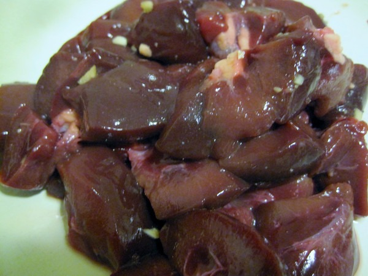
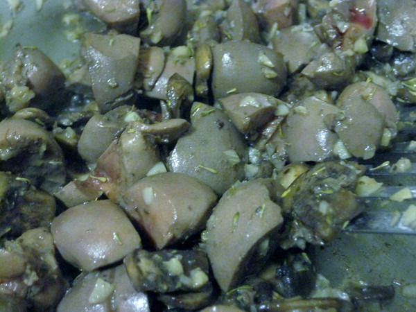

I just cooked beef kidney for the first time and it came out great. I decided not to look at other recipes and instead take my best ideas from cooking beef liver and apply them to the kidney. My plan worked! I enjoyed the flavor even more than beef liver.

Why would anyone want to eat beef kidney? Like beef liver, [kidney is very nutritious](http://www.wolframalpha.com/input/?i=beef+kidney).It is high in protein, Vitamin B12 and riboflavin (B2). Beef kidney is also cheap. I was able to buy a pound of 100% grass pastured beef kidney from my neighborhood farmers market for just $4. When it comes to organ meats, always seek out the highest quality.

Also this recipe is for beef kidney, it will absolutely work the same for beef liver.

_Beef kidney chopped into bite-size pieces with most of the excess fat removed._

**Summary**: _A tasty way to cook up beef kidney._

#### Ingredients

-   beef kidney
-   garlic
-   mushrooms
-   [tallow](/2011/02/rendering-beef-tallow-in-a-crock-pot/) (or other healthy cooking oil)
-   thyme
-   salt
-   pepper

#### Instructions

1.  Trim excess fat off kidney and chop into bite size pieces.
2.  Chop garlic into tiny pieces
3.  Heat pan and add cooking oil (medium heat).
4.  Add garlic to pan and let cook for 30 seconds.
5.  Throw in beef kidney and mushrooms together.
6.  Add liberal amount of thyme.
7.  Add salt and pepper.
8.  Cook until done (pull out a piece and cut in half to test).

#### Quick notes

Some organ meat recipes say to add a splash of red wine. You can do that. I've found water works too.

Preparation time: 20 minute(s) Cooking time: 15 minute(s) Diet tags: High protein

---

## Comments

### Jim
*February 8 at 2012 at 7:51 PM*

MAS,

I like the idea of including offal into the diet, but find the choices (like liver, kidney, etc...) to be unappetizing.  Do you encounter this, and if so, how did you overcome?

---

### MAS
*February 8 at 2012 at 7:55 PM*

@Jim - I would say your first step is to grind them up and bury them in a chili or meatloaf. A little each time. You'll barely taste it.

---

